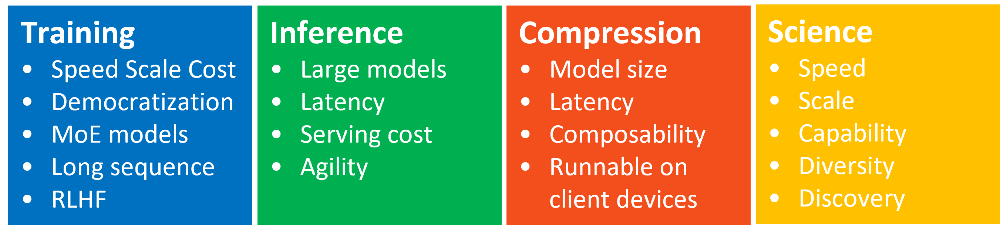

[](https://github.com/Microsoft/DeepSpeed/blob/master/LICENSE)
[](https://pypi.org/project/deepspeed/)
[](https://pepy.tech/project/deepspeed)
[](#build-pipeline-status)
[](https://twitter.com/intent/follow?screen_name=MSFTDeepSpeed)
[](https://twitter.com/MSFTDeepSpeedJP)
[](https://www.zhihu.com/people/deepspeed)


<div align="center">
 
 
</div>

## Latest News
<b> <span style="color:orange" > DeepSpeed empowers ChatGPT-like model training with a single click, offering 15x speedup over SOTA RLHF systems with unprecedented cost reduction at all scales; [learn how](https://github.com/microsoft/DeepSpeed/tree/master/blogs/deepspeed-chat)</span>.</b>

* [2023/10] [DeepSpeed-VisualChat: Improve Your Chat Experience with Multi-Round Multi-Image Inputs](https://github.com/microsoft/DeepSpeed/tree/master/blogs/deepspeed-visualchat/10-03-2023/README.md) [[English](https://github.com/microsoft/DeepSpeed/tree/master/blogs/deepspeed-visualchat/10-03-2023/README.md)] [[中文](https://github.com/microsoft/DeepSpeed/blob/master/blogs/deepspeed-visualchat/10-03-2023/README-Chinese.md)] [[日本語](https://github.com/microsoft/DeepSpeed/blob/master/blogs/deepspeed-visualchat/10-03-2023/README-Japanese.md)]
* [2023/09] Announcing the DeepSpeed4Science Initiative: Enabling large-scale scientific discovery through sophisticated AI system technologies [[DeepSpeed4Science website](https://deepspeed4science.ai/)] [[Tutorials](https://www.deepspeed.ai/deepspeed4science/)] [[Blog](https://www.microsoft.com/en-us/research/blog/announcing-the-deepspeed4science-initiative-enabling-large-scale-scientific-discovery-through-sophisticated-ai-system-technologies/)] [[中文](https://github.com/microsoft/DeepSpeed/blob/master/blogs/deepspeed4science/chinese/README.md)] [[日本語](https://github.com/microsoft/DeepSpeed/blob/master/blogs/deepspeed4science/japanese/README.md)]
* [2023/08] [DeepSpeed ZeRO-Inference: 20X faster inference through weight quantization and KV cache offloading](https://github.com/microsoft/DeepSpeedExamples/blob/master/inference/huggingface/zero_inference/README.md)
* [2023/08] [DeepSpeed-Chat: Llama/Llama-2 system support, efficiency boost, and training stability improvements](https://github.com/microsoft/DeepSpeed/tree/master/blogs/deepspeed-chat/ds-chat-release-8-31/README.md)
* [2023/08] [DeepSpeed Ulysses: System Optimizations for Enabling Training of Extreme Long Sequence Transformer Models](https://github.com/microsoft/DeepSpeed/tree/master/blogs/deepspeed-ulysses) [[中文](https://github.com/microsoft/DeepSpeed/blob/master/blogs/deepspeed-ulysses/chinese/README.md)] [[日本語](https://github.com/microsoft/DeepSpeed/blob/master/blogs/deepspeed-ulysses/japanese/README.md)]
* [2023/06] [ZeRO++: A leap in speed for LLM and chat model training with 4X less communication](https://www.microsoft.com/en-us/research/blog/deepspeed-zero-a-leap-in-speed-for-llm-and-chat-model-training-with-4x-less-communication/)[[English](https://www.microsoft.com/en-us/research/blog/deepspeed-zero-a-leap-in-speed-for-llm-and-chat-model-training-with-4x-less-communication/)] [[中文](https://github.com/microsoft/DeepSpeed/blob/master/blogs/zeropp/chinese/README.md)] [[日本語](https://github.com/microsoft/DeepSpeed/blob/master/blogs/zeropp/japanese/README.md)]

---

# Extreme Speed and Scale for DL Training and Inference

***[DeepSpeed](https://www.deepspeed.ai/) enables world's most powerful language models like [MT-530B](https://www.microsoft.com/en-us/research/blog/using-deepspeed-and-megatron-to-train-megatron-turing-nlg-530b-the-worlds-largest-and-most-powerful-generative-language-model/) and [BLOOM](https://huggingface.co/blog/bloom-megatron-deepspeed)***. It is an easy-to-use deep learning optimization software suite that powers unprecedented scale and speed for both training and inference. With DeepSpeed you can:

* Train/Inference dense or sparse models with billions or trillions of parameters
* Achieve excellent system throughput and efficiently scale to thousands of GPUs
* Train/Inference on resource constrained GPU systems
* Achieve unprecedented low latency and high throughput for inference
* Achieve extreme compression for an unparalleled inference latency and model size reduction with low costs

---

# DeepSpeed's four innovation pillars




## DeepSpeed-Training

DeepSpeed offers a confluence of system innovations, that has made large scale DL training effective, and efficient, greatly improved ease of use, and redefined the DL training landscape in terms of scale that is possible. These innovations such as ZeRO, 3D-Parallelism, DeepSpeed-MoE, ZeRO-Infinity, etc. fall under the training pillar. Learn more: [DeepSpeed-Training](https://www.deepspeed.ai/training/)

## DeepSpeed-Inference

DeepSpeed brings together innovations in parallelism technology such as tensor, pipeline, expert and ZeRO-parallelism, and combines them with high performance custom inference kernels, communication optimizations and heterogeneous memory technologies to enable inference at an unprecedented scale, while achieving unparalleled latency, throughput and cost reduction. This systematic composition of system technologies for inference falls under the inference pillar. Learn more: [DeepSpeed-Inference](https://www.deepspeed.ai/inference)


## DeepSpeed-Compression

To further increase the inference efficiency, DeepSpeed offers easy-to-use and flexible-to-compose compression techniques for researchers and practitioners to compress their models while delivering faster speed, smaller model size, and significantly reduced compression cost. Moreover, SoTA innovations on compression like ZeroQuant and XTC are included under the compression pillar. Learn more: [DeepSpeed-Compression](https://www.deepspeed.ai/compression)

## DeepSpeed4Science

In line with Microsoft's mission to solve humanity's most pressing challenges, the DeepSpeed team at Microsoft is responding to this opportunity by launching a new initiative called *DeepSpeed4Science*, aiming to build unique capabilities through AI system technology innovations to help domain experts to unlock today's biggest science mysteries. Learn more: [DeepSpeed4Science website](https://deepspeed4science.ai/) and [tutorials](https://www.deepspeed.ai/deepspeed4science/)

---

# DeepSpeed Software Suite

## DeepSpeed Library

   The [DeepSpeed](https://github.com/microsoft/deepspeed) library (this repository) implements and packages the innovations and technologies in DeepSpeed Training, Inference and Compression Pillars into a single easy-to-use, open-sourced repository. It allows for easy composition of multitude of features within a single training, inference or compression pipeline. The DeepSpeed Library is heavily adopted by the DL community, and has been used to enable some of the most powerful models (see [DeepSpeed Adoption](#deepspeed-adoption)).

## Model Implementations for Inference (MII)

   [Model Implementations for Inference (MII)](https://github.com/microsoft/deepspeed-mii) is an open-sourced repository for making low-latency and high-throughput inference accessible to all data scientists by alleviating the need to apply complex system optimization techniques themselves. Out-of-box, MII offers support for thousands of widely used DL models, optimized using DeepSpeed-Inference, that can be deployed with a few lines of code, while achieving significant latency reduction compared to their vanilla open-sourced versions.

## DeepSpeed on Azure

   DeepSpeed users are diverse and have access to different environments. We recommend to try DeepSpeed on Azure as it is the simplest and easiest method. The recommended method to try DeepSpeed on Azure is through AzureML [recipes](https://github.com/Azure/azureml-examples/tree/main/v1/python-sdk/workflows/train/deepspeed). The job submission and data preparation scripts have been made available [here](https://github.com/microsoft/Megatron-DeepSpeed/tree/main/examples_deepspeed/azureml). For more details on how to use DeepSpeed on Azure, please follow the [Azure tutorial](https://www.deepspeed.ai/tutorials/azure/).

---

# DeepSpeed Adoption

DeepSpeed is an important part of Microsoft’s new
[AI at Scale](https://www.microsoft.com/en-us/research/project/ai-at-scale/)
initiative to enable next-generation AI capabilities at scale, where you can find more
information [here](https://innovation.microsoft.com/en-us/exploring-ai-at-scale).

DeepSpeed has been used to train many different large-scale models, below is a list of several examples that we are aware of (if you'd like to include your model please submit a PR):

  * [Megatron-Turing NLG (530B)](https://www.microsoft.com/en-us/research/blog/using-deepspeed-and-megatron-to-train-megatron-turing-nlg-530b-the-worlds-largest-and-most-powerful-generative-language-model/)
  * [Jurassic-1 (178B)](https://uploads-ssl.webflow.com/60fd4503684b466578c0d307/61138924626a6981ee09caf6_jurassic_tech_paper.pdf)
  * [BLOOM (176B)](https://huggingface.co/blog/bloom-megatron-deepspeed)
  * [GLM (130B)](https://github.com/THUDM/GLM-130B)
  * [xTrimoPGLM (100B)](https://www.biorxiv.org/content/10.1101/2023.07.05.547496v2)
  * [YaLM (100B)](https://github.com/yandex/YaLM-100B)
  * [GPT-NeoX (20B)](https://github.com/EleutherAI/gpt-neox)
  * [AlexaTM (20B)](https://www.amazon.science/blog/20b-parameter-alexa-model-sets-new-marks-in-few-shot-learning)
  * [Turing NLG (17B)](https://www.microsoft.com/en-us/research/blog/turing-nlg-a-17-billion-parameter-language-model-by-microsoft/)
  * [METRO-LM (5.4B)](https://arxiv.org/pdf/2204.06644.pdf)

DeepSpeed has been integrated with several different popular open-source DL frameworks such as:

|                                                                                                | Documentation                                |
| ---------------------------------------------------------------------------------------------- | -------------------------------------------- |
 | [Transformers with DeepSpeed](https://huggingface.co/docs/transformers/main/main_classes/deepspeed) |
|  | [Accelerate with DeepSpeed](https://huggingface.co/docs/accelerate/usage_guides/deepspeed) |
|  | [Lightning with DeepSpeed](https://lightning.ai/docs/pytorch/stable/advanced/model_parallel.html#deepspeed) |
|  | [MosaicML with DeepSpeed](https://docs.mosaicml.com/projects/composer/en/latest/trainer/using_the_trainer.html?highlight=deepspeed#deepspeed-integration) |
|  | [Determined with DeepSpeed](https://docs.determined.ai/latest/training/apis-howto/deepspeed/overview.html) |
|  | [MMEngine with DeepSpeed](https://mmengine.readthedocs.io/en/latest/common_usage/large_model_training.html#deepspeed) |

---

# Build Pipeline Status

| Description | Status |
| ----------- | ------ |
| NVIDIA | [](https://github.com/microsoft/DeepSpeed/actions/workflows/nv-torch110-p40.yml) [](https://github.com/microsoft/DeepSpeed/actions/workflows/nv-torch110-v100.yml) [](https://github.com/microsoft/DeepSpeed/actions/workflows/nv-torch-latest-v100.yml) [](https://github.com/microsoft/DeepSpeed/actions/workflows/nv-h100.yml) [](https://github.com/microsoft/DeepSpeed/actions/workflows/nv-inference.yml) [](https://github.com/microsoft/DeepSpeed/actions/workflows/nv-nightly.yml) |
| AMD | [](https://github.com/microsoft/DeepSpeed/actions/workflows/amd-mi100.yml) [](https://github.com/microsoft/DeepSpeed/actions/workflows/amd-mi200.yml) |
| CPU | [](https://github.com/microsoft/DeepSpeed/actions/workflows/nv-torch-latest-cpu.yml) |
| PyTorch Nightly | [](https://github.com/microsoft/DeepSpeed/actions/workflows/nv-torch-nightly-v100.yml) |
| Integrations | [](https://github.com/microsoft/DeepSpeed/actions/workflows/nv-transformers-v100.yml) [](https://github.com/microsoft/DeepSpeed/actions/workflows/nv-lightning-v100.yml) [](https://github.com/microsoft/DeepSpeed/actions/workflows/nv-accelerate-v100.yml) [](https://github.com/microsoft/DeepSpeed/actions/workflows/nv-megatron.yml) [](https://github.com/microsoft/DeepSpeed/actions/workflows/nv-mii.yml) [](https://github.com/microsoft/DeepSpeed/actions/workflows/nv-ds-chat.yml) |
| Misc | [](https://github.com/microsoft/DeepSpeed/actions/workflows/formatting.yml) [](https://github.com/microsoft/DeepSpeed/actions/workflows/pages/pages-build-deployment) [](https://deepspeed.readthedocs.io/en/latest/?badge=latest)[](https://github.com/microsoft/DeepSpeed/actions/workflows/python.yml) |

# Installation

The quickest way to get started with DeepSpeed is via pip, this will install
the latest release of DeepSpeed which is not tied to specific PyTorch or CUDA
versions. DeepSpeed includes several C++/CUDA extensions that we commonly refer
to as our 'ops'.  By default, all of these extensions/ops will be built
just-in-time (JIT) using [torch's JIT C++ extension loader that relies on
ninja](https://pytorch.org/docs/stable/cpp_extension.html) to build and
dynamically link them at runtime.

## Requirements
* [PyTorch](https://pytorch.org/) must be installed _before_ installing DeepSpeed.
* For full feature support we recommend a version of PyTorch that is >= 1.9 and ideally the latest PyTorch stable release.
* A CUDA or ROCm compiler such as [nvcc](https://docs.nvidia.com/cuda/cuda-compiler-driver-nvcc/#introduction) or [hipcc](https://github.com/ROCm-Developer-Tools/HIPCC) used to compile C++/CUDA/HIP extensions.
* Specific GPUs we develop and test against are listed below, this doesn't mean your GPU will not work if it doesn't fall into this category it's just DeepSpeed is most well tested on the following:
  * NVIDIA: Pascal, Volta, Ampere, and Hopper architectures
  * AMD: MI100 and MI200

## PyPI
We regularly push releases to [PyPI](https://pypi.org/project/deepspeed/) and encourage users to install from there in most cases.

```bash
pip install deepspeed
```

After installation, you can validate your install and see which extensions/ops
your machine is compatible with via the DeepSpeed environment report.

```bash
ds_report
```

If you would like to pre-install any of the DeepSpeed extensions/ops (instead
of JIT compiling) or install pre-compiled ops via PyPI please see our [advanced
installation instructions](https://www.deepspeed.ai/tutorials/advanced-install/).

## Windows
Windows support is partially supported with DeepSpeed. On Windows you can build wheel with following steps, currently only inference mode is supported.
1. Install pytorch, such as pytorch 1.8 + cuda 11.1
2. Install visual cpp build tools, such as VS2019 C++ x64/x86 build tools
3. Launch cmd console with Administrator privilege for creating required symlink folders
4. Run `python setup.py bdist_wheel` to build wheel in `dist` folder

# Features

Please checkout [DeepSpeed-Training](https://www.deepspeed.ai/training), [DeepSpeed-Inference](https://www.deepspeed.ai/inference) and [DeepSpeed-Compression](https://www.deepspeed.ai/compression) pages for full set of features offered along each of these three pillars.

# Further Reading

All DeepSpeed documentation, tutorials, and blogs can be found on our website: [deepspeed.ai](https://www.deepspeed.ai/)


|                                                                                                | Description                                  |
| ---------------------------------------------------------------------------------------------- | -------------------------------------------- |
| [Getting Started](https://www.deepspeed.ai/getting-started/)                                   |  First steps with DeepSpeed                  |
| [DeepSpeed JSON Configuration](https://www.deepspeed.ai/docs/config-json/)                     |  Configuring DeepSpeed                       |
| [API Documentation](https://deepspeed.readthedocs.io/en/latest/)                               |  Generated DeepSpeed API documentation       |
| [Tutorials](https://www.deepspeed.ai/tutorials/)                                               |  Tutorials                                   |
| [Blogs](https://www.deepspeed.ai/posts/)                                                       |  Blogs                                   |


# Contributing
DeepSpeed welcomes your contributions! Please see our
[contributing](CONTRIBUTING.md) guide for more details on formatting, testing,
etc.<br/>
Thanks so much to all of our amazing contributors!

<a href="https://github.com/microsoft/DeepSpeed/graphs/contributors">
  
</a>

## Contributor License Agreement
This project welcomes contributions and suggestions. Most contributions require you to
agree to a Contributor License Agreement (CLA) declaring that you have the right to, and
actually do, grant us the rights to use your contribution. For details, visit
https://cla.opensource.microsoft.com.

When you submit a pull request, a CLA bot will automatically determine whether you need
to provide a CLA and decorate the PR appropriately (e.g., status check, comment). Simply
follow the instructions provided by the bot. You will only need to do this once across
all repos using our CLA.

## Code of Conduct
This project has adopted the [Microsoft Open Source Code of
Conduct](https://opensource.microsoft.com/codeofconduct/). For more information see the
[Code of Conduct FAQ](https://opensource.microsoft.com/codeofconduct/faq/) or contact
[opencode@microsoft.com](mailto:opencode@microsoft.com) with any additional questions or comments.

# Publications
1. Samyam Rajbhandari, Jeff Rasley, Olatunji Ruwase, Yuxiong He. (2019) ZeRO: memory optimizations toward training trillion parameter models. [arXiv:1910.02054](https://arxiv.org/abs/1910.02054) and [In Proceedings of the International Conference for High Performance Computing, Networking, Storage and Analysis (SC '20)](https://dl.acm.org/doi/10.5555/3433701.3433727).
2. Jeff Rasley, Samyam Rajbhandari, Olatunji Ruwase, and Yuxiong He. (2020) DeepSpeed: System Optimizations Enable Training Deep Learning Models with Over 100 Billion Parameters. [In Proceedings of the 26th ACM SIGKDD International Conference on Knowledge Discovery & Data Mining (KDD '20, Tutorial)](https://dl.acm.org/doi/10.1145/3394486.3406703).
3. Minjia Zhang, Yuxiong He. (2020) Accelerating Training of Transformer-Based Language Models with Progressive Layer Dropping. [arXiv:2010.13369](https://arxiv.org/abs/2010.13369) and [NeurIPS 2020](https://proceedings.neurips.cc/paper/2020/hash/a1140a3d0df1c81e24ae954d935e8926-Abstract.html).
4. Jie Ren, Samyam Rajbhandari, Reza Yazdani Aminabadi, Olatunji Ruwase, Shuangyan Yang, Minjia Zhang, Dong Li, Yuxiong He. (2021) ZeRO-Offload: Democratizing Billion-Scale Model Training. [arXiv:2101.06840](https://arxiv.org/abs/2101.06840) and [USENIX ATC 2021](https://www.usenix.org/conference/atc21/presentation/ren-jie).
5. Hanlin Tang, Shaoduo Gan, Ammar Ahmad Awan, Samyam Rajbhandari, Conglong Li, Xiangru Lian, Ji Liu, Ce Zhang, Yuxiong He. (2021) 1-bit Adam: Communication Efficient Large-Scale Training with Adam's Convergence Speed. [arXiv:2102.02888](https://arxiv.org/abs/2102.02888) and [ICML 2021](http://proceedings.mlr.press/v139/tang21a.html).
6. Samyam Rajbhandari, Olatunji Ruwase, Jeff Rasley, Shaden Smith, Yuxiong He. (2021) ZeRO-Infinity: Breaking the GPU Memory Wall for Extreme Scale Deep Learning. [arXiv:2104.07857](https://arxiv.org/abs/2104.07857) and [SC 2021](https://dl.acm.org/doi/abs/10.1145/3458817.3476205).
7. Conglong Li, Ammar Ahmad Awan, Hanlin Tang, Samyam Rajbhandari, Yuxiong He. (2021) 1-bit LAMB: Communication Efficient Large-Scale Large-Batch Training with LAMB's Convergence Speed. [arXiv:2104.06069](https://arxiv.org/abs/2104.06069) and [HiPC 2022](https://hipc.org/advance-program/).
8. Conglong Li, Minjia Zhang, Yuxiong He. (2021) The Stability-Efficiency Dilemma: Investigating Sequence Length Warmup for Training GPT Models. [arXiv:2108.06084](https://arxiv.org/abs/2108.06084) and [NeurIPS 2022](https://openreview.net/forum?id=JpZ5du_Kdh).
9. Yucheng Lu, Conglong Li, Minjia Zhang, Christopher De Sa, Yuxiong He. (2022) Maximizing Communication Efficiency for Large-scale Training via 0/1 Adam. [arXiv:2202.06009](https://arxiv.org/abs/2202.06009).
10. Samyam Rajbhandari, Conglong Li, Zhewei Yao, Minjia Zhang, Reza Yazdani Aminabadi, Ammar Ahmad Awan, Jeff Rasley, Yuxiong He. (2022) DeepSpeed-MoE: Advancing Mixture-of-Experts Inference and Training to Power Next-Generation AI Scale [arXiv:2201.05596](https://arxiv.org/abs/2201.05596) and [ICML 2022](https://proceedings.mlr.press/v162/rajbhandari22a.html).
11. Shaden Smith, Mostofa Patwary, Brandon Norick, Patrick LeGresley, Samyam Rajbhandari, Jared Casper, Zhun Liu, Shrimai Prabhumoye, George Zerveas, Vijay Korthikanti, Elton Zhang, Rewon Child, Reza Yazdani Aminabadi, Julie Bernauer, Xia Song, Mohammad Shoeybi, Yuxiong He, Michael Houston, Saurabh Tiwary, Bryan Catanzaro. (2022) Using DeepSpeed and Megatron to Train Megatron-Turing NLG 530B, A Large-Scale Generative Language Model [arXiv:2201.11990](https://arxiv.org/abs/2201.11990).
12. Xiaoxia Wu, Zhewei Yao, Minjia Zhang, Conglong Li, Yuxiong He. (2022) Extreme Compression for Pre-trained Transformers Made Simple and Efficient. [arXiv:2206.01859](https://arxiv.org/abs/2206.01859) and [NeurIPS 2022](https://openreview.net/forum?id=xNeAhc2CNAl).
13. Zhewei Yao, Reza Yazdani Aminabadi, Minjia Zhang, Xiaoxia Wu, Conglong Li, Yuxiong He. (2022) ZeroQuant: Efficient and Affordable Post-Training Quantization for Large-Scale Transformers. [arXiv:2206.01861](https://arxiv.org/abs/2206.01861) and [NeurIPS 2022](https://openreview.net/forum?id=f-fVCElZ-G1).
14. Reza Yazdani Aminabadi, Samyam Rajbhandari, Minjia Zhang, Ammar Ahmad Awan, Cheng Li, Du Li, Elton Zheng, Jeff Rasley, Shaden Smith, Olatunji Ruwase, Yuxiong He. (2022) DeepSpeed Inference: Enabling Efficient Inference of Transformer Models at Unprecedented Scale. [arXiv:2207.00032](https://arxiv.org/abs/2207.00032) and [SC 2022](https://dl.acm.org/doi/abs/10.5555/3571885.3571946).
15. Zhewei Yao, Xiaoxia Wu, Conglong Li, Connor Holmes, Minjia Zhang, Cheng Li, Yuxiong He. (2022) Random-LTD: Random and Layerwise Token Dropping Brings Efficient Training for Large-scale Transformers. [arXiv:2211.11586](https://arxiv.org/abs/2211.11586).
16. Conglong Li, Zhewei Yao, Xiaoxia Wu, Minjia Zhang, Yuxiong He. (2022) DeepSpeed Data Efficiency: Improving Deep Learning Model Quality and Training Efficiency via Efficient Data Sampling and Routing. [arXiv:2212.03597](https://arxiv.org/abs/2212.03597).
17. Xiaoxia Wu, Cheng Li, Reza Yazdani Aminabadi, Zhewei Yao, Yuxiong He. (2023) Understanding INT4 Quantization for Transformer Models: Latency Speedup, Composability, and Failure Cases. [arXiv:2301.12017](https://arxiv.org/abs/2301.12017).
18. Syed Zawad, Cheng Li, Zhewei Yao, Elton Zheng, Yuxiong He, Feng Yan. (2023) DySR: Adaptive Super-Resolution via Algorithm and System Co-design. [ICLR:2023](https://openreview.net/forum?id=Pgtn4l6eKjv).
19. Sheng Shen, Zhewei Yao, Chunyuan Li, Trevor Darrell, Kurt Keutzer, Yuxiong He. (2023) Scaling Vision-Language Models with Sparse Mixture of Experts. [arXiv:2303.07226](https://arxiv.org/abs/2303.07226).
20. Quentin Anthony, Ammar Ahmad Awan, Jeff Rasley, Yuxiong He, Aamir Shafi, Mustafa Abduljabbar, Hari Subramoni, Dhabaleswar Panda. (2023) MCR-DL: Mix-and-Match Communication Runtime for Deep Learning [arXiv:2303.08374](https://arxiv.org/abs/2303.08374) and will appear at IPDPS 2023.
21. Siddharth Singh, Olatunji Ruwase, Ammar Ahmad Awan, Samyam Rajbhandari, Yuxiong He, Abhinav Bhatele. (2023) A Hybrid Tensor-Expert-Data Parallelism Approach to Optimize Mixture-of-Experts Training [arXiv:2303.06318](https://arxiv.org/abs/2303.06318) and will appear at ICS 2023.
22. Guanhua Wang, Heyang Qin, Sam Ade Jacobs, Connor Holmes, Samyam Rajbhandari, Olatunji Ruwase, Feng Yan, Lei Yang, Yuxiong He. (2023) ZeRO++: Extremely Efficient Collective Communication for Giant Model Training [arXiv:2306.10209](https://arxiv.org/abs/2306.10209).
23. Zhewei Yao, Xiaoxia Wu, Cheng Li, Stephen Youn, Yuxiong He. (2023) ZeroQuant-V2: Exploring Post-training Quantization in LLMs from Comprehensive Study to Low Rank Compensation [arXiv:2303.08302](https://arxiv.org/abs/2303.08302)
24. Pareesa Ameneh Golnari, Zhewei Yao, Yuxiong He. (2023) Selective Guidance: Are All the Denoising Steps of Guided Diffusion Important? [arXiv:2305.09847](https://arxiv.org/abs/2305.09847)
25. Zhewei Yao, Reza Yazdani Aminabadi, Olatunji Ruwase, Samyam Rajbhandari, Xiaoxia Wu, Ammar Ahmad Awan, Jeff Rasley, Minjia Zhang, Conglong Li, Connor Holmes, Zhongzhu Zhou, Michael Wyatt, Molly Smith, Lev Kurilenko, Heyang Qin, Masahiro Tanaka, Shuai Che, Shuaiwen Leon Song, Yuxiong He. (2023) DeepSpeed-Chat: Easy, Fast and Affordable RLHF Training of ChatGPT-like Models at All Scales [arXiv:2308.01320](https://arxiv.org/abs/2308.01320).
26. Xiaoxia Wu, Zhewei Yao, Yuxiong He. (2023) ZeroQuant-FP: A Leap Forward in LLMs Post-Training W4A8 Quantization Using Floating-Point Formats [arXiv:2307.09782](https://arxiv.org/abs/2307.09782)
27. Zhewei Yao, Xiaoxia Wu, Conglong Li, Minjia Zhang, Heyang Qin, Olatunji Ruwase, Ammar Ahmad Awan, Samyam Rajbhandari, Yuxiong He. (2023) DeepSpeed-VisualChat: Multi-Round Multi-Image Interleave Chat via Multi-Modal Causal Attention [arXiv:2309.14327](https://arxiv.org/pdf/2309.14327.pdf)


# Videos
1. DeepSpeed KDD 2020 Tutorial
    1. [Overview](https://www.youtube.com/watch?v=CaseqC45DNc&list=PLa85ZdUjfWS21mgibJ2vCvLziprjpKoW0&index=29)
    2. [ZeRO + large model training](https://www.youtube.com/watch?v=y4_bCiAsIAk&list=PLa85ZdUjfWS21mgibJ2vCvLziprjpKoW0&index=28)
    3. [17B T-NLG demo](https://www.youtube.com/watch?v=9V-ZbP92drg&list=PLa85ZdUjfWS21mgibJ2vCvLziprjpKoW0&index=27)
    4. [Fastest BERT training + RScan tuning](https://www.youtube.com/watch?v=o1K-ZG9F6u0&list=PLa85ZdUjfWS21mgibJ2vCvLziprjpKoW0&index=26)
    5. DeepSpeed hands on deep dive: [part 1](https://www.youtube.com/watch?v=_NOk-mBwDYg&list=PLa85ZdUjfWS21mgibJ2vCvLziprjpKoW0&index=92), [part 2](https://www.youtube.com/watch?v=sG6_c4VXLww&list=PLa85ZdUjfWS21mgibJ2vCvLziprjpKoW0&index=94), [part 3](https://www.youtube.com/watch?v=k9yPkBTayos&list=PLa85ZdUjfWS21mgibJ2vCvLziprjpKoW0&index=93)
    6. [FAQ](https://www.youtube.com/watch?v=nsHu6vEgPew&list=PLa85ZdUjfWS21mgibJ2vCvLziprjpKoW0&index=24)
2. Microsoft Research Webinar
    * Registration is free and all videos are available on-demand.
    * [ZeRO & Fastest BERT: Increasing the scale and speed of deep learning training in DeepSpeed](https://note.microsoft.com/MSR-Webinar-DeepSpeed-Registration-On-Demand.html).
3. [DeepSpeed on AzureML](https://youtu.be/yBVXR8G8Bg8)
4. Community Tutorials
    * [DeepSpeed: All the tricks to scale to gigantic models (Mark Saroufim)](https://www.youtube.com/watch?v=pDGI668pNg0)
    * [Turing-NLG, DeepSpeed and the ZeRO optimizer (Yannic Kilcher)](https://www.youtube.com/watch?v=tC01FRB0M7w)
    * [Ultimate Guide To Scaling ML Models (The AI Epiphany)](https://www.youtube.com/watch?v=hc0u4avAkuM)
