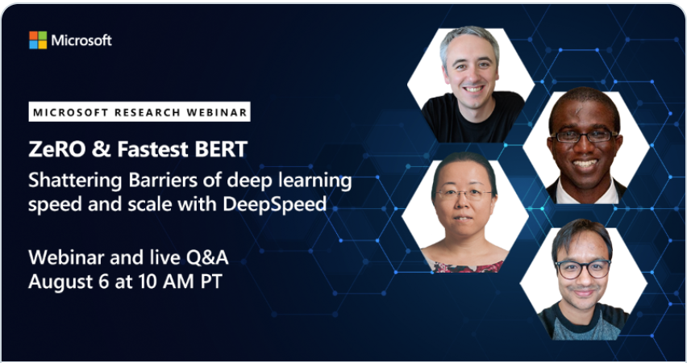

[DeepSpeed](https://www.deepspeed.ai/) is a deep learning optimization
library that makes distributed training easy, efficient, and effective.

<i><b>10x Larger Models</b></i>

<i><b>10x Faster Training</b></i>

<i><b>Minimal Code Change</b></i>

DeepSpeed can train deep learning models with over a hundred billion parameters on current
generation of GPU clusters, while achieving over 10x in system performance
compared to the state-of-art. Early adopters of DeepSpeed have already produced
a language model (LM) with over 17B parameters called
[Turing-NLG](https://www.microsoft.com/en-us/research/blog/turing-nlg-a-17-billion-parameter-language-model-by-microsoft),
establishing a new SOTA in the LM category.

DeepSpeed is an important part of Microsoft’s new
[AI at Scale](https://www.microsoft.com/en-us/research/project/ai-at-scale/)
initiative to enable next-generation AI capabilities at scale, where you can find more
information [here](https://innovation.microsoft.com/en-us/exploring-ai-at-scale).

**_For further documentation, tutorials, and technical deep-dives please see [deepspeed.ai](https://www.deepspeed.ai/)!_**

# News

* [2020/08/07] [DeepSpeed Microsoft Research Webinar](https://note.microsoft.com/MSR-Webinar-DeepSpeed-Registration-On-Demand.html) is now available on-demand **[_NEW_]**
* [2020/07/24] [DeepSpeed Microsoft Research Webinar](https://note.microsoft.com/MSR-Webinar-DeepSpeed-Registration-On-Demand.html) on August 6th, 2020 **[_NEW_]**
  
* [2020/05/19] [ZeRO-2 & DeepSpeed: Shattering Barriers of Deep Learning Speed & Scale](https://www.microsoft.com/en-us/research/blog/zero-2-deepspeed-shattering-barriers-of-deep-learning-speed-scale/)
* [2020/05/19] [An Order-of-Magnitude Larger and Faster Training with ZeRO-2](https://www.deepspeed.ai/news/2020/05/18/zero-stage2.html)
* [2020/05/19] [The Fastest and Most Efficient BERT Training through Optimized Transformer Kernels](https://www.deepspeed.ai/news/2020/05/18/bert-record.html)
* [2020/02/13] [Turing-NLG: A 17-billion-parameter language model by Microsoft](https://www.microsoft.com/en-us/research/blog/turing-nlg-a-17-billion-parameter-language-model-by-microsoft/)
* [2020/02/13] [ZeRO & DeepSpeed: New system optimizations enable training models with over 100 billion parameters](https://www.microsoft.com/en-us/research/blog/zero-deepspeed-new-system-optimizations-enable-training-models-with-over-100-billion-parameters/)

# Table of Contents
| Section                                 | Description                                 |
| --------------------------------------- | ------------------------------------------- |
| [Why DeepSpeed?](#why-deepspeed)        |  DeepSpeed overview                         |
| [Features](#features)                   |  DeepSpeed features                         |
| [Further Reading](#further-reading)     |  DeepSpeed documentation, tutorials, etc.   |
| [Contributing](#contributing)           |  Instructions for contributing to DeepSpeed |
| [Publications](#publications)           |  DeepSpeed publications                     |

# Why DeepSpeed?
Training advanced deep learning models is challenging. Beyond model design,
model scientists also need to set up the state-of-the-art training techniques
such as distributed training, mixed precision, gradient accumulation, and
checkpointing. Yet still, scientists may not achieve the desired system
performance and convergence rate. Large model sizes are even more challenging:
a large model easily runs out of memory with pure data parallelism and it is
difficult to use model parallelism. DeepSpeed addresses these challenges to
accelerate model development *and* training.

# Features

Below we provide a brief feature list, see our detailed [feature
overview](https://www.deepspeed.ai/features/) for descriptions and usage.

* [Distributed Training with Mixed Precision](https://www.deepspeed.ai/features/#distributed-training-with-mixed-precision)
  * 16-bit mixed precision
  * Single-GPU/Multi-GPU/Multi-Node
* [Model Parallelism](https://www.deepspeed.ai/features/#model-parallelism)
  * Support for Custom Model Parallelism
  * Integration with Megatron-LM
* [Memory and Bandwidth Optimizations](https://www.deepspeed.ai/features/#memory-and-bandwidth-optimizations)
  * The Zero Redundancy Optimizer (ZeRO)
  * Constant Buffer Optimization (CBO)
  * Smart Gradient Accumulation
* [Training Features](https://www.deepspeed.ai/features/#training-features)
  * Simplified training API
  * Gradient Clipping
  * Automatic loss scaling with mixed precision
* [Training Optimizers](https://www.deepspeed.ai/features/#training-optimizers)
  * Fused Adam optimizer and arbitrary `torch.optim.Optimizer`
  * Memory bandwidth optimized FP16 Optimizer
  * Large Batch Training with LAMB Optimizer
  * Memory efficient Training with ZeRO Optimizer
* [Training Agnostic Checkpointing](https://www.deepspeed.ai/features/#training-agnostic-checkpointing)
* [Advanced Parameter Search](https://www.deepspeed.ai/features/#advanced-parameter-search)
  * Learning Rate Range Test
  * 1Cycle Learning Rate Schedule
* [Simplified Data Loader](https://www.deepspeed.ai/features/#simplified-data-loader)
* [Performance Analysis and Debugging](https://www.deepspeed.ai/features/#performance-analysis-and-debugging)

# Further Reading

All DeepSpeed documentation can be found on our website: [deepspeed.ai](https://www.deepspeed.ai/)

| Article                                                                                        | Description                                  |
| ---------------------------------------------------------------------------------------------- | -------------------------------------------- |
| [DeepSpeed Features](https://www.deepspeed.ai/features/)                                       |  DeepSpeed features                          |
| [Getting Started](https://www.deepspeed.ai/getting-started/)                                   |  First steps with DeepSpeed                         |
| [DeepSpeed JSON Configuration](https://www.deepspeed.ai/docs/config-json/)                     |  Configuring DeepSpeed                       |
| [API Documentation](https://deepspeed.readthedocs.io/en/latest/)                               |  Generated DeepSpeed API documentation       |
| [CIFAR-10 Tutorial](https://www.deepspeed.ai/tutorials/cifar-10)                               |  Getting started with CIFAR-10 and DeepSpeed |
| [Megatron-LM Tutorial](https://www.deepspeed.ai/tutorials/megatron/)                           |  Train GPT2 with DeepSpeed and Megatron-LM   |
| [BERT Pre-training Tutorial](https://www.deepspeed.ai/tutorials/bert-pretraining/)             |  Pre-train BERT with DeepSpeed |
| [Learning Rate Range Test Tutorial](https://www.deepspeed.ai/tutorials/lrrt/)                  |  Faster training with large learning rates   |
| [1Cycle Tutorial](https://www.deepspeed.ai/tutorials/1Cycle/)                                  |  SOTA learning schedule in DeepSpeed         |

# Contributing
DeepSpeed welcomes your contributions! Please see our
[contributing](CONTRIBUTING.md) guide for more details on formatting, testing,
etc.

## Contributor License Agreement
This project welcomes contributions and suggestions. Most contributions require you to
agree to a Contributor License Agreement (CLA) declaring that you have the right to, and
actually do, grant us the rights to use your contribution. For details, visit
https://cla.opensource.microsoft.com.

When you submit a pull request, a CLA bot will automatically determine whether you need
to provide a CLA and decorate the PR appropriately (e.g., status check, comment). Simply
follow the instructions provided by the bot. You will only need to do this once across
all repos using our CLA.

## Code of Conduct
This project has adopted the [Microsoft Open Source Code of
Conduct](https://opensource.microsoft.com/codeofconduct/). For more information see the
[Code of Conduct FAQ](https://opensource.microsoft.com/codeofconduct/faq/) or contact
[opencode@microsoft.com](mailto:opencode@microsoft.com) with any additional questions or
comments.

# Publications
1. Samyam Rajbhandari, Jeff Rasley, Olatunji Ruwase, Yuxiong He. (2019) ZeRO: Memory Optimization Towards Training A Trillion Parameter Models. [ArXiv:1910.02054](https://arxiv.org/abs/1910.02054)
