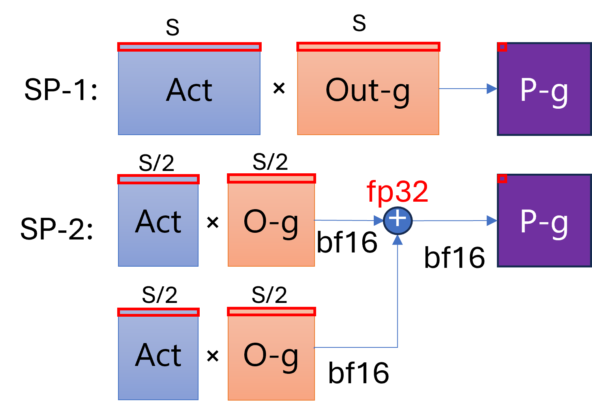
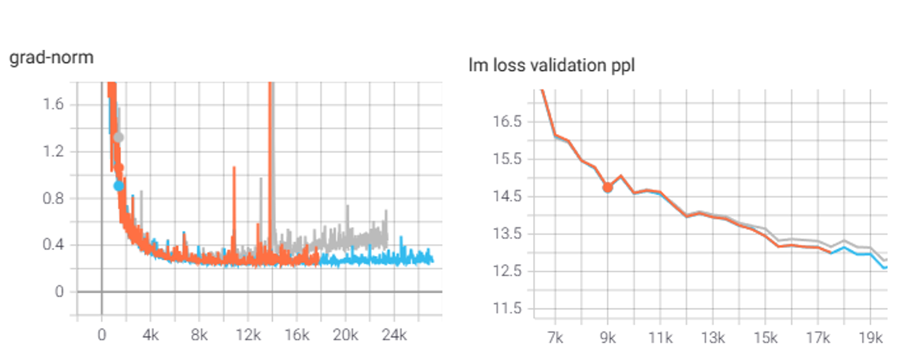

# Communictaion Optimization for Large-Scale Training 

## Table of Contents
1. [Introduction](#introduction)
2. [Parameter-update All-Reduce Optimization](#ar-opt)
3. [ZeRO2 Gradient All-Gather Optimization](#ag-opt)
4. [Sequence-Parallel Optimization](#sp-opt)
5. [Sequence-Parallel Convergence Consideration](#convergence)

## 1. Introduction 
Training LLMs on large data-set can be costly both in terms of resource-budget and time-to-completion. An important step to minimize such cost is to find the right number of resources together with a scalable library that assures training under a time limit. In this post, we target a key component of the scalability feature at DeepSpeed, the communication optimization. There are several communication collectives used in the main DeepSpeed's technologies, which we go through their optimization in detail in the following sections.

## 2. Parameter-update All-Reduce Optimization 

Before diving into this techniques, let's take a step back and show some of the case studies that motivates this work of all-reduce optimization. 

All-reduce operation is an important part of the the training process. In ZeRO, we handle this in buckets, which can be configured to get good comminication throughput. As the number of GPUs increases, we encounter smaller-partition all-reduces. In this case, the current bucketing scheme cannot help with the communication overhead. This mostly becomes an issue when training smaller-scale models (like Llama-7B) with large number of GPUs. 

For instance, when training a dense-7B architecture with Zero stages 1 or 2, we encounter a 1 and 2 second increase for the all-reudce time by increasing from 256 to 512 and 1024 A100 GPUs. This issue mostly arises from the fact that, the gradient-averaging happens with smaller partitions (#parameters / #GPUs) per-GPU rank. This issue gets more serious when training MoE architectures (3 - 12 second) for which the expert's parameters can be farther away due to the current parallelism layout of data and expert parallelism.

In this section, we introduce two main optimization techniques for alleviating these communication bottleneck.

First, Multi-rank bucketing for the same process group: for this optimization, we simply pack all data that requires to be reduced from different ranks into one big flattened tensor and call all-reduce instead of reduce operations. After the reduction, we scatter the right portion of data to the corresponding ranks.

Second, add new layout for the expert-data parallelism: the default parallelism layout for MoE architecture (as shown in Fig 1) is planned in a way that the experts are placed first on E parallel GPUs and replicated D times (data-parallel). With this layout, we encounter slower all-reduce as data-parallel ranks are placed farther away espcially when we have cross-rank communication. We call this layout E + D. 

   

  *Fig 1: Different MoE parallel layout. left) E + D, which places the GPUs in EP dimension first before adding DP, right) D + E, that replicates each expert by DP size, before constructing EP. We get faster all-reduce for the second layout while increasing the all-to-all time. It potentially resutls in faster e2e training time, as the communication volume for all-reduce (total parameter size) is normally much more than all-to-all (MLP activation memory).* 

By changing this layout from E + D to D + E (shown in Fig 1), where we first replicate each expert by D times and then add them across expert-parallel dimension, we can reduce the all-reduce time substantially. On an A100-DGX cluster, where each node has 8 GPUs, we see about 8x reduction in cross-node communication-volume for the parameter update process. Note that by adding this optimization, we increase the cost of All-to-All happening for the MoE part of the model, however, we have seen that the preformance benfit of all-reduce overweighs this cost.

After applying these two techniques for our training scenario, we reduce the all-reduce time by 2x for dense architecture and 5x - 8x for the MoE one using the multi-rank bucketing technique, and another 2x using the new D + E layout for the MoE architecture. We see higher performance gain on MoE architectures when using large number of GPUs. For the end-to-end training of a 7B-base MoE architecture, we reduce iteration-time from 13 sec to 9.5 sec on 512 GPUs (37%) and from 16 sec to 4.9 sec on 1k-GPU setup (3.3x).

## 3. ZeRO2 Gradient All-Gather Optimization 

The same as with all-reduce, all-gather takes longer as we have more partitions. As the parameters are stored in a flattened buffer for ZeRO stage-2, we can simply have a one call to all-gather the parameters into this tensor.

When all-gathering the updated parameters at Zero-Stage2, the bucketing scheme uses several narrow operations and creates a list of tensors with the bucket size from each partition. We needed this scheme to align with the `all_gather` operation from PyTorch. 
However, by adding the support for the `all_gather_into_tensor`, operation that has been added to the newer versions of PyTorch, we can simply have a kernel call to do the full-parameter all-gather. With this optimization, we see about 2x reduction in the step time for large-scale training. 

## 4. Sequence-Parallel Optimization 

For this part of the optimization, we add some fusion for the communication that is required fpr the DeepSpeed-Ulysses to provide a more scalable approach for when we increase the SP from 2 to 8 (for this study, we consider A100-DGX hardware, which has 8 GPUs per-node and by increasing the parallelism more than 8, we encounter performance-hit by the cross-node communication).

These fusions are done at two levels:
1. Fuse the sequence all-to-all for q,k, and v: we Scatter the heads using the mixed tensor rather than splitting them beforehand. For this part, we need to get some more information from the modeling side (such as the number of q and kv heads), to split the heads before calling all-to-all. We have added some new changes on the Megatron-DeepSpeed repo that incorporate these changes for the sequence-parallelism.
2. Fuse the all-to-all tensors and call the PyTorch's all-to-all-sinlge API: we reshape the tensors for the scatter dimension and use a single tensor for all-to-all which alleviates the overhead of using a list of tensors which requires a contiguous call for each element of the list.

By adding these optimizations, we see about 10 to 15% speedup compared to the previous design, and obtain good scalability across different SP-degree and context-lengths. In the following table, we show the improvement acheieved by using SP, when doubling the GPU-count and increasing the SP-degree. We obtain over 80% of efficiency when increasing from 256 to 512 GPUs using SP-2. Furthermore, by increasing the sequence-length and SP, while keeping the proceesed tokens similar, we achieve over 75% of efficiency for 2x more resources. On the other hand, if we can double the number of tokens (shown on the last row of table 1), we can improve the performance to 1.81x.

| GPUs | bsz | seq | Tokens (M) | SP | Sample (4K)-per-second | Speedup (x) | 
|----------|:------:|:------:|:------:|:------:|:------:|:------:|
256	| 256|	8192	|2|1	| 60.71	 |1
512	| 256|	8192	|2|2	| 111.18 |	1.83
512	| 128|	16384 |2|4 | 108.81 |	1.79 
512	| 64	|32768	|2|8	| 106.54 |	1.75
512	| 64	|65536	|4|8	| 110.05 |	1.81

Table 1. Sequence-Parallelism scalability using DeepSpeed-Ulysses.

## 5. Sequence-Parallel Convergence Consideration 

Let's first start with a real scenario that we used Sequence-Parallelism to improve the training efficiency. When training a 7B dense model, using SP-2 and sequence-length 8K, we see some convergence issue that happens in relatively long run after more than 10K training steps. By further debugging this, we realized that gradients and parameter norms don't match between SP-1 and SP-2. Next, we dive into the solutions applied to matching the accuracy between these two experiments.

By using sequence-parallelism (SP), we partition the tokens by the SP size, and combine them when computing the attention-scores. Thus, all of the transformer operations only work on part of the data, except for the attention that the heads are scattered and we combine all tokens using all-to-all communication. On the backward path though, the gradinet of each parameter needs to combine them between the SP ranks, since they are only partially computed with 1/SP of the data (as shown in Fig 2). This is due to the fact that loss function (cross-entropy) is computed over all tokens before backpropagting the loss back into the network.

Fig 2 shows illustrates the difference between a SP-1 and SP-2 gradinent computatuion. As we see, the dot-product computation is divided between SP ranks for the SP-2 case. Therefore, we need to reduce the GeMM's output across the SP-group before averaging the gradients for the data-parallel group. To fix the difference in gradient norm, we scale down the total world-size by the SP size, and then we can match the gradient norms.

   

  *Fig 2: Gradient-accumulation difference between SP-1 and SP-2. When using Sp-2 we increase the precision of all-reduce to fp32 to match the accuracy with the no-SP experiment.* 

Unfortunately, this fix alone did not resolve all the convergence issue, and we see a flattened lm-loss behaviour after running over 14K training steps. As before, we use gradient-norm as the main metric for debgging this issue. As Fig 3 shows, gradients-norm for SP-2 starts off to be similar to SP-1, however, we see a gradual increase in the gradient norm, which seems to be harmful for training convergence.

After further investigation, we find that the precision-loss is the main source of the different training behaviour due to partitioning the gradient-GeMM calculation across the SP group. When using mixed-precission training, the accumulation for the dot-product normally uses a higher-precision to reduce the risk of precision-loss. However, when using SP, we convert the partial GeMM's result to lower-precision (fp16/bf16) before reducing it across the SP ranks. To remedy this, we use high-precision all-reduce when using sequence-parallelism (this introduces about 5% of overhead on average).

   

  *Fig 3: Fix SP-Convergence issue. Orange: baseline (no-SP), gray: SP-2 (fix gradient averaging), blue: SP-2 (fix precision). After fixing the scaling for the gradient averaging (gray), we see the loss and grad-norm start matching, however there is gradual increas of grad-norm and the accuracy degrades after 14K steps. By increasing the all-reduce precision to fp32 (blue), we see the lm-loss and grad-norm matching baseline.* 

