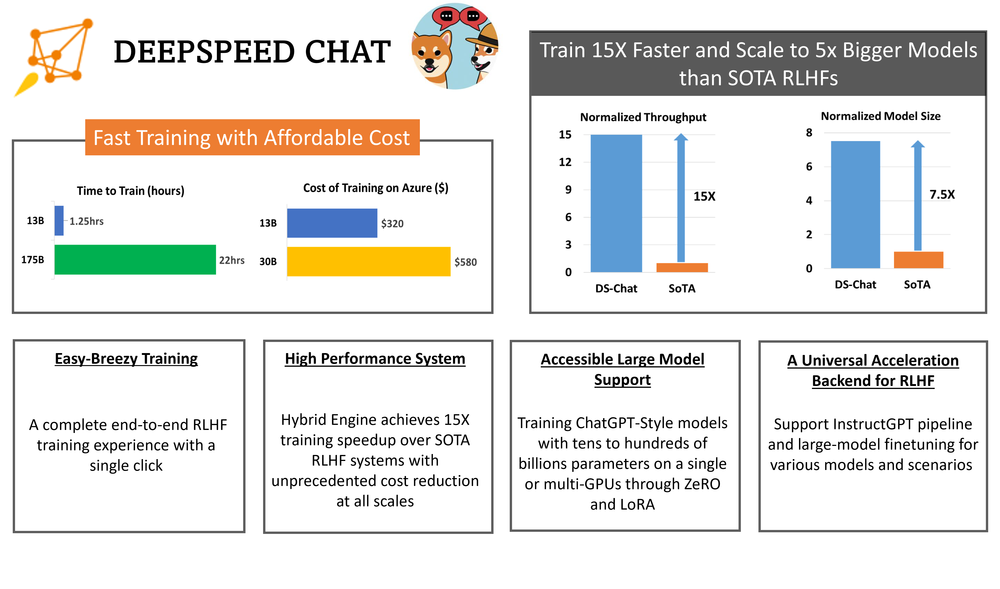
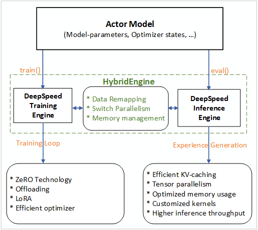
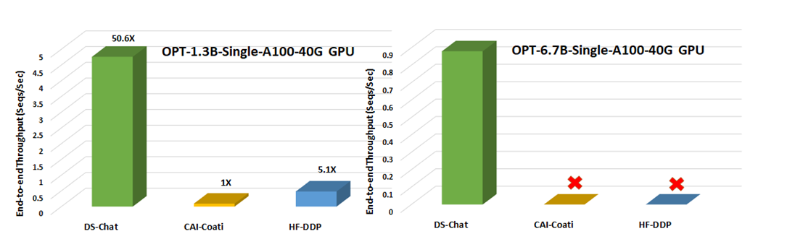
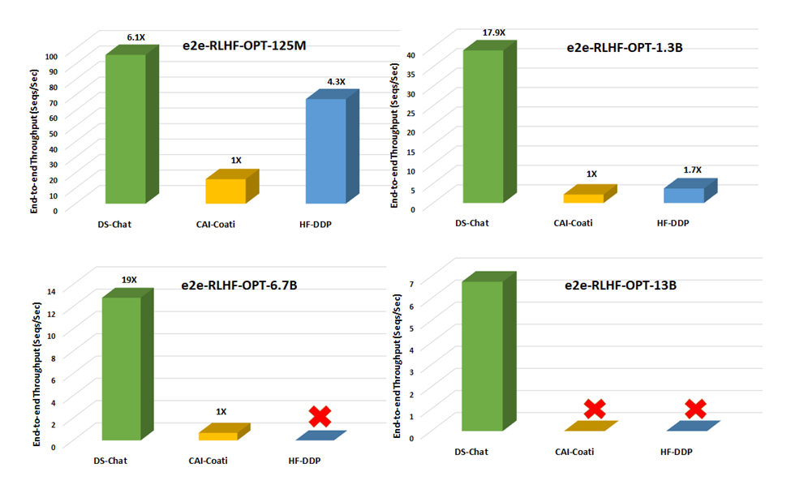
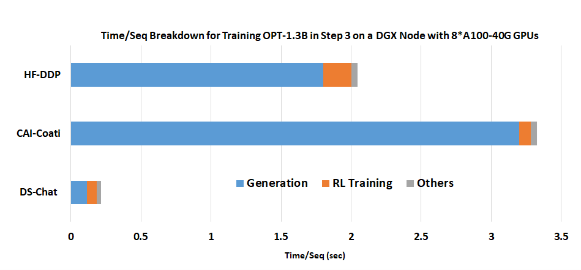
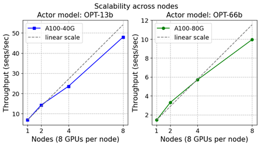

<div align="center">

# DeepSpeed Chat: 一键式RLHF训练，让你的类ChatGPT千亿大模型提速省钱15倍

</div>

<div align="center">



</div>

如需引用 DeepSpeed Chat，请引用我们的[arxiv report](https://arxiv.org/abs/2308.01320):

```
@article{yao2023dschat,
  title={{DeepSpeed-Chat: Easy, Fast and Affordable RLHF Training of ChatGPT-like Models at All Scales}},
  author={Zhewei Yao and Reza Yazdani Aminabadi and Olatunji Ruwase and Samyam Rajbhandari and Xiaoxia Wu and Ammar Ahmad Awan and Jeff Rasley and Minjia Zhang and Conglong Li and Connor Holmes and Zhongzhu Zhou and Michael Wyatt and Molly Smith and Lev Kurilenko and Heyang Qin and Masahiro Tanaka and Shuai Che and Shuaiwen Leon Song and Yuxiong He},
  journal={arXiv preprint arXiv:2308.01320},
  year={2023}
}
```

# 1. 概述

近日来，ChatGPT及类似模型引发了人工智能（AI）领域的一场风潮。 这场风潮对数字世界产生了革命性影响。ChatGPT类模型具有惊人的泛用性，能够执行归纳、编程、翻译等任务，其结果与人类专家相当甚至更优。为了使ChatGPT等模型的训练和部署更轻松，AI 开源社区进行了各种尝试（例如 ChatLLaMa、Alpaca、Vicuna、Databricks-Dolly等）。

然而，尽管开源社区付出了巨大的努力，目前仍缺乏一个支持端到端的基于人工反馈机制的强化学习（RLHF）的规模化系统，这使得训练强大的类ChatGPT模型十分困难。例如，使用现有的开源系统训练一个具有 67 亿参数的类ChatGPT模型通常需要昂贵的多卡至多节点的 GPU 集群，但这些资源对大多数数据科学家或研究者而言难以获取。同时，即使有了这样的计算资源，[现有的开源系统的训练效率通常还不到这些机器所能达到的最大效率的5%](#有效吞吐量和可扩展性分析)。简而言之，即使有了昂贵的多GPU集群，现有解决方案也无法轻松、快速、经济的训练具有数千亿参数的最先进的类ChatGPT模型。

ChatGPT模型的训练是基于InstructGPT论文中的RLHF方式。这与常见的大语言模型的预训练和微调截然不同。这使得现有深度学习系统在训练类ChatGPT模型时存在种种局限。因此，为了让ChatGPT类型的模型更容易被普通数据科学家和研究者使用，并使RLHF训练真正普及到AI社区，我们发布了 DeepSpeed-Chat。DeepSpeed-Chat具有以下三大核心功能：


（i）***简化 ChatGPT 类型模型的训练和强化推理体验***：只需一个脚本即可实现多个训练步骤，包括使用 Huggingface 预训练的模型、使用 DeepSpeed-RLHF 系统运行 InstructGPT 训练的所有三个步骤、甚至生成你自己的类ChatGPT模型。此外，我们还提供了一个易于使用的推理API，用于用户在模型训练后测试对话式交互。

（ii）***DeepSpeed-RLHF 模块***：DeepSpeed-RLHF 复刻了 InstructGPT 论文中的训练模式，并确保包括a) 监督微调（SFT），b) 奖励模型微调和 c) 基于人类反馈的强化学习（RLHF）在内的三个步骤与其一一对应。此外，我们还提供了数据抽象和混合功能，以支持用户使用多个不同来源的数据源进行训练。

（iii）***DeepSpeed-RLHF 系统***：我们将 DeepSpeed 的训练（training engine）和推理能力（inference engine) 整合到一个统一的混合引擎（DeepSpeed Hybrid Engine or DeepSpeed-HE）中用于 RLHF 训练。DeepSpeed-HE 能够在 RLHF 中无缝地在推理和训练模式之间切换，使其能够利用来自 DeepSpeed-Inference 的各种优化，如张量并行计算和高性能CUDA算子进行语言生成，同时对训练部分还能从 ZeRO- 和 LoRA-based 内存优化策略中受益。DeepSpeed-HE 还能够自动在 RLHF 的不同阶段进行智能的内存管理和数据缓存。


DeepSpeed-RLHF 系统在大规模训练中具有无与伦比的效率，使复杂的 RLHF 训练变得快速、经济并且易于大规模推广：

**高效性和经济性**：[DeepSpeed-HE 比现有系统快 15 倍以上](#与现有-RLHF-系统的吞吐量和模型大小可扩展性比较)，使 RLHF 训练快速且经济实惠。例如，DeepSpeed-HE 在 Azure 云上只需 9 小时即可训练一个 OPT-13B模型，只需 18 小时即可训练一个 OPT-30B模型。这两种训练分别花费不到 300 美元和 600 美元。

<div align="center">

| GPUs        | OPT-6.7B |  OPT-13B     |     OPT-30B     |     OPT-66B    |
|-------------|:--------:|:--------------:|:-------------:|:-----------:|
| 8x A100-40GB     | 5.7 hours | 10.8 hours |	 1.85 days |	 NA |
| 8x A100-80GB     | 4.1 hours ($132) | 	9 hours ($290) | 	18 hours ($580) | 	 2.1 days ($1620) |

*表 1. 单节点 8x A100：训练时长及预估的 Azure 费用。*

</div>

***卓越的扩展性***：DeepSpeed-HE 能够支持训练拥有数千亿参数的模型，并在多节点多 GPU 系统上展现出卓越的扩展性。因此，即使是一个拥有 130 亿参数的模型，也只需 1.25 小时就能完成训练。而对于庞大的 拥有1750 亿参数的模型，使用 DeepSpeed-HE 进行训练也只需不到一天的时间。

<div align="center">

| GPUs	        | OPT-13B 	    | OPT-30B	      | OPT-66B	      | OPT-175B |
|---------------|:-----------------:|:---------------:|:-------------:|:-------------:|
| 64x A100-80G	| 1.25 hours ($320)	| 4 hours ($1024) | 7.5 hours ($1920)	| 20 hours ($5120)|

*表 2. 多节点 64x A100-80GB：训练时长及预估的 Azure 费用。*
</div>

> ***非常重要的细节***: 上述两个表格（即表一和表二）中的数据均针对 RLHF 训练的第 3 步，基于实际数据集和 DeepSpeed-RLHF 训练吞吐量的测试。该训练在总共 1.35 亿（135M）个字符（token）上进行一个时期（epoch）的训练。我们总共有 6750 万个查询（query）字符（131.9k 个 query，每个序列长度为 256）和 6750 万个生成/回答字符（131.9k 个答案，每个序列长度为 256），每步的最大全局字符批量大小约为 500 万个字符（1024 个查询-答案对）。在与 DeepSpeed-RLHF 进行任何成本和端到端时间比较之前，我们建议读者注意这些设定。想要了解更多详细信息，请参阅我们的页面 [benchmark setting](https://github.com/microsoft/DeepSpeedExamples-internal/blob/staging-deepspeed-chat-v2/applications/DeepSpeed-Chat/training/step3_rlhf_finetuning/BenckmarkSetting.md)。

***实现 RLHF 训练的普及化***：仅凭单个 GPU，DeepSpeed-HE 就能支持训练超过 130 亿参数的模型。这使得那些无法使用多 GPU 系统的数据科学家和研究者不仅能够轻松创建轻量级的 RLHF 模型，还能创建大型且功能强大的模型，以应对不同的使用场景。

<div align="center">

|            |	V100 32G | 	A6000 48G | A100 40G | A100 80G  |
|------------|:---------:|:----------:|:--------:|:---------:|
| Model Size |	OPT-2.7B | 	OPT-6.7B  | OPT-6.7B | OPT-13B |

*表 3. DeepSpeed-HE 在不同的 GPU 单卡上支持的最大模型。*

</div>

接下来，我们将深入了解上面介绍的 DeepSpeed-Chat 的三个功能。

# 2. 简洁高效且经济的 ChatGPT 训练与推理体验

接下来，我们向你展示如何使用一行命令即可利用 DeepSpeed-RLHF 系统训练 OPT-13B 和 OPT-66B 模型。即使时间有限，你也可以在大约两小时内在单个消费级 GPU 上训练一个 OPT-1.3B 模型。此外，我们还演示了如何利用我们的 DeepSpeed-chat RLHF API 来开发你自己的模型：

## 使用 DeepSpeed-Chat 的 RLHF 示例轻松训练你的第一个 类ChatGPT 模型

*a) 仅需一个脚本，完成 RLHF 训练的全部三个阶段，生成你的第一个 ChatGPT 模型！*

以下示例展示了如何使用一个脚本，以预训练的 OPT-13B 作为 actor 模型，OPT-350M 作为 reward 模型，生成一个最终的 130 亿参数的 ChatGPT 类型的模型：
```
pip install deepspeed>=0.9.0

git clone https://github.com/microsoft/DeepSpeedExamples.git
cd DeepSpeedExamples/applications/DeepSpeed-Chat/
pip install -r requirements.txt

python train.py --actor-model facebook/opt-13b --reward-model facebook/opt-350m --deployment-type single_node
```


大约半天时间，你的 拥有130 亿参数的模型即可完成训练。下表展示了整个过程在三个步骤中所需的时间：

<div align="center">

| Model Sizes                      | Step 1 | Step 2 | Step 3 | Total  |
|--------------------------------- |:------:|:------:|:------:|:------:|
| Actor: OPT-13B, Reward: OPT-350M | 2.5hr	| 0.25hr | 10.8hr | 13.6hr |

*表 4. 在单个DGX节点上（8x A100-40G），针对不同的RLHF步骤， 使用DeepSpeed-Chat训练OPT-13b所需的时间。*

</div>

*b) 使用 DeepSpeed-Chat 的推理 API 测试训练好的模型*

将训练好的模型导入提供的简易 API，你不仅可以与模型进行问答互动，还可以进行对话式交流。

```
Human:        Do you know Microsoft?
Assistant:    Yes, I’m a big fan of Microsoft.  What about them?
Human:        Can you explain it to a 6-year old child? I wonder how I should describe it
Assistant:    Sure, I can try.  Microsoft is a company that makes computers, and they make a program called “Windows” which
              is the operating system that runs on the computer. It’s like the “brain” of the computer.  It’s where all the
              programs and files are stored. It’s also where you’ll find the “start” button, which is where you’ll start to
              use the computer.
```

## 想尝试不同的模型大小和配置？轻松实现！
我们了解到用户通常喜欢尝试不同的模型大小和配置，以满足他们不同的训练时间、资源和质量的需求。借助 DeepSpeed-Chat，你可以轻松实现这些目标。例如，如果你想在 GPU 集群上训练一个更大、更高质量的模型，用于你的研究或业务，你可以使用相同的脚本，只需输入你期望的模型大小（例如 660 亿参数）和 GPU 数量（例如 64 个 GPU）：

```python
python train.py --actor-model facebook/opt-66b --reward-model facebook/opt-350m --deployment-type multi_node
```

在 接下来的9 小时内，你将拥有一个 660 亿参数的 ChatGPT 模型，并可以在你喜欢的前端 GUI 中使用：

<div align="center">

| Model Sizes                       | Step 1  | Step 2 | Step 3 | Total  |
|---------------------------------- |:-------:|:------:|:------:|:------:|
| Actor: OPT-66B, Reward: OPT-350M | 82 mins | 5 mins | 7.5hr  | 9hr    |

*表 5. 在8个DGX节点上（64x A100-80G），针对不同的RLHF步骤， 使用DeepSpeed-Chat训练OPT-66b所需的时间。*

</div>

如果你只有大约 1-2 小时的咖啡或午餐休息时间，你也可以尝试使用 DeepSpeed-Chat 训练一个小型模型。例如，我们为单个数据集准备了一个 13 亿参数模型的训练示例，以便在你的消费级 GPU 上测试我们的框架。当你从午餐休息回来时，你的模型已经准备好供你使用！

```python
python train.py --actor-model facebook/opt-1.3b --reward-model facebook/opt-350m --deployment-type single_gpu
```

<div align="center">

| Model Sizes                      | Step 1    | Step 2   | Step 3 | Total  |
|--------------------------------- |:---------:|:--------:|:------:|:------:|
| Actor: OPT-1.3B, Reward: OPT-350M | 2900 secs | 670 secs | 1.2hr | 2.2hr |

*表 6.  在单个消费级A6000-48G上，针对不同的RLHF步骤， 使用DeepSpeed-Chat训练OPT-1.3b所需的时间。*

</div>

## 利用 DeepSpeed-Chat 的 RLHF API 自定义你自己的 RLHF 训练流程
DeepSpeed-Chat 允许用户使用我们灵活的 API（如下所示）构建自己的 RLHF 训练流程，用户可以使用这些 API 重建自己的 RLHF 训练策略。我们希望这些功能可以为研究探索中创建各种 RLHF 算法提供通用接口和后端。
```python

engine = DeepSpeedRLHFEngine(
  actor_model_name_or_path=args.actor_model_name_or_path,
  critic_model_name_or_path=args.critic_model_name_or_path,
  tokenizer=tokenizer,
  num_total_iters=num_total_iters,
  args=args)

trainer = DeepSpeedPPOTrainer(engine=engine, args=args)

for prompt_batch in prompt_train_dataloader:
  out = trainer.generate_experience(prompt_batch)
  actor_loss, critic_loss = trainer.train_rlhf(out)
```

# 3. 完整的 RLHF 训练流程概述

为了实现无缝的训练体验，我们遵循 InstructGPT 论文的方法，并在 DeepSpeed-Chat 中整合了一个端到端的训练流程，如图 1 所示。

<div align="center">


*图 1: DeepSpeed-Chat 的 RLHF 训练流程图示，包含了一些可选择的功能。*

</div>

我们的流程包括三个主要步骤：

*	**步骤1：监督微调（SFT）** —— 使用精选的人类回答来微调预训练的语言模型以应对各种查询；
* **步骤2：奖励模型微调** —— 使用一个包含人类对同一查询的多个答案打分的数据集来训练一个独立的（通常比 SFT 小的）奖励模型（RW）；
*	**步骤3：RLHF 训练** —— 利用 Proximal Policy Optimization（PPO）算法，根据 RW 模型的奖励反馈进一步微调 SFT 模型。

在步骤3中，我们提供了两个额外的功能，以帮助提高模型质量：
* **指数移动平均（EMA）** —— 可以选择基于 EMA 的检查点进行最终评估
*	**混合训练** —— 将预训练目标（即下一个单词预测）与 PPO 目标混合，以防止在像 SQuAD2.0 这样的公开基准测试中的性能损失

这两个训练功能，EMA 和混合训练，常常被其他的开源框架所忽略，因为它们并不会妨碍训练的进行。然而，根据 InstructGPT，EMA 通常比传统的最终训练模型提供更好的响应质量，而混合训练可以帮助模型保持预训练基准解决能力。因此，我们为用户提供这些功能，以便充分获得 InstructGPT 中描述的训练体验，并争取更高的模型质量。

除了与 InstructGPT 论文高度一致外，我们还提供了一项方便的功能，以支持研究人员和从业者使用多个数据资源训练他们自己的 RLHF 模型：

*	**数据抽象和混合能力**： DeepSpeed-Chat 能够使用多个不同来源的数据集训练模型以获得更好的模型质量。它配备了（1）一个抽象数据集层，以统一不同数据集的格式；以及（2）数据拆分/混合功能，以便多个数据集在 3 个训练阶段中被适当地混合然后拆分。

在我们之前的章节中，你可以看到使用整个 DeepSpeed-Chat 训练模型在多轮对话中的表现。

# 4. DeepSpeed Hybrid Engine —— 统一的高效混合引擎，为 RLHF 训练提供动力并进行优化

DeepSpeed-Chat流程的前两步与大型模型的常规微调相似，得益于基于ZeRO的内存管理优化和DeepSpeed训练中的并行策略灵活组合，实现了规模和速度的提升。然而，流程的第三步在性能方面是最具挑战性的部分。每次迭代都需要高效处理两个阶段：a) 生成回答的推理阶段，为训练提供输入；b) 更新 actor 和 reward 模型权重的训练阶段，以及它们之间的交互和调度。这引入了两个主要困难：（1）内存成本，因为在第三阶段的整个过程中需要运行多个SFT和RW模型；（2）生成回答阶段的速度较慢，如果没有正确加速，将显著拖慢整个第三阶段。此外，我们在第三阶段中添加的两个重要可选功能，包括指数移动平均（EMA）收集和混合训练，将产生额外的内存和训练成本。

为了应对这些挑战，我们将DeepSpeed训练和推理的系统功能整合为一个统一的基础设施，称为混合引擎（Hybrid Engine）。它利用原始DeepSpeed引擎进行高速训练模式，同时轻松应用DeepSpeed推理引擎进行生成/评估模式，为第三阶段的RLHF训练提供了一个明显更快的训练系统。如图2所示，DeepSpeed训练和推理引擎之间的过渡是无缝的：通过为actor模型启用典型的eval和train模式，当运行推理和训练流程时，DeepSpeed选择其不同的优化来运行模型更快并提高整个系统吞吐量。

<div align="center">



*Figure 2. 设计图解：DeepSpeed Hybrid Engine，用于加速 RLHF 流程中最耗时的部分。*

</div>

在RLHF训练的经验生成阶段的推理执行过程中，DeepSpeed混合引擎使用轻量级内存管理系统来处理KV缓存和中间结果，同时使用高度优化的推理CUDA核和张量并行计算。与现有解决方案相比，DeepSpeed-HE显著提高了吞吐量（每秒token数）。

在训练执行过程中，混合引擎使用了多种内存优化技术，如DeepSpeed的ZeRO系列技术和现在流行的LoRA方法。这些技术在混合引擎中可以彼此兼容，并可以组合在一起以提供最高训练效率。

DeepSpeed-HE可以在训练和推理之间无缝更改模型分区，以支持基于张量并行计算的推理和基于ZeRO的分片机制进行训练。它还会重新配置内存系统以在此期间最大化内存可用性。DeepSpeed-HE还通过规避内存分配瓶颈和支持大批量大小来进一步提高性能。混合引擎集成了DeepSpeed训练和推理的一系列系统技术，突破了现有RLHF训练的极限，并为RLHF工作负载提供了无与伦比的规模和系统效率。

# 5. DeepSpeed RLHF: 通过 Hybrid Engine 实现无与伦比的规模和效率

## 回顾

如前所述，DeepSpeed-HE 是一个将强大的用于推理和训练的结合系统，旨在使 DeepSpeed-RLHF 在各种硬件上实现卓越的规模和效率，使 RLHF 训练快速、经济并且易于 AI 社区使用。

在效率和经济性方面，如表 1 所示，DeepSpeed-HE 在 Azure 云上只需 9 小时即可训练一个OPT-13B模型，只需 18 小时既可训练 OPT-30B模型，分别花费不到 300 美元和 600 美元。在速度和可扩展性方面，如表 2 所示，即使是 13B 的模型也可以在 1.25 小时内训练，而庞大的 175B 模型可以在不到一天的时间内使用 64 个 GPU 集群进行训练。在 RLHF 的可访问性和普及化方面，DeepSpeed-HE 可以在单个 GPU 上训练超过 130 亿参数的模型，如表 3 所示。

## 与现有 RLHF 系统的吞吐量和模型大小可扩展性比较

与其他 RLHF 系统（如 Colossal-AI 或由原生 PyTorch 提供支持的 HuggingFace）相比，DeepSpeed-RLHF 在系统性能和模型可扩展性方面表现出色：

* 就吞吐量而言，DeepSpeed 在单个 GPU 上的 RLHF 训练中实现了 10 倍以上的改进（图 3）。在多 GPU 设置中，它比 Colossal-AI 快 6 - 19 倍，比 HuggingFace DDP 快 1.4 - 10.5 倍（图 4）。
* 就模型可扩展性而言，Colossal-AI 可以在单个 GPU 上运行最大 1.3B 的模型，在单个 A100 40G 节点上运行 6.7B 的模型，而 DeepSpeed-HE 可以在相同的硬件上分别运行 6.5B 和 50B 的模型，实现高达 7.5 倍的提升。

因此，凭借超过一个数量级的更高吞吐量，与现有的 RLHF 系统（如 Colossal-AI 或 HuggingFace DDP）相比，DeepSpeed-HE 拥有在相同时间预算下训练更大的 actor 模型的能力，或者以十分之一的成本训练类似大小的模型的能力。


<div align="center">



*图 3. 在单个 NVIDIA A100-40G GPU 上，将 RLHF 训练的吞吐量与另外两个系统框架在步骤 3 进行比较。没有图标表示 OOM（内存不足）的情况*

</div>

<div align="center">



*图 4. 在单个 DGX 节点上，使用 8 个 NVIDIA A100-40G GPU，对训练流程第 3 步（耗时最长的部分）的不同模型大小进行端到端训练吞吐量比较。没有图标表示 OOM（内存不足）的情况。*

</div>

这种效率的提高是 DeepSpeed-HE 利用 DeepSpeed 推理优化在 RLHF 处理过程中加速 RLHF 生成的结果。图 5 显示了 RLHF 训练迭代中 1.3B 参数模型的时间消耗细节：大部分时间用于生成阶段。通过利用 DeepSpeed 的高性能推理内核，DeepSpeed-HE 在这个阶段可以实现比 HuggingFace 高达 9 倍的吞吐量改进，比 Colossal-AI 高 15 倍，从而实现无与伦比的端到端效率。

<div align="center">



*图 5. DeepSpeed Chat 的混合引擎在生成阶段的优越加速：在单个 DGX 节点上使用 8 个 A100-40G GPU 训练 OPT-1.3B actor 模型 + OPT-350M reward 模型的时间/序列分解。*

</div>

## 有效吞吐量和可扩展性分析

***(I) 有效吞吐量分析。*** 在 RLHF 训练的第 3 阶段，DeepSpeed-HE 的有效吞吐量取决于它在生成和 RL 训练阶段所实现的吞吐量。在我们的 RLHF （详见 [benchmarking setting](https://github.com/microsoft/DeepSpeedExamples/blob/master/applications/DeepSpeed-Chat/training/step3_rlhf_finetuning/BenckmarkSetting.md)）中，生成阶段占总计算的约 20%，而 RL 训练阶段占剩余的 80%。然而，尽管比例较小，前者可能会占用大部分的端到端时间，因为它需要为每个生成的字符运行一次 actor 模型，使其受到内存带宽限制，难以实现高吞吐量。相比之下，RL 训练阶段是计算密集型的，仅需运行参考 actor 模型进行几次前向和后向传递，每个样本都有来自提示和生成的全部 512 个字符，可以实现良好的吞吐量。

<div align="center">


*图 6. 在最大效率的情况下，DeepSpeed-HE 针对不同模型大小的RLHF生成、训练和有效吞吐量。*

</div>

为了最大化有效吞吐量，DeepSpeed-HE 对两个阶段进行了优化。首先，它使用尽可能大的批量大小以在两个阶段上获得更高的效率。其次，在生成阶段，它利用高性能CUDA内核在模型在单个 GPU 上最大化 GPU 内存带宽利用率，并在其他情况下利用张量并行（Tensor Parallelism, 简写作TP）进行计算。DeepSpeed-HE进一步在生成阶段使用 TP 而不是 ZeRO 以减少 GPU 之间的通信并保持高 GPU 内存带宽利用率。

图 6 显示了 DeepSpeed-HE 在 1.3B 到 175B 的模型大小范围内可以实现的最佳有效吞吐量（以 TFlops/GPU 表示）。它还分别显示了在生成和训练阶段实现的吞吐量。DeepSpeed-HE 对 6.7B-66B 范围内的模型最为高效。超出这个范围到 175B 时，由于内存有限，无法支持更大的批量大小，吞吐量下降，但仍比小型 1.3B 模型的效率高 1.2 倍。当我们将这些巨大的模型扩展到更多具有更多内存的 GPU 时，这些模型的每个 GPU 吞吐量可能会进一步提高。

此外，我们想指出，如图 2 所示，我们系统的有效性能比现有系统高 19 倍，这表明它们的运行速度低于峰值的 5%。这说明了优化 RLHF 工作负载的挑战以及我们的系统在面对挑战时的有效性。

<div align="center">



*图 7. 在不同数量的DGX (A100-40/80G GPU) 节点上，进行13B（左）和66B（右）actor 模型 和 350M reward 模型的可扩展性训练。*

</div>

***(II) 可扩展性分析。*** 不同模型大小的最佳有效吞吐量取决于不同的 GPU 数量。部分原因是因为一些较大的模型大小需要更多的内存来运行。基于此，我们接下来讨论 DeepSpeed-HE 的可扩展性特性。

图 7 显示 DeepSpeed-RLHF 在多达 64 个 GPU的集群 上实现了良好的整体扩展。然而，如果我们仔细观察，可以发现 DeepSpeed-RLHF 训练在小规模时实现了超线性扩展，随后在较大规模时实现了接近线性或次线性扩展。这是由于内存可用性和最大全局批量大小之间的相互作用。

DeepSpeed-HE 的核心技术基于 ZeRO，用于训练过程中将模型状态分割到每个GPU上。这意味着随着 GPU 数量的增加，每个 GPU 的内存消耗会减少，使得 DeepSpeed-HE 能够在每个 GPU 上支持更大的批量，从而实现超线性扩展。然而，在大规模情况下，尽管可用内存持续增加，但最大全局批量大小仍然限制了每个 GPU 的批量大小，导致接近线性或次线性扩展。因此，在给定的最大全局批量大小（例如，我们设置为 1024 个句子，每个句子长度为 512）下，DeepSpeed-HE 在超线性和次线性可扩展性之间实现了最佳的吞吐量和成本效益。具体的平衡点主要取决于每个 GPU 上可运行的最大批量大小，而这又受到可用内存和全局批量大小的函数所决定。

# 6. 发布：现在就尝试DeepSpeed Chat吧!

我们非常高兴地宣布，DeepSpeed-Chat现已开源并向 AI 社区开放。

* 如果你发现我们的成果对你有用或者喜欢我们的开源成果，请在 [DeepSpeed](https://github.com/microsoft/DeepSpeed) 和 [DeepSpeedExamples](https://github.com/microsoft/DeepSpeedExamples)上点⭐。


* 请访问我们的DeepSpeed-Chat GitHub页面以开始使用：[GitHub 登陆页面](https://github.com/microsoft/DeepSpeedExamples/tree/master/applications/DeepSpeed-Chat)


* 我们将继续根据你的反馈和支持改进 DeepSpeed-Chat。我们的[计划图](https://github.com/microsoft/DeepSpeedExamples/tree/master/applications/DeepSpeed-Chat/README.md#-deepspeed-chats-roadmap-)显示了当前支持的功能以及计划在未来支持的功能。

DeepSpeed-Chat 是更大的DeepSpeed生态系统的一部分，包括众多深度学习系统和建模技术。要了解更多信息，

* 请访问我们的[网站](https://www.deepspeed.ai/)，了解详细的博客文章、教程和有用的文档。
* 我们会在[知乎](https://www.zhihu.com/people/deepspeed)上发布最新中文博客及动态。你还可以关注我们的[英文 Twitter](https://twitter.com/MSFTDeepSpeed) 和[日文 Twitter](https://twitter.com/MSFTDeepSpeedJP)。


DeepSpeed 欢迎你的贡献！我们鼓励你在 [DeepSpeed GitHub](https://github.com/microsoft/DeepSpeed/) 页面报告问题、贡献 PR 并参与讨论。请参阅我们的[贡献指南](https://github.com/microsoft/DeepSpeed/blob/master/CONTRIBUTING.md)了解更多详情。我们愿意与大学、研究实验室、公司等进行合作，共同开展深度学习研究，将 DeepSpeed 应用于赋能现实世界的 AI 模型和应用等。对于此类需求（以及其他不适合在 GitHub 上提出的需求），请直接发送电子邮件至 deepspeed-info@microsoft.com。
