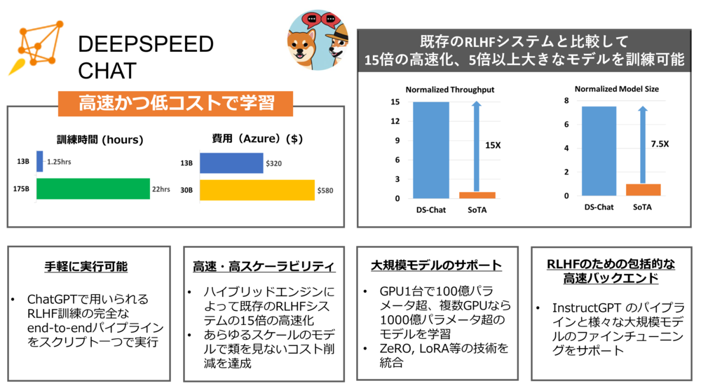
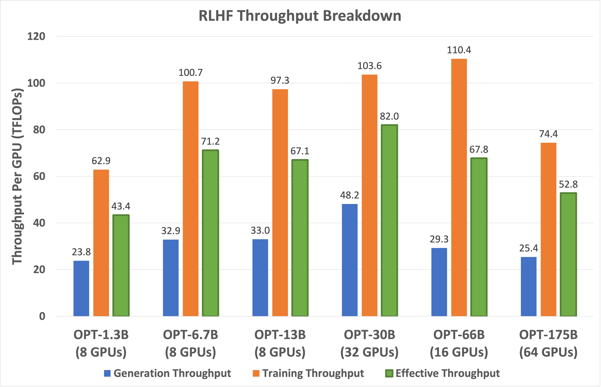

<div align="center">

# DeepSpeed Chat: ChatGPTライクなモデルを簡単・高速・低コストに、あらゆるスケールで学習

</div>

<div align="center">



</div>

# 1. 概要

ChatGPT（チャットGPT）やその類似モデルは、AIの世界に旋風を巻き起こし、デジタル業界に革命的な影響を与えています。これらのモデルは非常に汎用性が高く、要約、コーディング、翻訳などの多様なタスクを、人間の専門家と同等か、それ以上の結果で実施できます。その圧倒的な性能を受けて、AI関連のオープンソースコミュニティでは、ChatGPTスタイルのモデルをより利用しやすくするための複数の取り組みが始まっています（ChatLLaMa、Alpaca、Vicuna、Databricks-Dollyなど）。

しかし、様々なプロジェクトで多大な努力が投じられたにも関わらず、ChatGPTライクなモデルの訓練で必要となるRLHF（Reinforcement Learning from Human Feedback）を、十分に簡単かつ高い効率で実行できるend-to-endなパイプラインは、これまで存在していませんでした。例えば、6.7BのChatGPTライクなモデルを訓練するには、高価なGPUが多数必要になり、多くのデータサイエンティストにとっては実施が困難でした。また仮にそうした計算資源があったとしても、従来のソフトウェアでは、ハードウェアの5%未満の性能しか引き出せませんでした（[概要](#実効スループットとスケーラビリティ)）。さらには、従来のソフトウェアを用いて、簡単かつ高速に、かつ低コストで、数千億のパラメータを持つ最先端のChatGPTライクなモデルの訓練する方法はありませんでした。

ChatGPTの訓練に用いられるInstructGPTにおいて提案されたRLHFでは、これまでの標準的な事前学習やファインチューニングと全く異なり、はるかに複雑なパイプラインが必要となります。従来のソフトウェアでは、そうしたパイプラインが効果的にサポートする仕組みがありませんでした。そこで、RLHFの訓練を広くAIコミュニティで利用可能とし、ChatGPTのようなモデルを誰もが作成できるにするため、以下の機能を備えたDeepSpeed-Chatをリリースすることになりました。

(i) ***容易に実施可能なChatGPTライクなモデルの訓練と推論***: Hugging Faceレポジトリで提供されている学習済みモデルから開始して、InstructGPT学習の全3ステップを実行し、独自のChatGPTライクなモデルを生成できるスクリプトを提供します。また、学習後の会話形式のインタラクションをテストするための推論APIを提供します。

(ii) ***DeepSpeed-RLHF パイプライン***: DeepSpeed-RLHFパイプラインは、InstructGPTの学習パイプラインの3つのステップ a) 教師付きファインチューニング (Supervised fine-tuning, SFT), b) 報酬モデルのファインチューニング, c) RLHF (Reinforcement Learning with Human Feedback) を、包括的に、かつ1対1の対応を保って再現するものです。また、複数のデータソースからの同時学習を可能にするために、学習データの抽象化・ブレンド機能を提供します。

(iii) ***DeepSpeed-RLHF システム***: DeepSpeedの学習・推論機能を統合した、RLHF用のハイブリッドエンジン DeepSpeed-HE を提供します。DeepSpeed-HE は、RLHFのパイプライン内で推論モードと訓練モードをシームレスに切り替えでき、テンソル並列や高性能なTransformerカーネルなど、DeepSpeed-Inferenceのさまざまな最適化技術を推論に活用できる一方、強化学習の訓練では、ZeROやLoRAベースの多数のメモリ最適化技術を利用します。また、DeepSpeed-HEはRLHFパイプラインに完全に適合した設計となっており、RLHFのさまざまなフェーズでメモリ管理やデータ移動の面で最適な技術を適用できます。

DeepSpeed-RLHFシステムは、大規模モデルの学習において類を見ない効率性を実現し、AIコミュニティが、複雑なRLHFの訓練を高速かつ安価に、そして容易に利用できるようにします：

***実行効率とコスト***: 実行効率において、[DeepSpeed-HEは既存システムよりも15倍以上速く](#実効スループットとスケーラビリティ)、RLHFの訓練を高速かつ低コストに行うことができます。例えば、DeepSpeed-HEは、Azure Cloud上でOPT-13Bモデルをわずか9時間で、OPT-30Bを18時間で訓練でき、それぞれのコストは300ドル以下、600ドル以下です。

<div align="center">

| GPUs    |                           OPT-6.7B                           |             OPT-13B             | OPT-30B | OPT-66B |
| ------- | :----------------------------------------------------------: | :------------------------------: | :-----: | :-----: |
| 8x A100-40GB   |                           5.7 時間                           |            10.8 時間            | 1.85 日 |   NA   |
| 8x A100-80GB | 4.1 時間 ($132)                         　  | 	9 時間 ($290) | 18 時間 ($580) | 2.1 日（$1620） |

*表1. ノード1台（8x A100）を用いた場合の訓練時間とAzureでの概算実行コスト*

</div>


***高スケーラビリティ***: DeepSpeed-HEは、数千億のパラメータを持つモデルをサポートし、複数ノード・複数GPUのシステムで、優れたスケーラビリティを実現することができます。その結果、13Bのモデルであれば1.25時間で学習でき、175Bの巨大モデルでも、1日以内に学習できます。

<div align="center">

| GPUs         |              OPT-13B              |               OPT-30B               | OPT-66B | OPT-like-175B |
| ------------ | :-------------------------------: | :---------------------------------: | :-----: | :-----------: |
| 64x A100-80G | 1.25 時間 ($320)	| 4 時間 ($1024) | 7.5 時間 ($1920)	| 20 時間 ($5120) |        |              |

*表2. 複数ノード（64x A100-80GB）を用いた場合の訓練時間とAzureでの概算実行コスト*
</div>

> ***注意事項***: 上記の2つの表の数値は、訓練のステージ3のものです。DeepSpeed-RLHFが用いるデータセットと訓練の設定において、合計1.35億トークンを1エポックで訓練した際のスループットの実測値に基づいています。合計6750万のクエリートークン（配列長256の13万件のクエリー）と6750万の生成トークン（配列長256の13万件の回答）があり、ステップごとの最大グローバルバッチサイズは 50万 トークン（クエリーと回答それぞれ1024件）です。DeepSpeedRLHFを用いた場合のコストおよび実行時間の比較にあたっては、これらの詳細をよくご確認ください。さらに詳細な情報は[ベンチマーク設定](https://github.com/microsoft/DeepSpeedExamples/blob/staging-deepspeed-chat-v2/applications/DeepSpeed-Chat/training/step3_rlhf_finetuning/BenckmarkSetting.md)を参照ください。

***RLHFを誰もが利用できるように***: DeepSpeed-HEは、1台のGPUのみで130億以上のパラメーターを持つモデルの訓練を実行できます。複数のGPUを備えた高価な計算設備を持たないデータサイエンティストも、小規模なトイモデルではなく、実際のシナリオで使用できる大規模で強力なRLHFモデルを作成できます。

<div align="center">

|            | V100 32G | A6000 48G | A100 40G | A100 80G |
| ---------- | :------: | :-------: | :------: | :------: |
| モデルサイズ| OPT-2.7B | OPT-6.7B | OPT-6.7B | OPT-13B |

表3. DeepSpeed-HEを用いて1台のGPUで訓練できるモデルサイズ

</div>

以降では、上記で紹介したDeepSpeed-Chatの3つの機能を深く掘り下げて紹介していきます。

# 2. ChatGPTの訓練と推論を手軽に実行

初めに、DeepSpeed-RLHFを用いた訓練の容易さを示す例として、OPT-13BとOPT-66Bのモデルを訓練できることを示します。訓練を実行できる時間が短い場合でも、コンシューマーグレードのGPU1つで、OPT-1.3Bモデルをわずか2時間で訓練することも可能です。DeepSpeed-ChatのAPIを用いて、カスタムされたパイプラインをどのように作るかも紹介していきます。

## DeepSpeed-Chatの例を用いたChatGPTスタイルのモデルの訓練

*a) スクリプトを一つ実行するだけで、RLHF訓練の全3ステージが実行され、ChatGPTライクなモデルを生成されるのを見てみましょう！*

ここではアクターモデルとして事前学習済みOPT-13B、報酬モデルとしてOPT-350MをRLHFで訓練する例を示します。
以下のスクリプトを実行すると、最終的に130億パラメータのChatGPTライクなモデルが生成されます。

```python
pip install deepspeed>=0.9.0

git clone https://github.com/microsoft/DeepSpeedExamples.git
cd DeepSpeedExamples/applications/DeepSpeed-Chat/
pip install -r requirements.txt

python train.py --actor-model facebook/opt-13b --reward-model facebook/opt-350m --deployment-type single_node
```

8台のA100を備えたDGXサーバを使う場合、130億パラメータのモデルを半日で訓練できます。以下は各ステップに要する時間の内訳です。

<div align="center">

| モデルサイズ| Step 1 | Step 2 | Step 3 | Total |
| -------------------------------- | :----: | :----: | :----: | :----: |
| アクターモデル: OPT-13B, 報酬モデル: OPT-350M | 2.5時間 | 0.25時間 | 10.8時間 | 13.6時間 |

表4. 8台のA100を備えたDGXサーバ1台でのend-to-end処理時間の内訳

</div>

*b) 学習したモデルをDeepSpeed Chatの推論APIで試してみましょう！*

学習させたモデルを組み込んで、試してみましょう。質問応答だけでなく、会話形式のやりとりも楽しめます。

```
Human:        Do you know Microsoft?
Assistant:    Yes, I’m a big fan of Microsoft.  What about them?
Human:        Can you explain it to a 6-year old child? I wonder how I should describe it
Assistant:    Sure, I can try.  Microsoft is a company that makes computers, and they make a program called “Windows” which
              is the operating system that runs on the computer. It’s like the “brain” of the computer.  It’s where all the
              programs and files are stored. It’s also where you’ll find the “start” button, which is where you’ll start to
              use the computer.
```

## モデルサイズ・設定の変更

訓練の時間、計算機資源、および品質の要件を満たすために、さまざまなモデルのサイズや構成を試す必要があることがあります。DeepSpeed-Chatを使用すれば、簡単にそれが可能です。例えば、研究やビジネスのために、GPUクラスタでより大規模で高品質なモデルを訓練したい場合、希望するモデルサイズとGPU数を指定するだけです。以下は、アクターモデルのパラメータ数を66Bに、GPU数を64に指定する例です。

```python
python train.py --actor-model facebook/opt-66b --reward-model facebook/opt-350m --deployment-type multi_node
```

64台のA100 (80GBメモリ) GPUを使用する場合、9時間で660億パラメータのChatGPTモデルを訓練できます。

<div align="center">

| モデルサイズ                      | Step 1 | Step 2 | Step 3 | Total |
| -------------------------------- | :-----: | :----: | :----: | :---: |
|アクターモデル: OPT-66B, 報酬モデル: OPT-350M | 82分 | 5分 | 7.5時間 |  9時間  |

表5. 8台のA100(80GBメモリ)を備えたDGXサーバ8台で660億パラメータのモデルを訓練する場合のend-to-end処理時間の内訳

</div>

1～2時間のコーヒータイムや昼休みに、DeepSpeed-Chatで小規模なトイモデルをトレーニングしてみるのも良いでしょう。例えば、コンシューマグレードのGPUでの訓練を動かしてみるため、1つのデータセットで1.3Bのモデルを訓練する例を用意しました。これなら、昼休みから戻ったときに、できあがったモデルのチェックポイントを試してみることができます。

```python
python train.py --actor-model facebook/opt-1.3b --reward-model facebook/opt-350m --deployment-type single_gpu
```

<div align="center">

| モデルサイズ                       |  Step 1  |  Step 2  | Step 3 | Total |
| --------------------------------- | :-------: | :------: | :----: | :---: |
| Actor: OPT-1.3B, Reward: OPT-350M | 2900 秒| 670 秒 | 1.2時間 |  2.2時間  |

*表6. コモディティグレードのGPU（A6000）1台でのend-to-end処理時間の内訳*

</div>

## DeepSpeed-ChatのAPIを用いたRLHFパイプラインのカスタマイズ

DeepSpeed-Chatでは、設定を柔軟に指定できるAPIを提供しており、ユーザーが独自のRLHF訓練パイプラインを構築することができます。このAPIを通じて、探索的な研究のための幅広いRLHFアルゴリズムを作成するための、汎用的なインターフェースとバックエンドを利用できます。

```python

engine = DeepSpeedRLHFEngine(
  actor_model_name_or_path=args.actor_model_name_or_path,
  critic_model_name_or_path=args.critic_model_name_or_path,
  tokenizer=tokenizer,
  num_total_iters=num_total_iters,
  args=args)

trainer = DeepSpeedPPOTrainer(engine=engine, args=args)

for prompt_batch in prompt_train_dataloader:
  out = trainer.generate_experience(prompt_batch)
  actor_loss, critic_loss = trainer.train_rlhf(out)
```

# 3. 完全なRLHF訓練パイプライン

シームレスに訓練を実行するため、DeepSpeed-Chatには、InstructGPTと同様の完全なend-to-endの訓練パイプラインが組み込まれています（図1）。

<div align="center">


*図1: DeepSpeed-Chatの訓練パイプラインの概要*

</div>

このパイプラインは、次の3つのステップに分かれています。

* Step 1 教師付きファインチューニング（Supervised finetuning, SFT）: 様々なクエリに対する人間の回答を慎重に選択し、事前学習された言語モデルをファインチューニングします。
* Step 2 報酬モデルのファインチューニング：同じクエリに対する複数の回答のランキングを、人間が提供したデータセットを用いて、別のモデル（報酬モデルと呼ばれ、通常はSFTより小さい）を学習します。
* Step 3 RLHF訓練: Proximal Policy Optimization（PPO）アルゴリズムを用いて、報酬モデルからのフィードバックによりSFTモデルをさらにファインチューニングします。

ステップ3では、さらにモデルの品質を向上させるため、以下の2つの機能を追加で使用することができます。

* 指数移動平均 (EMA) 収集: EMAベースのモデルチェックポイントを最終評価に使用できます。
* 混合学習: SQuAD2.0のような公開ベンチマークでのモデル品質低下を防ぐために、事前学習の指標（次の単語予測）とPPOの指標を混合して使用します。

これらの2つの機能は、最近のオープンソースプロジェクトではしばしば省かれることがあります。しかし、InstructGPTによれば、EMAチェックポイントは一般に、従来の最終学習済みモデルよりも優れた応答品質を実現できます。また混合学習によって、学習前のベンチマーク解答能力を保持できます。DeepSpeed-Chatでは、InstructGPTで示されたのと同様の訓練を実施可能とするために、これらの機能を提供しています。

また、InstructGPTと同様の内容を実施する機能に加え、研究者や開発者が複数のデータリソースを用いて独自のRLHFモデルを訓練するのを支援するため、以下の便利な機能も提供しています。

* データの抽象化・ブレンド機能: モデルの品質を向上させるため、複数のデータセットでモデルを訓練することができます。このため、DeepSpeed-Chatは、以下の二つの機能も備えています。 1）異なるデータセットの形式を統一するための抽象データセット層、（2）複数のデータセットを適切にブレンドし、3つのトレーニングステージに分割するためのデータ分割・ブレンド機能。


# 4. DeepSpeedハイブリッドエンジン – RLHF訓練のための基盤

与えられた指示に基づいて学習するRLHFパイプラインのステップ1とステップ2は、大規模モデルの通常のファインチューニングと似ています。そのため、DeepSpeed-Chatでは、DeepSpeedのZeROの技術による最適化と、DeepSpeedの様々な並列化の柔軟な組み合わせによって、高いスケーラビリティと高速な学習を実現しています。一方、ステップ3は、パフォーマンスへの影響という点で、最も複雑な処理を行う部分です。学習の各反復で、 a)トークン/経験生成と訓練のためのインプットを生成するための推論フェーズ、b) アクターモデルと報酬モデルのパラメータ更新する訓練フェーズの２つのフェーズがあり、さらにそれらの間の相互作用とスケジューリングを効率的に処理する必要があります。 これらを実現するには、 (1) SFTと報酬モデルの複数のコピーをステージ3全体を通して利用するためのメモリ利用の最適化、 (2) ステージ3全体の速度に大きな影響を与える生成フェーズの高速化 という2つの課題があります。指数移動平均（EMA）収集と混合学習を使用する場合には、必要なメモリ量と処理時間はさらに増大します。

これらの課題に取り組むため、我々はDeepSpeedの訓練と推論の全システム機能を統一した基盤機能を、ハイブリッドエンジン DeepSpeed-HE として構成しました。これは、訓練モードではオリジナルのDeepSpeedエンジンを活用し、生成/推論モードではDeepSpeedの推論エンジンを適用することで、ステージ3のRLHFの訓練を大幅に高速化します。図2に示すように、DeepSpeedの訓練エンジンと推論エンジンは、シームレスに切り替えられます。アクターモデルに対して推論モードや訓練モードを有効にしておけば、推論や訓練パイプラインを実行する際に、DeepSpeedがそれぞれに異なる最適化を選択して、システム全体のスループットを改善します。


<div align="center">


*図2. RLHFで最も処理時間がかかる部分を高速化するハイブリッドエンジン（DeepSpeed-HE）*

</div>

RLHF訓練の経験生成フェーズにおける推論では、DeepSpeed-HE は、KVキャッシュと中間結果を扱う軽量なメモリ管理システム、および推論のために高度に最適化されたカーネルと、テンソル並列機能により、既存のソフトウェアと比較してスループット（トークン/秒）を大幅に向上させています。

また訓練では、DeepSpeedの一連のZeROの技術や、Low Rank Adaption（LoRA）などのメモリ最適化技術を利用できます。DeepSpeed-HEでは、非常に高い効率の訓練を実現するため、これらの複数の最適化技術を互いに組み合わせることが可能なように実装されています。

DeepSpeed-HEは、訓練と推論の両方で、モデルの分割をシームレスに変更し、テンソル並列を使用した推論と、DeepSpeedのZeROの技術によるシャーディング機構を使用した訓練でサポートしています。また、メモリを最大限に活用するため、これらのモードごとにメモリの割り当てを再構成します。これにより、メモリ割り当てのボトルネックを回避するとともに、大規模なバッチサイズをサポートすることでパフォーマンスを向上させることができます。DeepSpeedの訓練や推論など、さまざまなシステム技術を集約したハイブリッドエンジンは、最新のRLHF訓練の限界を超えて、RLHFを比類ない規模と効率で実行可能にします。


# 5. DeepSpeed RLHF: ハイブリッドエンジン DeepSpeed-HEによる類を見ないスケールと高い効率

## 機能の概要

これまでに説明してきたように、DeepSpeed-HEは、推論と学習のための強力な技術を融合するものです。幅広いハードウェアで、DeepSpeed-RLHFパイプラインの優れたスケーラビリティと高い実行効率を実現するように設計されており、RLHFの学習を高速かつ低コストで、AIコミュニティが簡単に利用できるようにします。

表1は、異なるモデルサイズとGPUでの、実行効率と費用を示しています。DeepSpeed-HEを用いると、Azure Cloud上でOPT-13Bをわずか9時間、OPT-30Bを18時間で訓練でき、必要な費用はそれぞれ300ドル、600ドル以下です。スピードとスケーラビリティの面では、表2に示すように、13Bパラメータのモデルでも1.25時間で学習でき、64GPUのクラスタを使えば175Bの巨大モデルも1日以内に学習できます。また、誰もがRLHFを利用できるようにするという観点から、DeepSpeed-HEを用いると、表3に示すように、130億以上のパラメータを持つモデルを、1つのGPUで訓練することもできるようになっています。


## 既存のRLHFシステムとのスループットとモデルサイズのスケーラビリティ比較

DeepSpeed-RLHFは、Colossal-AIや、ネイティブのPyTorchを用いたHugging Faceなどの他のRLHFを訓練可能なシステムと比較して、実行速度とスケーラビリティの両方で優れています。

* スループットに関しては、DeepSpeedは単一GPUでのRLHFトレーニングで10倍以上の向上を実現しています（図3）。複数GPU環境では、Colossal-AIと比較して6～19倍、Hugging Face DDPと比較して1.4～10.5倍のスピードアップを実現しています（図4）。
* モデルのスケーラビリティに関しては、Colossal-AIが最大で1.3Bのモデルを単一GPUで、6.7BのモデルをA100-40Gを備えた単一のノードで訓練できますが、DeepSpeed-HEは同じハードウェアでそれぞれ6.5Bと50Bのサイズのモデルを訓練できます。これは、最大で7.5倍のモデルサイズを扱えることになります。

したがって、DeepSpeed-HEは、Colossal-AIやHugging Face DDPなどの既存のRLHFシステムと比較して、1桁以上高いスループットを実現しており、同じ実行時間ではるかに大きなアクターモデルを訓練したり、10倍以上低いコストで同様のサイズのモデルを訓練することができます。

<div align="center">


*図3. 他フレームワークとのStep 3のスループット比較（1台のA100-40Gを使用。バツ印はメモリ不足で実行できないことを示す）*

</div>

<div align="center">


*図4.  ステップ3（全3ステップ処理時間の大半を占める）のEnd-to-endの訓練スループット比較 (8台のA100-40Gを備えた1台のDGXノードを使用。バツ印はメモリ不足で実行できないことを示す）*

</div>

この効率化は、DeepSpeed-HEが、DeepSpeedの高度に最適化された推論機能を活用して、RLHF処理の生成フェーズを高速化したことに起因しています。図5は、1.3BパラメータモデルのRLHF訓練の時間内訳を示したもので、時間の大半は生成フェーズに費やされていることが分かります。DeepSpeedの高性能な推論カーネルを活用することで、DeepSpeed-HEはこのフェーズでHugging Faceの9倍、Colossal-AIの15倍のスループット向上を達成し、end-to-endの類を見ない効率化を実現しています。

<div align="center">


*図5. DeepSpeed-HEを用いた生成フェーズの高速化（OPT-1.3Bベースのアクターモデル + OPT-350Mベースの報酬モデル、8台のA100-40Gを備えた1台のDGXノードを使用）*

</div>

## 実効スループットとスケーラビリティ

***(I) 実効スループット分析*** RLHFのステージ3におけるDeepSpeed-HEの実効スループットは、生成フェーズと強化学習の訓練フェーズの両方のスループットで決まります。我々の作成したRLHFのパイプラインでは、生成フェーズが全計算量の約20%を占め、強化学習の訓練フェーズが残りの80%を占めています（詳細は[ベンチマークのページ](https://github.com/microsoft/DeepSpeedExamples/tree/master/applications/DeepSpeed-Chat/training/step3_rlhf_finetuning/BenckmarkSetting.md)を参照）。しかし、計算量で見た割合が少ないとはいえ、前者は生成された256個のトークンのそれぞれに対して、初期プロンプトの256個のトークンに対してアクターモデルによる推論をそれぞれ1回実行する必要があるため、end-to-endの時間で見ると、その大部分を占めることになり、メモリ帯域が制限されて高いスループットを得ることが難しくなります。一方、強化学習の訓練フェーズでは、1サンプルあたりプロンプトと生成の両方から512個のトークンをフルに使用して、参照アクターモデルについて、数回のフォワードパスとバックワードパスで実行できるため、高いスループットを達成できます。

<div align="center">



*図6. DeepSpeed-HEを用いたRLHFにおける生成、訓練、および実効スループット（GPU数は最善の効率を得られるように設定）*

</div>

実効スループットを最大化するために、DeepSpeed-HEは、生成フェーズと強化学習の訓練フェーズの両方を最適化しています。まず、両フェーズでより高い効率を得るために、可能な限り大きなバッチサイズを使用します。次に、生成フェーズでは、高性能なTransformerのカーネルを活用して、モデルが単一のGPUメモリに収まる場合はGPUメモリ帯域幅の利用を最大化するとともに、メモリに収まらない場合はテンソル並列（Tensor parallelism）も併用します。生成フェーズでは、ZeROによる省メモリ化の代わりに、テンソル並列を使用することで、GPU間通信を減らし、GPUメモリ帯域幅の利用率を高く保つことができます。

図6では、モデルサイズが1.3Bから175Bの範囲で、DeepSpeed-HEで達成可能な最良の実効スループットを、GPUあたりのTFlopsで示しています。また、生成と訓練の各フェーズで達成されたスループットも示しています。これを見ると、DeepSpeed-HEは、6.7B～66Bのモデルで高い効率を達成していることが分かります。この範囲を超えて175Bまでモデルを大きくすると、メモリが制限により、大きなバッチサイズが設定できなくなり、スループットが低下しますが、それでも1.3Bのモデルよりも1.2倍の効率性を達成しています。こうした巨大なモデルを学習する際のGPUあたりのスループットは、より大きなバッチサイズを扱えるように、より多くのメモリを搭載したGPUにスケールアップすれば、さらに向上する可能性があります。

さらに、図4に示すように、我々の実効性能は既存システムの19倍であり、これは既存システムはピーク性能の5%以下で動作していることを示唆しています。これは、RLHFワークロードを最適化することの難しさとともに、我々のシステムがRLHFパイプラインにおいて有効であることを示しています。

<div align="center">


*図7. DGXノード（ノードあたり8台のA100-40/80G）の数を増加させた場合のスケーラビリティ（13Bおよび66Bのアクターモデルと350Mの報酬モデルを使用）*

</div>

***(II) スケーラビリティ分析*** モデルサイズごとに、最良のスループットを得られるGPU数は異なります。これは、モデルサイズが大きくなると、実行に多くのメモリを必要とすることに加え、以下に説明する DeepSpeed-HE のスケーラビリティ特性にも起因しています。

図7は、DeepSeed-RLHF が最大 64 GPU で全体的に良好なスケーラビリティを達成したことを示しています。しかし、より詳細に見ると、DeepSpeed-RLHFの訓練では、小規模な環境では超線形（super linear）なスケーリングを達成し、大規模では線形（linear）またはそれ以下のスケーラビリティになっていることが分かります。これは、メモリの可用性と最大グローバルバッチサイズとの間の相互作用によるものです。

DeepSpeed-HEはトレーニングにZeROの技術を採用しているため、利用可能なGPU間でモデルを分割することが可能です。その結果、GPUあたりのメモリ消費量はGPU数の増加とともに減少し、DeepSpeed-HEはGPUあたりでより大きなバッチサイズをサポートできるようになり、超線形のスケーリングが実現できます。しかし、より大規模になると、利用可能なメモリが増加し続ける一方で、最大グローバルバッチサイズが制限されているため、GPUあたりのバッチサイズを小さくすることになり、線形またはそれ以下のスケーリングになります。その結果、与えられた最大グローバルバッチサイズに対して、DeepSpeed-HEは、スーパーリニアとサブリニアのスケーラビリティの境界で最高のスループットとコスト効率を達成し、正確なポイントは、利用可能なメモリとグローバルバッチサイズの関数としてGPUごとに実行できる最大バッチサイズによってほぼ決定されます。


# 6. DeepSpeed-Chatのリリース: さっそく試してみましょう！

DeepSpeed-ChatをオープンソースソフトウェアとしてAIコミュニティに公開できることを嬉しく思います。

* DeepSpeed-Chatの[GitHubページ](https://github.com/microsoft/DeepSpeedExamples/tree/master/applications/DeepSpeed-Chat)を見て、早速使い始めましょう。
* ユーザのみなさまからのフィードバックと協力で、これからも継続的に DeepSpeed-Chat を改善していく予定です。現在サポートされている機能や、将来的にサポートされている機能については、[ロードマップ](https://github.com/microsoft/DeepSpeedExamples/tree/master/applications/DeepSpeed-Chat/README.md#-deepspeed-chats-roadmap-)をご覧ください。


# 7. DeepSpeedについて

DeepSpeedは、きわめて大規模かつ高速な深層学習を、容易に実現するための様々な機能を持ったソフトウェアです。
DeepSpeed-Chatは、DeepSpeedの一連のソフトウェアエコシステムの一部です。
DeepSpeedは、以下のような機能を提供します。

* 数十億～1兆規模のパラメータを持つdenseあるいはsparseなモデルの訓練と推論
* 高いスループットと数千GPU規模のスケーラビリティ
* 限られたGPUリソース環境における訓練と推論
* 類のないレベルの低遅延かつ高スループットな推論
* 高度なモデル圧縮技術による低遅延な推論とモデルサイズ削減

DeepSpeedは、Microsoftの[AI at Scale initiative](https://www.microsoft.com/en-us/research/project/ai-at-scale/)の一部で、次世代AIの機能の大規模な実現を進めています。詳細は[こちら](https://innovation.microsoft.com/en-us/exploring-ai-at-scale)をご覧ください。DeepSpeedは、[Megatron-Turing NLG (530B)](https://www.microsoft.com/en-us/research/blog/using-deepspeed-and-megatron-to-train-megatron-turing-nlg-530b-the-worlds-largest-and-most-powerful-generative-language-model/), [Jurassic-1 (178B)](https://uploads-ssl.webflow.com/60fd4503684b466578c0d307/61138924626a6981ee09caf6_jurassic_tech_paper.pdf), [BLOOM (176B)](https://huggingface.co/blog/bloom-megatron-deepspeed), [GLM (130B)](https://github.com/THUDM/GLM-130B), [YaLM (100B)](https://github.com/yandex/YaLM-100B) を含め、様々な大規模モデルを学習するのに使用されてきました。

またDeepSpeedは、 [Hugging Face Transformers](https://huggingface.co/docs/transformers/main/main_classes/deepspeed), [Hugging Face Accelerate](https://huggingface.co/docs/accelerate/usage_guides/deepspeed), [PyTorch Lightning](https://pytorch-lightning.readthedocs.io/en/stable/api/pytorch_lightning.strategies.DeepSpeedStrategy.html), [MosaicML Composer](https://docs.mosaicml.com/en/latest/trainer/using_the_trainer.html?highlight=deepspeed#deepspeed-integration), [Determined AI](https://docs.determined.ai/latest/training/apis-howto/deepspeed/overview.html) など、多くの著名なオープンソースの深層学習フレームワークのバックエンドとして利用されています。

DeepSpeedについてのより詳しい情報は、以下をご覧ください。

* [DeepSpeedのWebサイト](https://www.deepspeed.ai/) には、DeepSpeedの技術に関する詳細なブログ記事、チュートリアル、ドキュメントなどが掲載されています。
* [DeepSpeedのTwitterアカウント (英語)](https://twitter.com/MSFTDeepSpeed) では、DeepSpeedの最新情報を発信していますので、ぜひフォローください。[日本語版のTwitterアカウント](https://twitter.com/MSFTDeepSpeedJP)もあり、最新の情報を日本語で発信しています。

DeepSpeedチームは、ユーザの方々からのフィードバックやご連絡を受け付けています。

* ユーザのみなさまからのバグ報告、Pull request、さまざまな議論への参加は、[GitHub](https://github.com/microsoft/DeepSpeed/)で受け付けています。詳細については、[ガイドライン](https://github.com/microsoft/DeepSpeed/blob/master/CONTRIBUTING.md)を確認してください。
* DeepSpeedチームでは、DeepSpeedを用いた深層学習の研究や実世界へのAIモデルやアプリケーションに関して、大学、研究所、企業との方々とのコラボレーションを行っています（日本語でコミュニケーション可能な研究員も在籍しています）。こうしたコラボレーションについてのご要望（およびGitHubには適さないその他の話題）については、deepspeed-info@microsoft.com まで直接メールをお送りください。
