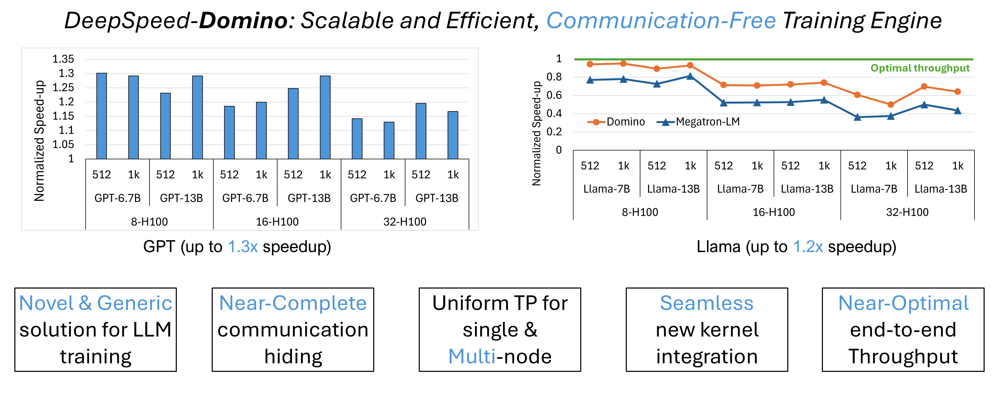
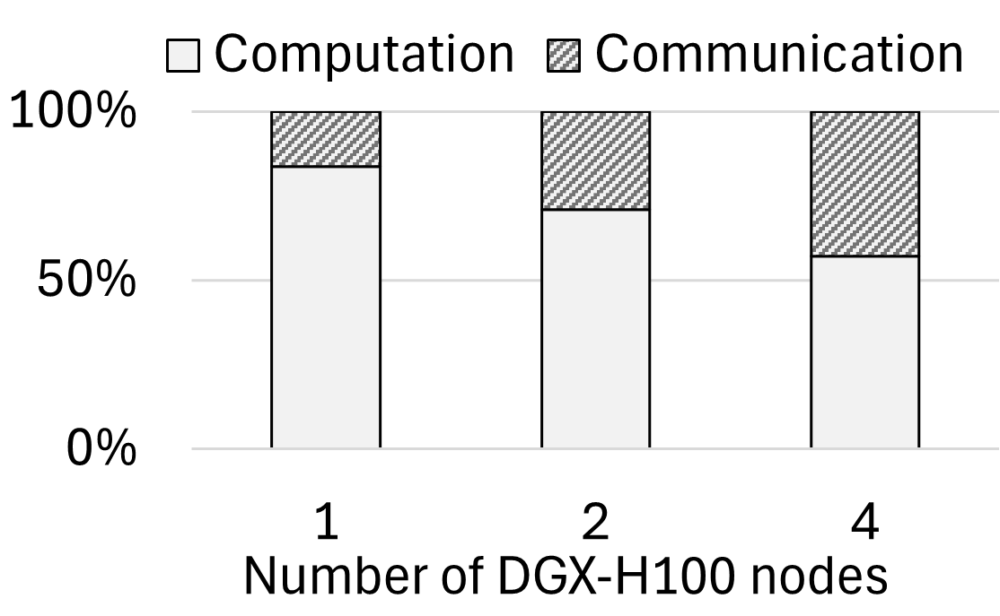
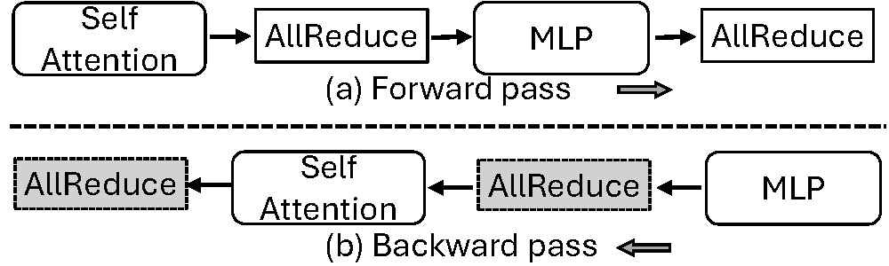
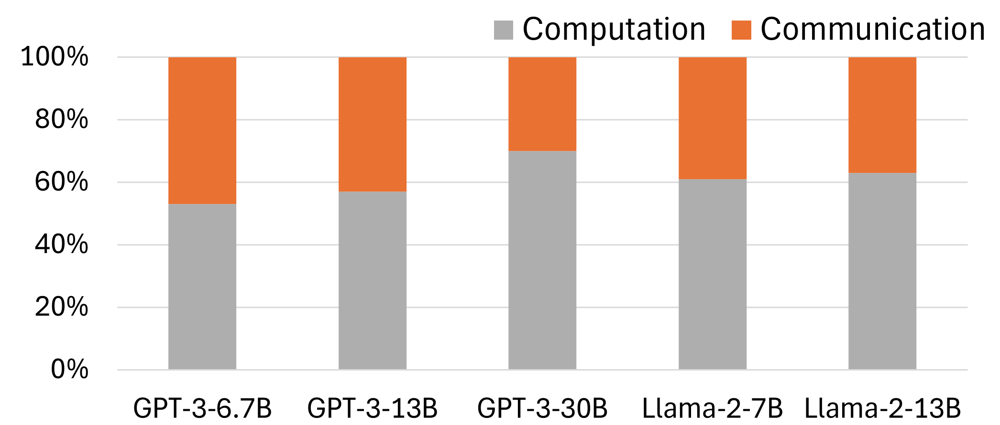
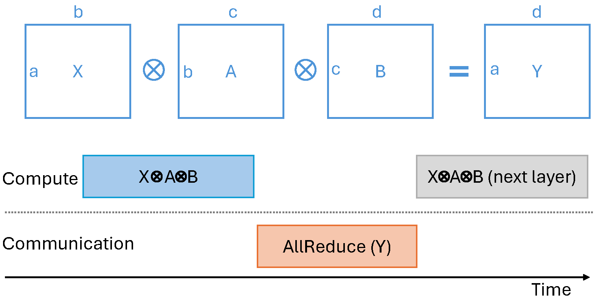
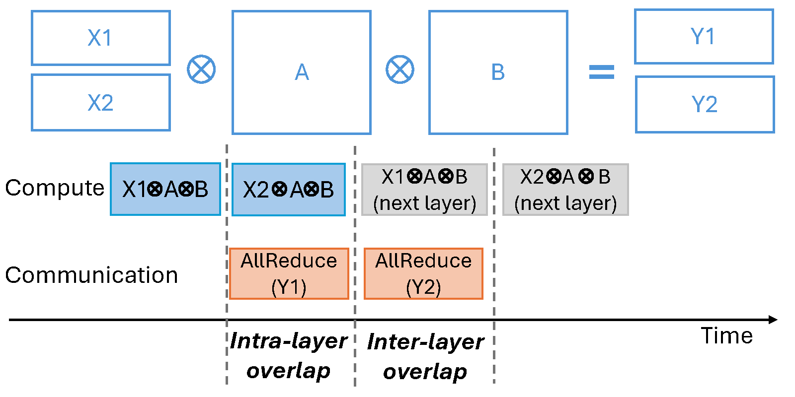
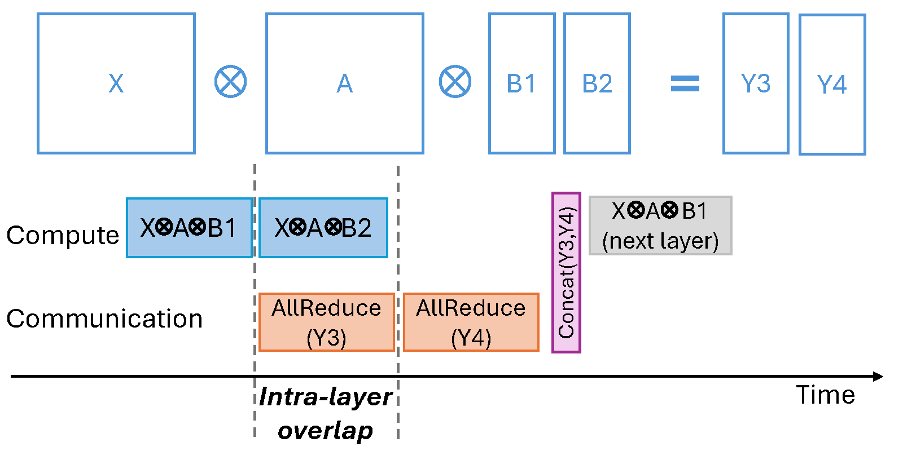
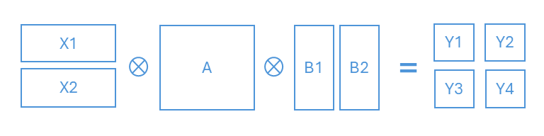
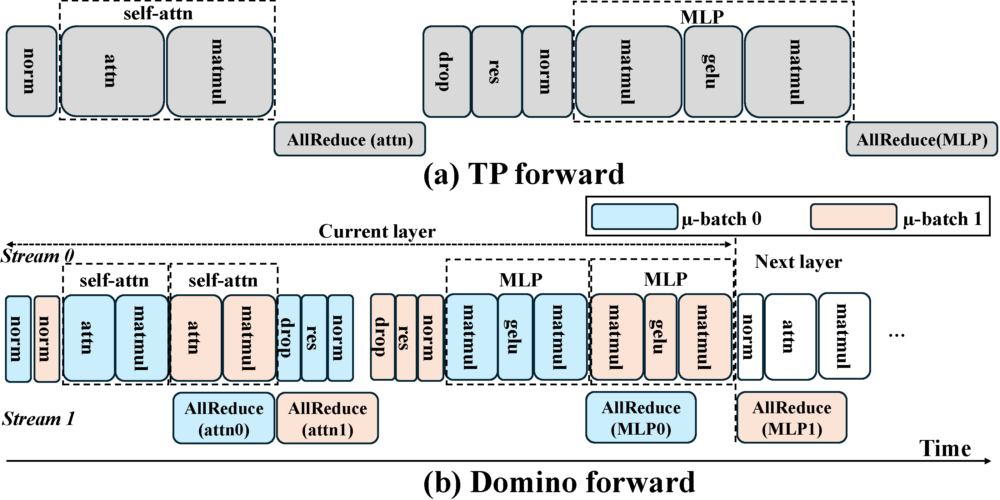
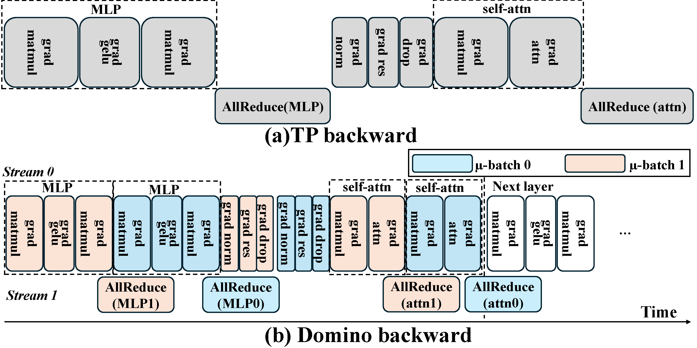

<p align="center">
  
</p>

<div align="center">

# Domino: Communication-Free LLM Training Engine

</div>

<div align="center">
  

<div align="left">

*Figure 1: Project Domino is Microsoft DeepSpeed's Tensor Parallel (TP) Training Engine, which provides a uniform solution for both single-node and **multi-node** cases. Domino scales up traditional single-node-only TP solution to multi-node environments via **near-complete communication hiding** behind computation.*

</div>
</div><br>

# Table of Content
1. [Introduction](#introduction)
2. [Domino Highlights](#domino-highlights)
3. [Design Motivation](#design-motivation)
4. [Domino Design](#domino-design)
5. [Implementation and Optimization](#implementation-and-optimization)
6. [Getting Started: Try out DeepSpeed-Domino](#getting-started-try-out-deepspeed-domino)
7. [Citation](#citation)
8. [Acknowledgements](#acknowledgements)


# Introduction

Generative AI (GenAI) has enabled transformative applications in a wide variety of domains, including chatbot, high-quality image and video generation, text summarization. These capabilities are built on top of large foundation models, particularly Large Language Models (LLMs). LLMs are mostly transformer-based models, such as Llama and GPT model series. Due to huge transformer model size which is often far beyond single GPU's device memory capacity, it is necessary to train LLMs in distributed environment like multi-node settings.

For large-scale LLM training, three main distributed training paradigms have emerged: Data Parallelism (DP), Tensor Parallelism (TP), Pipeline Parallelism (PP). DP solutions, like DeepSpeed ZeRO and its variant PyTorch FSDP, provide memory-efficient data parallel training scheme. PP and TP both are model parallel techniques, where PP shards model at layer granularity and TP partitions every layer evenly on each GPU. Among all these three, TP is becoming a prominent approach due to its excellent system efficiency in single-node cases, where GPUs are directly connected with high bandwidth links like NVLink and NVSwitch.

However, TP falls short on multi-node cases with low cross-node communication bandwidth. [Prior work](https://arxiv.org/abs/2406.06858) reports the communication can take up to 75\% of end-to-end training time. Even with the latest DGX-H100 nodes equipped with high-end Infiniband of 400GB/s bandwidth, Figure 2 shows that the communication overheads remains to be up to 43\% end-to-end training iteration time. Despite recent advance in GeMM+NCCL kernel fusion techniques, which fuses GeMM with its subsequent communication collective to partially hide communication behind a single GeMM computation. These approaches still have limited computation-communication overlapping scope, thus often unable to fully hide communication behind single GeMM computation kernel. As GPU computation is getting faster (e.g., DGX-B200), communication overhead will be more pronounced in both single node and multi-node scenarios.

<div align="center">
  <br>

  *Figure 2: TP communication overhead in GPT-3-13B training using 1,2,4 DGX-H100 nodes (i.e., 8, 16, 32 H100 GPUs).*

</div>

# Domino Highlights


* *1-sentence summary*: Domino achieves **Near-Complete** communication hiding behind computation via breaking down a single batch training into smaller and independent pieces, allowing efficient pipelining.

Domino is the first work that provides a **uniform** Tensor Parallelism (TP) solution for both single-node and **multi-node** cases. Traditional TP solutions (e.g., Megatron-LM) fall short in multi-node cases due to limited cross-node communication bandwidth.

### Performance

We tested Domino over 1 to 4 DGX-H100 boxes (8-H100 per box). Each node has intra-node NVLink bandwidth of 900GB/s and inter-node IB bandwidth of 400GB/s. Performance results are summarized as follows:
1. For both GPT and Llama model series, Domino outperforms Megatron-LM by up to **1.3x** and **1.2x** separately in end-to-end training iteration throughput with varied model sizes, sequence lengths and batch sizes, which is summarized as the top Figure 1.
2. For several cases, Domino achieves **near-optimal** training throughput, where optimal throughput refers to the throughput achieved by disabling all communication in TP training.

For more detailed performance results, please refer to our [arxiv paper](https://arxiv.org/abs/2409.15241).

# Design Motivation

In this section, we briefly discuss three topics. First, we discuss on why it is good time to design and implement uniform TP solution for both single node and multi-node cases. Then, we analyze the communication overhead on latest Nvidia DGX-H100 boxes with high cross-node communication interconnects. Last, we describe TP's sequenctial data dependency which causing communication stands out.

### Why it is time for uniform TP for both single and MULTI-node?

Nvidia is pushing hard on breaking communication bandwidth gap between intra-node (i.e., GPUs within a node connected with NVLink) and inter-node (i.e., cross-node connected with Infini-Band(IB)). For example, each DGX-H100 is equipped with eight ConnectX-7 network cards and gets aggregated cross-node bandwidth of 400GB/s, which is at same level of intra-node NVLink (900GB/s). Therefore, it is time for proposing a uniform solution for both single node and multi-node TP training.

### Communication Overhead in TP

As described in [Megatron-LM paper](https://arxiv.org/pdf/1909.08053), for TP, every transformer block (i.e.,1 Self-Attention layer + 1 MLP layer) would incur 4 AllReduce calls, where two in forward pass and the other two in the backward pass (shown in Figure 3). Given a LLM consists of $N$ stacked transformer blocks, the total communication overhead equals to $4 * N$ AllReduce. Even for small models like GPT-3 2.7B or 6.7B which consists of 32 layers, the total number of AllReduce calls are 128 for every training iteration. For larger models, this communication times grow linearly with number of layers in the model.

<div align="center">
  <br>

  *Figure 3: TP communication = 4 x AllReduce x num\_transformer\_block*

</div>

One big issue for TP is that the *communication resides on critical path of every input batch training execution* due to sequential data dependency we described in the following [TP data dependency analysis](#tp-data-dependency-analysis) session. Therefore, all the communication overhead stands out and makes it hard to hide behind computation. In Figure 4, we provide our communication overhead measurement using Megatron-LM training GPT-3 and Lllama-2 model series with varied model sizes and batch sizes across 1 to 4 DGX-H100 nodes (i.e., 8 to 32 H100 GPUs). The communication overhead is up to **47\%** despite using latest Nvidia hardware DGX-H100 with 400GB/s cross-node bandwidth.

<div align="center">
  <br>

  *Figure 4: TP communication and computation ratio per training iteration time over different models and batch sizes using 1 to 4 DGX-H100 nodes.*

</div>

As Llama-3 405B model training takes 54 days on 16,000 H100 GPUs, the projected communication time can be up to around **25 days on 16,000 H100s**. This finding underscore that, despite using latest high-bandwidth interconnects like NVLink/Infini-Band(IB), the communication overhead still remains as a huge portion of end-to-end training time.

### TP data dependency analysis

In traditional TP shown as Figure 5, a transformer layer (either Attn or MLP layer) computation can be abstracted into $X\*A\*B=Y$, where $X$ is input. For attention layer, $A$ is attention computation (e.g., multihead-attention) and $B$ is linear layer. For MLP layer, both $A$ and $B$ are linear layers. An AllReduce is conducted on $Y$ after computation. Due to **sequential data dependency on $Y$ between computation (i.e., $X\*A\*B=Y$) and communication (i.e., AllReduce($Y$)), AllReduce($Y$) completely stands out**, thus making TP not efficient in limited communication bandwidth scenarios.

<div align="center">
  <br>
<div align="left">

  *Figure 5: TP Forward pass of single Self-Attention/MLP layer. (X is input, A is attention computation for Self-Attention layer and linear for MLP layer, B is linear for both Self-Attention and MLP layer. Y is X\*A\*B output)*

</div>
</div>


# Domino Design

Compared to Figure 5, Domino breaks data dependency of $X\*A\*B$ via [*Row-wise Split on Inputs X*](#row-wise-split-on-inputs-x), [*Column-wise Split on Weights B*](#column-wise-split-on-weights-b), as well as a [hybrid solution combining these two](#2d-split-on-both-x-and-b). After breaking computation into pieces, Domino pipelines computation and communication working on different independent pieces, thus achieving near-complete communication hiding behind computation. Domino's unique benefits are listed as follows:

1. Comparing with GeMM+NCCL kernel fusion techniques, Domino breaks data dependency thus has a much wider range of computation kernel sequences to overlap with NCCL call. For example, Domino can overlap AllReduce not only to a single GeMM, but also extend overlapping scope to multiple GeMMs, LayerNorm, DropOut and more.
2. Domino achieves near-complete communication hiding behind computation, thus also achieves near-optimal system throughput in certain cases. (Optimal throughput refers to end-to-end throughput that disables all communication in TP training.)
3. Domino works at kernel scheduler level, any kernel optimizations or new kernels can be seamlessly integrated into Domino framework.
4. Domino tensor partition scheme is simple and generic. It is easy for user side end-to-end correctness debugging when facing issues like overflow or weights/gradients errors.

For the ease of illustration, we describe forward propagation only (since backward pass is just in reverse order), and we describe only splitting tensor into two chunks.

## Row-wise split on Inputs X:

Domino breaks Input X in row dimension (i.e. batch dimension).

<div align="center">
  <br>

  *Figure 6: Domino row-wise (batch-dim) split on inputs X.*

</div>

**Data Dependency**: Split inputs' batch dimension has no data dependency for both intra-layer and inter-layer cases. Therefore, we achieve both *intra-layer* (AllReduce($Y1$) and $X2\*A\*B$) and *inter-layer* (AllReduce($Y2$) and next-layer's $X1\*A\*B$) computation-communication overlapping. With this batch split on inputs, Domino can hide up to **100\%** communication behind computation.

## Column-wise split on Weights B:

Domino breaks weight matrix B in column dimension.


<div align="center">
  <br>

  *Figure 7: Domino column-wise (last-dim) split on weights B.*

</div>

**Data Dependency**: Split Weights B column-wise have no data dependency in intra-layer case but have data dependency in inter-layer case. Therefore, we only achieve *intra-layer*
 (AllReduce($Y1$) and $X2\*A\*B$) computation-communication overlapping. This column-split on weights scheme remains essential, since row-wise input split only would lead to narrow shape tensors that hinder kernel computational efficiency. In practice, Domino achieves 50\% to 70\% communication hiding behind computation with weights B column-wise split.

## 2D Split on both X and B:

For extremely large LLMs, Domino splits both inputs X and weights B in row and column dimension, separately. This method is beneficial for model training requiring both low memory footprints and minimizing communication overheads.

<div align="center">
  <br>

  *Figure 8: Domino 2D split on both inputs X and weights B.*

</div>

**Data Dependency**: This 2D split policy inherits synchronization at the end of each transformer layer due to column-wise split on weights B. Therefore, the 2D approach only achieves *intra-layer* computation-communication overlapping.

# Implementation and Optimization

For brevity, we summarize key implementation of row-wise input split. For more implementation details, please refer to our [arxiv paper](https://arxiv.org/abs/2409.15241).

**Forward:** Figure 9 shows how we position and trigger NCCL calls in order to overlap with computation kernel sequences in forward propagation. We split batch into two chunks as $\mu$-batch0 and $\mu$-batch1. $\mu$-batch0 attention output as attn0 and MLP output as MLP0. $\mu$-batch1's attention output as attn1 and MLP output as MLP1. AllReduce(attn0) is overlapped with self-attention computation on $\mu$-batch1. For AllReduce(attn1), we group multiple $\mu$-batches' Dropout, Residual, LayerNorm computation-communication overlapping. This small kernel grouping not only enable complete hiding of AllReduce(attn1), but also provides proper overlapping space for AllReduce(MLP0) in the backward pass shown in Figure 10. For AllReduce(MLP0), we hide it behind $\mu$-batch1's MLP computation kernel sequence of GeMM + GeLU + GeMM. For AllReduce(MLP1), we hide it behind next layer's attention computation.

<div align="center">
  <br>

  *Figure 9: Transformer block (i.e., 1 self-attn + 1 MLP) forward pass. Upper figure is vanila TP implementation, bottom is Domino implementation.*

</div>

**Backward:** Figure 10 shows a simple example of batch split in to two $\mu$-batches as $\mu$-batch0 and $\mu$-batch1. Besides similar overlapping strategy in the forward pass, we extend the scope of overlap communication with weights' gradient computation inside same $\mu$-batch (e.g., AllReduce(MLP1) partially overlaps with its own $\mu$-batch1 computation as the 3rd orange block from left). Each *grad matmul* includes two separate GeMM computation for inputs gradient and weights gradient. Therefore, we can extend overlapping scope by overlapping AllReduce(MLP1) with $\mu$-batch1's weights gradient computation.

Backward is a bit more challenging because backward computation graph is automatically generated by torch.autograd(). To precisely control NCCL call triggering time, we implement a *no\_operation* module, which obtains communication handle during forward pass and retains it for use during backward pass. Our *no\_operation* module works seamlessly with torch.autograd(), and enable us precisely control NCCL start/end time without rewriting customized backward computation graph.

<div align="center">
  <br>

  *Figure 10: Transformer block (i.e., 1 self-attn + 1 MLP) backward pass. Upper figure is vanila TP implementation, bottom is Domino implementation.*

</div>

**General kernel optimizations:** We adopt general kernel-level optimization techniques. For example, we use cudaGraph to squeeze idle/bubble time between adjacent compute kernels to reduce end-to-end latency. We use CUDA multi-stream to increase parallel execution. We also leverage torch.compile() to further improve our system efficiency.

# Getting Started: Try out DeepSpeed-Domino

To try out DeepSpeed-Domino, please refer to [Domino tutorial](https://github.com/microsoft/DeepSpeedExamples/blob/master/training/DeepSpeed-Domino/README.md) in our DeepSpeedExample repo.

## Citation

```
@article{wang2024-deepspeed-domino,
  title={{Domino: Eliminating Communication in LLM Training via Generic Tensor Slicing and Overlapping}},
  author={Guanhua Wang and Chengming Zhang and Zheyu Shen and Ang Li and Olatunji Ruwase},
  journal={arXiv preprint arXiv:2409.15241},
  year={2024}
}
```

## Acknowledgements

This work is the result of a deep collaboration between Microsoft DeepSpeed and our academia partners from University of Maryland, University of Houston. The contributors include [Guanhua Wang](https://www.microsoft.com/en-us/research/people/guanhuawang/), [Hongwei Chen](https://github.com/hwchen2017) and [Olatunji Ruwase](https://www.microsoft.com/en-us/research/people/olruwase/) from Microsoft DeepSpeed Team, [Chengming Zhang](https://chengmingzh8.github.io/) from University of Houston, [Zheyu Shen](https://www.linkedin.com/in/zheyushen/) and [Ang Li](https://www.ang-li.com/) from University of Maryland.
