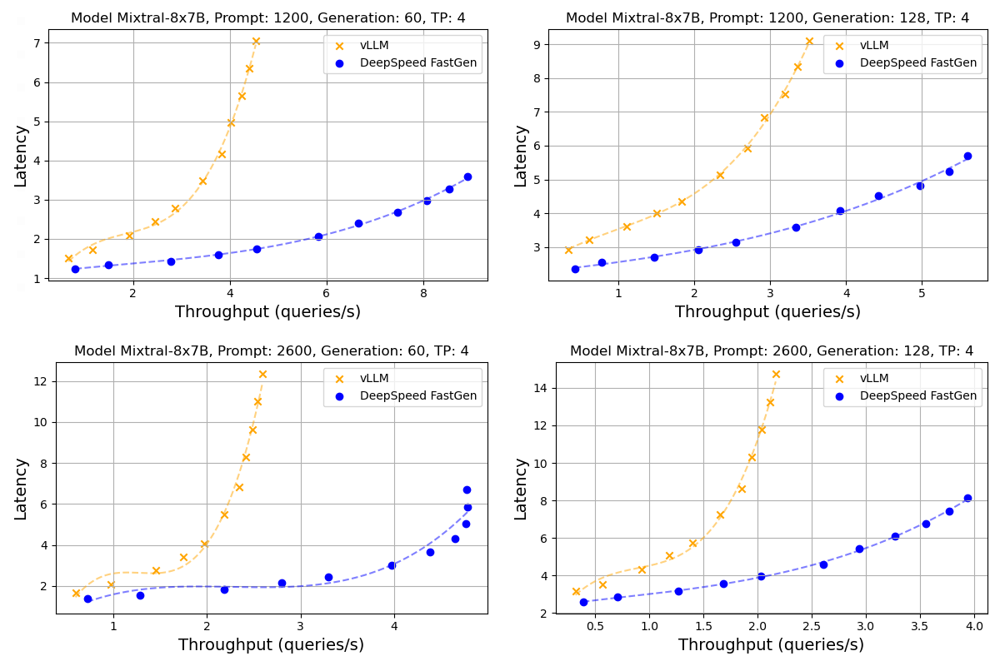
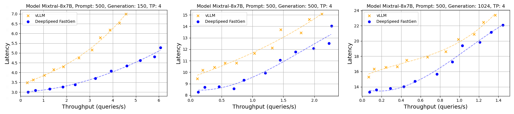
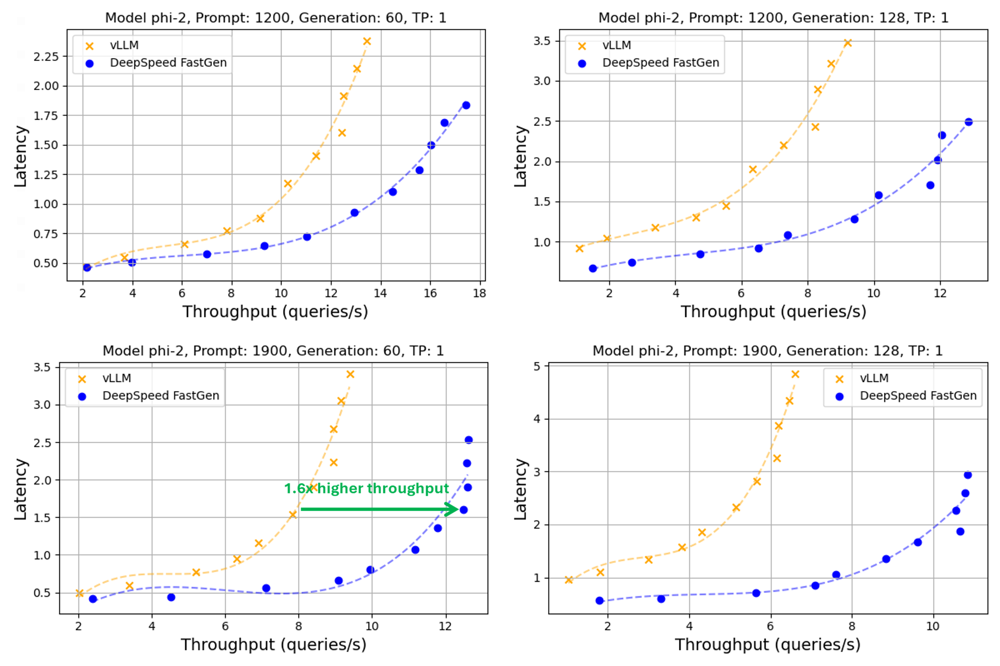
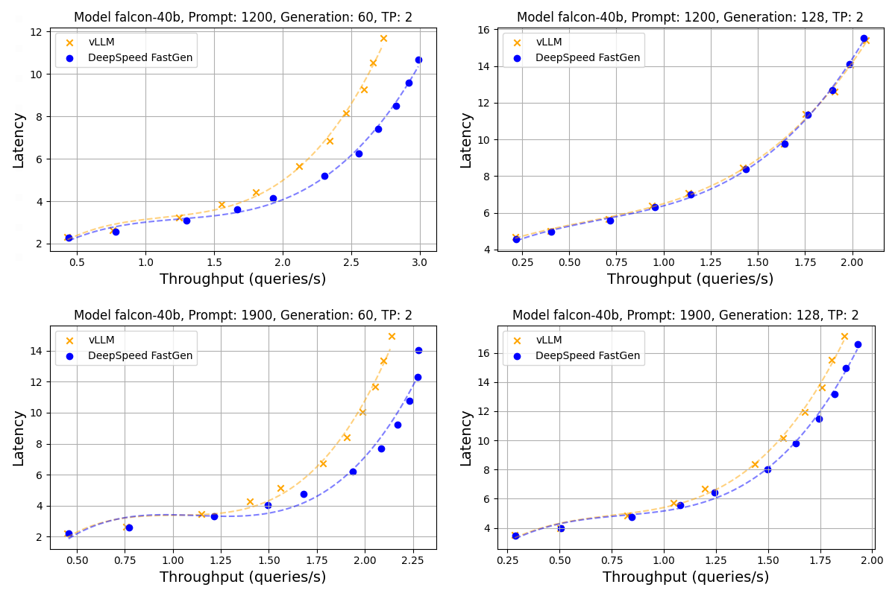
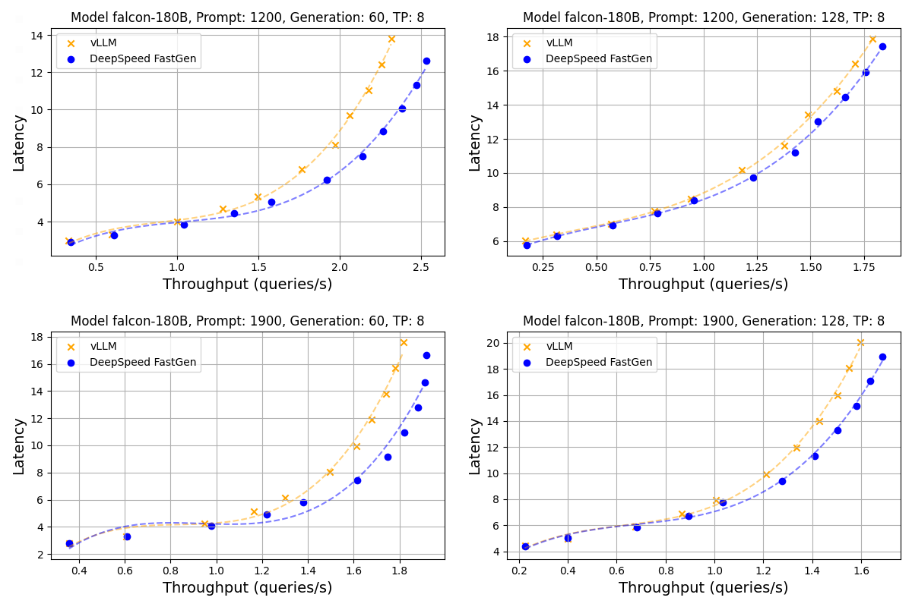

# DeepSpeed-FastGen: Introducing Mixtral, Phi-2, and Falcon support with major performance and feature enhancements.

 
 

# Table of Contents
1. [Introduction](#introduction)
2. [New Model Families](#new-model-families)
3. [Performance Optimizations](#performance-optimizations)
4. [Feature Enhancements](#stability-and-software-enhancements)
5. [Community Engagement](#community-engagement)
6. [Try Out DeepSpeed-FastGen](#try-out-deepspeed-fastgen)

# 1. Introduction 

[DeepSpeed-FastGen](https://github.com/microsoft/DeepSpeed/tree/master/blogs/deepspeed-fastgen) is an inference system framework that enables easy, fast, and affordable inference for large language models (LLMs). From general chat models to document summarization, and from autonomous driving to copilots at every layer of the software stack, the demand to deploy and serve these models at scale has skyrocketed. DeepSpeed-FastGen utilizes the Dynamic SplitFuse technique to tackle the unique challenges of serving these applications and offer higher effective throughput than other state-of-the-art systems like vLLM.

Today, we are happy to share that we are improving DeepSpeed-FastGen along three areas: i) three new model families, ii) performance optimizations, and iii) feature enhancements:
- **New Model Families**

  We introduce support for Mixtral (MoE), Falcon, and Phi-2 model families in DeepSpeed-FastGen. Our inference optimizations for these models provide up to 2.5X improvement in effective throughput over other state-of-the-art frameworks like vLLM.

- **Performance Optimizations**

  We drastically reduced the scheduling overhead of Dynamic SplitFuse and increased the efficiency of token sampling. As a result, we see higher throughput and lower latency, particularly when handling concurrent requests from many clients. We demonstrate the performance optimizations with benchmarks and evaluation of DeepSpeed-FastGen against vLLM for the newly added model families. The benchmark results can be seen in [Performance Evaluation](#performance-optimizations) and the benchmark code is available at [DeepSpeedExamples](https://github.com/microsoft/DeepSpeedExamples/tree/master/benchmarks/inference/mii).

- **Feature Enhancements**

  DeepSpeed-FastGen contains a rich set of features for running inference with many different model families and over 20,000 HuggingFace hosted models. We extend this feature set for all models to include a RESTful API, more generation options, and support for models using the safetensor checkpoint format. Additionally, we improve on overall stability and address bugs in our original DeepSpeed-FastGen release.

We now dive into the details of the new model families, performance optimizations, and software improvements. If you would like to get started right away please see [Try Out DeepSpeed-FastGen](#try-out-deepspeed-fastgen). This new release is available in [DeepSpeed versions >= 0.13.0](https://github.com/microsoft/DeepSpeed/tree/v0.13.0) and [DeepSpeed-MII versions >= 0.2.0](https://github.com/microsoft/DeepSpeed-MII/tree/v0.2.0).

# 2. New Model Families 

Today we introduce support for three new model families: i) [Mixtral (MoE)](https://arxiv.org/pdf/2401.04088.pdf), ii) [Phi-2](https://www.microsoft.com/en-us/research/blog/phi-2-the-surprising-power-of-small-language-models/), and iii) [Falcon](https://arxiv.org/pdf/2311.16867v1.pdf)

## Mixtral

Mixtral model, a language model based on sparse mixture of experts (MoE), has demonstrated promising performance across multiple benchmarks. The Mixtral model operates by applying a router network at each layer for every token, selecting two distinct experts for processing the current state and combine their outputs. This process is dynamic, with the possibility of different experts being chosen at each timestep. This architecture ensures that while each token is exposed to a broad spectrum of parameters, it actively utilizes only a subset during inference.

In this release, we are pleased to announce the support for Mixtral models. We've enhanced our FastGen codebase by the integration of the Mixtral model implementation, refinements to our high-performance kernels for efficient top-k gating, and updates to Rotary Positional Encoding (RoPE) implementation. These advancements ensure that users can fully exploit the capabilities of DeepSpeed-FastGen for executing Mixtral model inference, thereby achieving heightened performance and efficiency.

## Phi-2

Microsoft Research has introduced a suite of small language models (SLMs) named "Phi," notable for their exceptional performance across a spectrum of benchmarks. The latest addition to this suite, [Phi-2](https://www.microsoft.com/en-us/research/blog/phi-2-the-surprising-power-of-small-language-models/), is a language model boasting 2.7 billion parameters. It stands out as a testament to outstanding reasoning and language understanding capabilities, exemplifying state-of-the-art performance within the realm of base language models featuring fewer than 13 billion parameters. Notably, Phi-2 achieves parity with or surpasses models up to 25 times its size on complex benchmarks, a feat attributed to pioneering innovations in model scaling and meticulous training data curation.

Owing to its compact size, Phi-2 emerges as an ideal model for both researchers and deployment scenarios, promising a reduction in inference costs. To efficiently support the Phi-2 model family, we introduce partial RoPE support in our DeepSpeed-FastGen kernels.

## Falcon

Falcon is a family of large language models (LLMs) developed by the Technology Innovation Institute (TII). The Falcon models include Falcon 7B, Falcon-40B and its larger counterpart, Falcon-180B, the largest openly available language model to date.

A closer examination of the architectural nuances within the Falcon series reveals notable distinctions. Specifically, the Falcon 7B model diverges slightly from Falcon-40B; notably, Falcon-40B incorporates an additional layer norm preceding the parallel MLP layer, a feature absent in the Falcon 7B model. In contrast, Falcon-180B adheres to the same architecture as Falcon-40B but stands out as a scaled-up version.

# 3. Performance Optimizations and Evaluation 

SplitFuse effectively enhances utilization by simultaneously computing prompts and decoding (generating tokens). However, we observed a significant overhead for scheduling ragged batching, especially when generating a large number of tokens from numerous concurrent requests. In this release, we've minimized this scheduling overhead for querying KV cache states. As a result, there's a notable improvement in the performance for scenarios with a large number of generation steps.

In general for long prompts and a smaller number of generated tokens, we can fully utilize the benefits of SplitFuse, which combines prompt processing and decoding (token generation) in a single forward pass. This provides a significant advantage over vLLM in these scenarios as shown in our [previous blog](https://github.com/microsoft/DeepSpeed/tree/master/blogs/deepspeed-fastgen). For short prompts and a larger number of generated tokens, where most forward passes run purely for decoding, our highly optimized engine and the efficient scheduler for ragged batching demonstrate impressive performance.

We follow the benchmarking methodology we presented in our [previous blog](https://github.com/microsoft/DeepSpeed/tree/master/blogs/deepspeed-fastgen#a-benchmarking-methodology).

*NOTE: All the benchmarks in this blog use the recommended DeepSpeed-FastGen persistent deployment mode.*

### Mixtral

We developed a new MoE module, which contains kernels optimized for our inference engine. The enhancements in the decoding phase, included in this release, significantly improve throughput and efficiency in generating a large number of tokens as shown in *Figure 1*.

   

  *Figure 1: Throughput-latency curve of Mixtral using A100. A normal distribution was applied to prompt and generation lengths with averages of (1200, 2600) and (60, 128), respectively, and a 30% variance* 

We show the throughput-latency of Mixtral-8x7B-v0.1 running on A100 with tensor parallelism degree of 4. First, we show the scenarios where the prompt lengths are longer than the number of generation steps (i.e., tokens), which is typical of popular use cases like chatbots. From *Figure 1*, DeepSpeed-FastGen provides 2.4X higher throughput for a prompt length of 1200 and 60 generation steps. In addition to the performance for the long prompt scenarios, we present new results for shorter prompts and larger number of generation steps in *Figure 2*. Our performance advantage still holds.

   

  *Figure 2: Throughput-latency curve of Mixtral using A100. A normal distribution was applied to prompt and generation lengths with averages of 500 and (150, 500, 1024), respectively, and a 30% variance* 

As we can see in *Figure 2*, DeepSpeed-FastGen is showing higher throughput and lower latency thanks to the scheduling performance improvements presented in this blog.

### Phi-2

   

  *Figure 3: Throughput-latency curve of Phi-2 using A100. A normal distribution was applied to prompt and generation lengths with averages of (1200, 1900) and (60, 128), respectively, and a 30% variance* 

From *Figure 3*, DeepSpeed-FastGen provides 1.5X higher throughput for a prompt length of 1900 and 60 generation steps. For other scenarios our throughput-latency evaluation of the Phi-2 model show a similar pattern, with DeepSpeed-FastGen providing equivalent latency with greater throughput or lower latency for the same throughput.

### Falcon

Given the substantial size of the Falcon-40B and Falcon-180B models, the majority of computations are dedicated to forward passes, while the overhead of scheduling and token sampling is relatively minor.

   

  *Figure 4: Throughput-latency curve of Falcon 40B using A100. A normal distribution was applied to prompt and generation lengths with averages of (1200, 1900) and (60, 128), respectively, and a 30% variance* 

   

  *Figure 5: Throughput-latency curve of Falcon 180B using A100. A normal distribution was applied to prompt and generation lengths with averages of (1200, 1900) and (60, 128), respectively, and a 30% variance* 

As seen in *Figure 4* and *Figure 5*, DeepSpeed-FastGen is able to provide higher throughput and lower latency compared to vLLM for Falcon-40B and Falcon-180B.

# 4. Feature Enhancements 

In this section we introduce several feature enhancements that have been released since we first introduced DeepSpeed-FastGen.

## Performance improvements
We achieve a notable improvement in performance by minimizing the scheduling overhead for querying KV cache states as discussed in [Performance Optimizations](#performance-optimizations).

See [PR-4965](https://github.com/microsoft/DeepSpeed/pull/4965), [PR-377](https://github.com/microsoft/DeepSpeed-MII/pull/377) for more details.

## Support for safetensor checkpoints
Some HuggingFace-hosted model checkpoint weights are provided only in the safetensor format. We extend our HuggingFace checkpoint engine to work with the safetensor format to support even more models!

See [PR-4659](https://github.com/microsoft/DeepSpeed/pull/4659), [PR-296](https://github.com/microsoft/DeepSpeed-MII/pull/296) for more details.

## Added RESTful API

We add the option to automatically stand up a RESTful API when creating DeepSpeed-FastGen persistent deployments in DeepSpeed-MII. This API provides a way for users to send prompts to their deployments and receive responses using HTTP POST methods and tools like `curl` or python's `request` package. The RESTful API provides the same high throughput and low latency performance as our python APIs. For more information, please see [MII RESTful API](https://github.com/microsoft/DeepSpeed-MII#restful-api).

See [PR-348](https://github.com/microsoft/DeepSpeed-MII/pull/348), [PR-328](https://github.com/microsoft/DeepSpeed-MII/pull/328), [PR-294](https://github.com/microsoft/DeepSpeed-MII/pull/294) for more details.

## Added deployment and generate options

We extend the customizability of DeepSpeed-FastGen deployments and text-generation. Users can now specify a `device_map` when creating non-persistent pipelines and persistent deployments that controls which GPUs to use for hosting a model. Additionally, the interfaces between pipelines and deployments now match and include options for setting top-p, top-k, and temperature values. For additional information about the user-exposed options, please see [MII Pipeline](https://github.com/microsoft/DeepSpeed-MII#non-persistent-pipeline) and [MII Deployment](https://github.com/microsoft/DeepSpeed-MII#persistent-deployment).

See [PR-331](https://github.com/microsoft/DeepSpeed-MII/pull/331), [PR-280](https://github.com/microsoft/DeepSpeed-MII/pull/280), [PR-275](https://github.com/microsoft/DeepSpeed-MII/pull/275), [PR-268](https://github.com/microsoft/DeepSpeed-MII/pull/268), [PR-295](https://github.com/microsoft/DeepSpeed-MII/pull/295), for more details.

## Mitigate risk of deadlock

In use cases where many prompts are sent to a deployment in a small time window, deadlock can occur in the DeepSpeed-FastGen inference engine, resulting in no text-generation progress is made on any prompts. To mitigate this, we ensure that there is a sufficient margin in the KV cache when scheduling requests. While not completely resolved, we continue to investigate a fix for these situations that arrive when the deployment is under heavy load.

See [PR-274](https://github.com/microsoft/DeepSpeed-MII/pull/274) for more details.

## Inference Checkpoints

We add the capability to create inference engine snapshots to DeepSpeed-FastGen. This reduces the loading time for large models in future deployments.

See [PR-4664](https://github.com/microsoft/DeepSpeed/pull/4664) for more details.

## General stability and bug fixes

We include many bug fixes and stability improvements to DeepSpeed-FastGen. This includes fixing issues with some OPT model size variants, bugs with MII configuration options, and improved error messages.

See [PR-4938](https://github.com/microsoft/DeepSpeed/pull/4938), [PR-4920](https://github.com/microsoft/DeepSpeed/pull/4920), [PR-4739](https://github.com/microsoft/DeepSpeed/pull/4739), [PR-4694](https://github.com/microsoft/DeepSpeed/pull/4694), [PR-4634](https://github.com/microsoft/DeepSpeed/pull/4634), [PR-367](https://github.com/microsoft/DeepSpeed-MII/pull/367), [PR-350](https://github.com/microsoft/DeepSpeed-MII/pull/350), for more details.

# 5. Community Engagement 

DeepSpeed welcomes your contributions! We encourage you to report issues, contribute PRs, and join discussions on the [DeepSpeed GitHub](https://github.com/microsoft/DeepSpeed/) page. Please see our [contributing guide](https://github.com/microsoft/DeepSpeed/blob/master/CONTRIBUTING.md) for more details. We are open to collaborations with universities, research labs, and companies, such as those working together on deep learning research, applying DeepSpeed to empower real-world AI models and applications, and so on. For such requests (and other requests unsuitable for GitHub), please directly email to deepspeed-info@microsoft.com.

*We would like to recognize the contribution from our user community in adding support for the [Qwen](https://arxiv.org/abs/2309.16609) model family to DeepSpeed-FastGen in [PR-4913](https://github.com/microsoft/DeepSpeed/pull/4913).*

# 6. Try Out DeepSpeed-FastGen 

We are very excited to share this DeepSpeed-FastGen release.

* To get started, please visit our GitHub page for DeepSpeed-MII: [GitHub Landing Page](https://github.com/microsoft/DeepSpeed-MII)

DeepSpeed-FastGen is part of the bigger DeepSpeed ecosystem comprising a multitude of Deep Learning systems and modeling technologies. To learn more,

* Please visit our [website](https://www.deepspeed.ai/) for detailed blog posts, tutorials, and helpful documentation.
* You can also follow us on our [English Twitter](https://twitter.com/MSFTDeepSpeed), [Japanese Twitter](https://twitter.com/MSFTDeepSpeedJP), and [Chinese Zhihu](https://www.zhihu.com/people/deepspeed) for latest news on DeepSpeed.

The following items are on our roadmap and we plan to engage with our community on these through our GitHub issues and PRs:

* Performance improvements
* Quantization support
* New hardware backends through collaboration with partners

**"Star" our [DeepSpeed GitHub](https://github.com/microsoft/DeepSpeed/) and [DeepSpeed-MII GitHub](https://github.com/microsoft/DeepSpeed-MII/) repositories if you like our work!**
