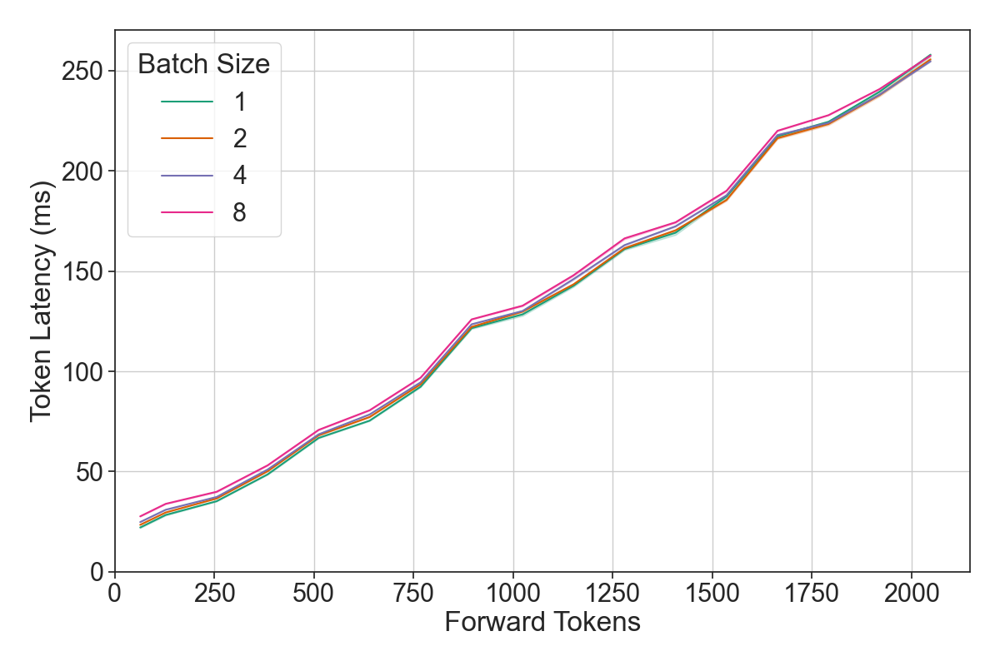
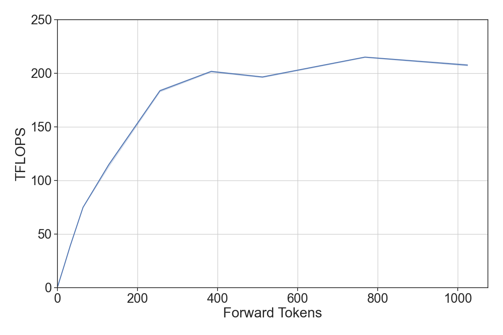
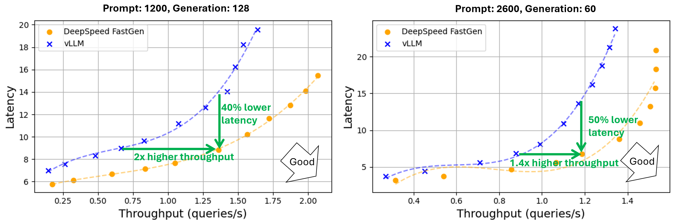
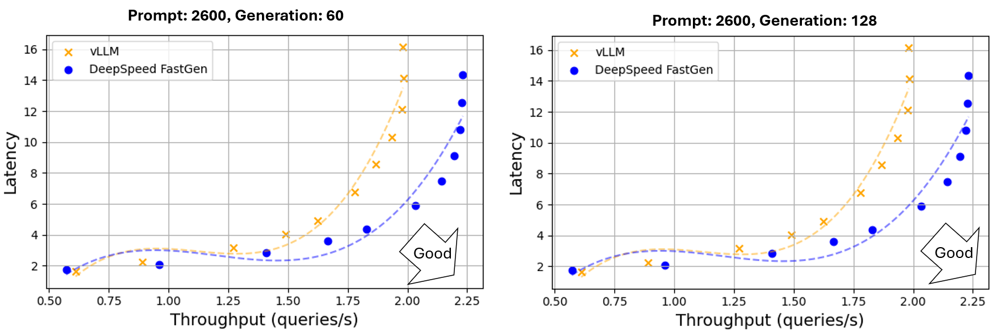
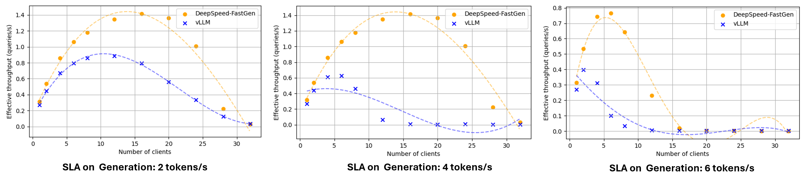
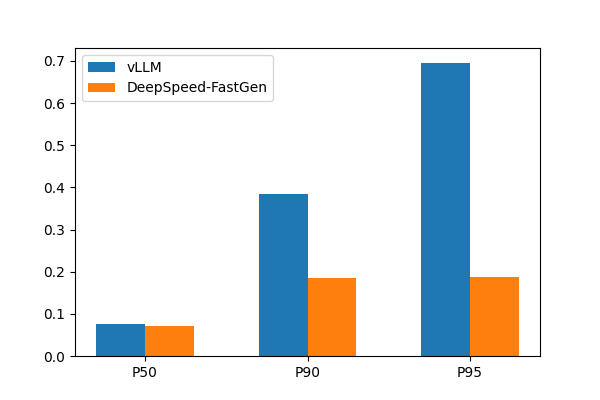
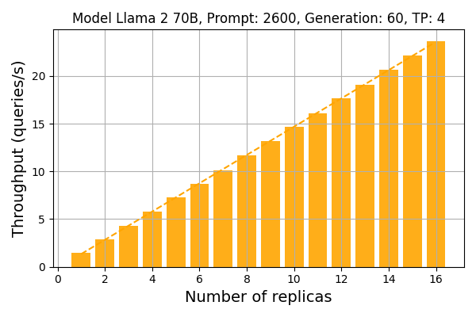
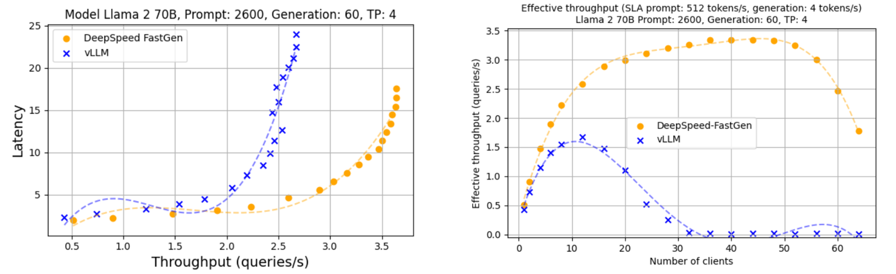
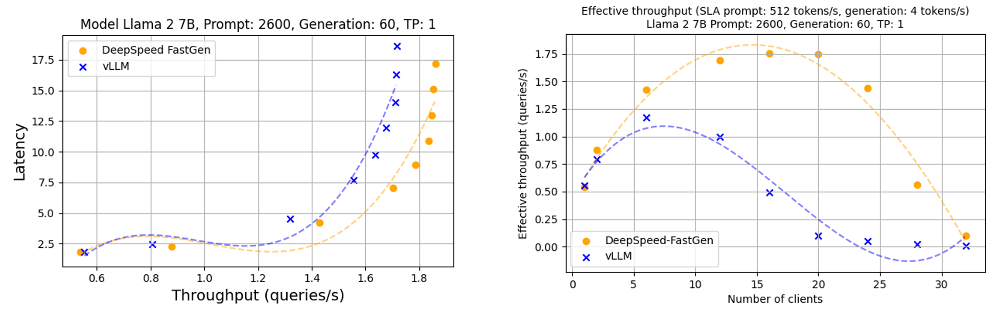

<div align="center">

# DeepSpeed-FastGen: MIIとDeepSpeed-InferenceによるLLMのための高速なテキスト生成

</div>

<div align="center">
 
 
</div>

## Table of Contents
1. [概要](#introduction)
2. [LLMのためのテキスト生成の既存技術](#background)
3. [Dynamic SplitFuse: プロンプト処理と生成を組み合わせる新しいアプローチ](#technical-approach)
4. [パフォーマンス評価](#performance-evaluation)
5. [DeepSpeed-FastGen: 実装と使い方](#using-deepspeed-fastgen)
6. [DeepSpeed-FastGenを使ってみる](#try)
7. [謝辞](#acknowledgements)


## 1. 概要 <a name="introduction"></a>

AIを様々な目的に利用する幅広いアプリケーションで、GPT-4やLLaMAのような大規模言語モデル（LLM）が、主要なワークロードになってきています。一般的なチャットモデルから、文書の要約、自動運転、ソフトウェアスタックの各層におけるプログラミングの補助まで、これらのモデルを大規模に展開・提供する需要が急増しています。DeepSpeedやPyTorchをはじめとするフレームワークは、一般に、LLMの訓練では良好なハードウェアの利用効率を達成できるものの、オープンエンドのテキスト生成などの課題では、GPUなどのハードウェア上で一度に実行される計算量が少ないことが、既存システムにおいて推論スループットのボトルネックとなっています。

PagedAttentionを搭載した [vLLM](https://arxiv.org/pdf/2309.06180.pdf) や [Orca](https://www.usenix.org/system/files/osdi22-yu.pdf) のような既存システムは、こうした課題を解決するために設計され、LLMの推論性能を大幅に向上させました。しかしこれらのシステムは依然として、特に長いプロンプトを含むワークロードにおいて、一貫したサービス品質の提供という点で課題を残しています。
数千トークンに及ぶコンテキストウィンドウをサポートするモデルやシステム、例えば [MPT-StoryWriter](https://www.mosaicml.com/blog/mpt-7b) や [DeepSpeed Ulysses](https://github.com/microsoft/DeepSpeed/tree/master/blogs/deepspeed-ulysses) などが増えるにつれて、これらの長いプロンプトのワークロードはますます重要になってきています。
これらの問題をより深く理解するために、LLMによるテキスト生成がどのように機能するか説明します。LLMによるテキスト生成は、プロンプト処理と生成と呼ばれる2つの異なるフェーズから構成されます。システムがこれらを全く独立に扱うと、生成のフェーズは、プロンプト処理によって中断されることになります。その結果、システムのレイテンシなどを定めた SLA (Service Level Agreement) に違反する可能性が高くなります。

このブログで紹介するDeepSpeed-FastGenは、新たに提案するDynamic SplitFuse技術などを活用することでこうした課題を解決し、vLLMなどの最新の既存システムと比較して最大2.3倍の実効スループットを実現するシステムです。
DeepSpeed-FastGenは、DeepSpeed-MIIとDeepSpeed-Inferenceの組み合わせにより、使いやすいテキスト生成機能を実現します。


**クイックスタート:** 最新の[DeepSpeed-MII](https://github.com/microsoft/DeepSpeed-MII)をインストールするだけで、 DeepSpeed-FastGenを試すことができます。


```bash
pip install deepspeed-mii
```

より簡単に利用できる、非永続型（推論サーバを起動しない）のパイプラインを使用してテキストを生成するには、次のコードを実行します。詳細については、[セクション5](#using-deepspeed-fastgen) をご覧ください。

```python
from mii import pipeline
pipe = pipeline("mistralai/Mistral-7B-v0.1")
output = pipe(["Hello, my name is", "DeepSpeed is"], max_new_tokens=128)
print(output)
```

## 2. LLMのためのテキスト生成の既存技術 <a name="background"></a>

テキスト系列を生成するためのワークロードは、次の2つのフェーズで構成されます。 1. プロンプト処理: ここでユーザーが与えたテキストは、アテンション機構におけるキーとバリューのキャッシュ（KVキャッシュ）を構築するために、トークンのバッチとして効率的に処理されます。 2. トークン生成: このフェーズで、KVキャッシュに単一のトークンが追加され、新たなトークンが生成されます。テキスト系列を生成する過程では、モデルは完全なテキストの系列を生成するために多くのフォワードパスの呼び出しを行います。これらのフェーズにおける様々な制限やボトルネックを解決するため、既存システムでは従来提案されてきた以下の2つの主要な技術が採用されています。

_<b> ブロックKVキャッシュ: </b>_

vLLMは、KVキャッシュにモノリシックの巨大なメモリ領域を割り当てることが、LLMによるテキスト生成システムの同時実行性を大幅に低下させる原因であるとし、その解決として、非連続的に確保されたメモリ領域をKVキャッシュとして利用することで、システム全体のスループットを増加させる [Paged Attention](https://arxiv.org/pdf/2309.06180.pdf) を提案しました。リクエストごとに様々なサイズの連続メモリ領域を割り当てるのではなく、固定されたサイズのメモリブロック（ページとも呼ばれる）を割り当てるようにします。このブロックKVキャッシュは、KVキャッシュによるメモリ断片化を解決することで、潜在的に処理可能な系列の同時実行数を増やし、システムのスループットを増加させます。こうした非連続KVキャッシュの実装は、[HuggingFace TGI](https://github.com/huggingface/text-generation-inference) と [NVIDIA TensorRT-LLM](https://github.com/NVIDIA/TensorRT-LLM) にも含まれています。


_<b> 連続バッチ（Continuous Batching）: </b>_

従来は、サーバーが複数のリクエストを一緒に処理するために待つという 動的バッチ（Dynamic Batching）が GPU利用率を改善するために使用されていました。しかし、このアプローチには欠点があります。通常は入力を同一の長さにパディングするか、より大きなバッチを構築するために、十分な数のリクエストが到着するまで処理を止めて待つ必要があります。

最近の大規模言語モデル（LLM）の推論と、それをサービスとして提供するための技術は、より細かい粒度でのスケジューリングとメモリ効率の最適化に焦点を当てています。例えば、Orcaは _イテレーションレベルのスケジューリング_ （連続バッチまたは Continuous Batching とも呼ばれる）を提案しており、これはモデルの各フォワードパスごとにスケジューリングの判断を行います。これにより、必要に応じてあるリクエストをバッチに含めたり除いたりすることができるため、パディングが不要になり、全体のスループットを向上させます。この連続バッチは、Orcaだけでなく、NVIDIAのTRT-LLM、HuggingFaceのTGI、およびvLLMにも実装されています。

現在のシステムでは、連続バッチ処理を実装するには二つの主要なアプローチがあります。TGIとvLLMでは、生成フェーズが中断されてプロンプト処理（TGIではインフィルと呼ばれる）が行われ、その後で生成を続けます。Orcaでは、これらのフェーズは区別されず、代わりにシーケンスの総数が一定の制限に達しない限り、実行中のバッチにプロンプトを追加します。これらのアプローチは、長いプロンプトを処理するために生成を一時停止する必要があるという点で、程度の差こそあれ似ています（[セクション3B](#splitfuse)参照）。


これらの課題に対処するために、私たちはDynamic SplitFuseと呼ばれる、プロンプト処理と生成を組み合わせる新しい手法を提案します。


## 3. Dynamic SplitFuse: プロンプト処理と生成を組み合わせる新しいアプローチ<a name="technical-approach"></a>

DeepSpeed-FastGenは、データセンターでのLLMの提供において、TRT-LLM、TGI、vLLMなどの既存のフレームワークと同様に、連続バッチと非連続なKVキャッシュを活用して、より高い占有率と応答性を実現するために開発されました。より高いレベルのパフォーマンスを実現するために、DeepSpeed-FastGenはSplitFuseを導入し、動的にプロンプトの分解し、生成と組み合わせることで、連続バッチとシステムスループットをさらに改善します。


### A. パフォーマンスに関する三つの知見

Dynamic SplitFuseについて説明する前に、その設計を動機付ける三つの重要なパフォーマンスに関する質問とその回答を示します。

*__1. 単一のLLMのフォワードパスに影響を与える要因は何ですか？__* 効果的にスケジューリングを行うためには、反復的に実行されるスケジューリングで制御すべき、関連する独立変数が何であるかを理解することが必要です。我々は以下に示すように、フォワードパス内のシーケンスの構成（シーケンスでのバッチサイズ）がフォワードパスのトークンの生数に比べてパフォーマンスにほとんど影響を与えないことを観察しました。これは、効果的なスケジューラを構築するには、主にフォワードパスのトークン数という単一の要素のみに注目すればよいことを意味しています。

<div align="center">
<br>
</div>

*__2. フォワードパスのトークン数の変化に対して、モデルのスループットはどのように反応しますか？__* LLMには比較的急に振る舞いが変化する、二つの主要な動作領域があります。トークン数が少ない場合、GPUのボトルネックはメモリからのモデルの読み出しであるため、スループットはトークン数に応じてスケールしますが、トークンが多い場合はモデルのスループットは計算によって制限され、ほぼ一定のスループットを示します。効率的な実行のために、すべてのフォワードパスが、スループットが飽和するような領域で実行されるのが望ましいと言えます。

<div align="center">
<br>
</div>

*__3. トークンのプールは複数のフォワードパスにどのようにスケジュールされるべきですか？__* 上記で述べたように、入力が適切に整列している場合、トークンのスループット曲線は凹形であり、これは二次導関数が0以下であることを意味します。例として、あるモデルの遅延からスループットへの凹関数を $f(x)$ としましょう。凹関数 $f(x)$ に対しては、以下が成り立ちます：

  $$0 \geq \lim_{h \to 0} \frac{f(x + h) - 2f(x) + f(x - h)}{h^2}$$

  $$0 \geq f(x + h) - 2f(x) + f(x - h)$$

  $$2f(x) \geq f(x + h) + f(x - h)$$

これは、処理する `2x` トークンのプールに対して、スループットを最大化する方法は、それらを二つのバッチに均等に分割することであると述べています。より一般的には、`P` トークンを `F` 回のフォワードパスで処理する必要があるシステムでは、理想的な分割スキームはそれらを均等に分割するものになります。

### B. Dynamic SplitFuse <a name="splitfuse"></a>

Dynamic SplitFuseは、プロンプト処理とトークン生成を組み合わせるための新しいアプローチです。DeepSpeed-FastGenは、プロンプトからの一部のトークンを取り出し、これを生成と組み合わせることで、一貫したフォワードサイズで実行するためにDynamic SplitFuseを利用します。Dynamic SplitFuseは以下の2つの主要な動作からなります：

1. 長いプロンプトは、はるかに小さなチャンクに分解され、複数のフォワードパス（イテレーション）にわたってスケジュールされます。生成は、最後のフォワードパスでのみ実行されます。
2. 短いプロンプトは、フォワードパスのための目標トークン数を正確に満たすようにスケジュールされます。短いプロンプトであっても、フォワードパスに与える目標のトークン数を正確に満たし、複数のフォワードパスでトークン数が均等になるように分解されることがあります。

これら2つの技術を組み合わせることで、以下のすべてのユーザー指標において、具体的な利点が得られます：

1. *__より良い応答性__*: 長いプロンプトによりフォワードパスで非常に長い時間がかかることがなくなり、モデルはクライアントから見てより低いレイテンシが実現できます。これは、同じ時間枠内でより多くのフォワードパスが実行されていることになります。
2. *__高い効率__*: 短いプロンプトを、その他のリクエストのトークンと一緒に実行することで、モデルは一貫して高スループットで動作します。
3. *__レイテンシ変動の減少と一貫性の向上__*： 1回のフォワードパスに与えるトークン数の変動が少なくなります。フォワードパスに与えるトークン数がパフォーマンスの主要な決定要因であるため、各フォワードパスのレイテンシは競合するシステムよりもはるかに一貫したものとなります。他の先行研究のように、プリエンプションや長時間実行されるプロンプトによって遅延が増加することはありません。

結果として、DeepSpeed-FastGenは、システムの利用率を高めるためにトークンをフォワードパスに加えていくことで、到着するリクエストのプロンプト処理を、進行中の生成フェーズを高速に実行しながら行えます。これにより、
他の最先端のテキスト生成システムと比較して、すべてのクライアントに対してより低レイテンシかつ高スループットのストリーミング生成を実現できます。


<div align="center">
  
  <br>

*図1: 連続バッチ処理戦略のイラスト。各ブロックはフォワードパスの実行を示しています。矢印は、1つ以上のトークンが生成されたシーケンスを持つフォワードパスを示しています。vLLMはフォワードパスでトークン生成またはプロンプト処理のいずれかを実行し、トークン生成はプロンプト処理をプリエンプトします。Orcaは生成と同時に完全な長さのプロンプトを実行します。Dynamic SplitFuseは、生成トークンとプロンプトトークンの両方で構成された固定サイズのバッチの動的構成を実行します。*
</div>

## 4. パフォーマンス評価 <a name="performance-evaluation"></a>

DeepSpeed-FastGenは、ブロックKVキャッシュとDynamic SplitFuseのcontinuous batchingを活用し、最先端のLLMサービング性能を提供します。我々は、以下で議論されるベンチマーク手法に従って、さまざまなモデルとハードウェア構成でDeepSpeed-FastGenとvLLMを評価します。

### A. ベンチマーク手法

パフォーマンスを測定するために、我々は2つの主要な定量的スキームを使用します。

**スループット-レイテンシカーブ**： 実サービス利用のための2つの主要な指標は、スループット（秒間リクエスト数で測定）とレイテンシ（各リクエストの応答性）です。これを測定するために、我々は複数のクライアント（1から32まで）を同時に起動し、サーバーにリクエスト（合計512）を送信します。各リクエストの結果としてのレイテンシは各リクエストの単位で測定され、スループットは実験を完了するためのエンドツーエンドの時間で測定されます。

**実効スループット**: チャットアプリケーションのようなインタラクティブなアプリケーションは、エンドツーエンドのレイテンシのようなトップレベルの指標では捉えきれない、より厳格で複雑な要件を持っている場合があります。特にここでは、急速に広く使われつつあるチャットアプリケーションのユーザシナリオに焦点を当てます：

1. ユーザーがプロンプトを送信してタスクを開始します。
2. システムがプロンプトを処理し、最初のトークンを返します。
3. 続くトークンは、生成されると同時に、ユーザーにストリーミングで送信されます。

このプロセスの各ポイントで、ユーザーにとって望ましくない体験になる可能性があります。例えば、最初のトークンが遅すぎる場合や、生成がしばらくの間停止するように見える場合です。我々は、これらの2つの観点を考慮に入れたSLAのフレームワークを提案します。

プロンプトと生成されたテキストの長さには、非常に広い幅があり、またそれが計算コストに影響を与えるため、スループットとレイテンシに厳格なSLA値を設定することは非現実的です。したがって、我々はプロンプトのレイテンシのSLAをプロンプト内の|トークン数| / 512秒（= 512トークン/秒）と定義します。さらに、人間の読む速度を考慮して、生成レイテンシのSLAを、指数移動平均（EMA）で秒間2、4、または6トークンに設定します。これらのSLAを満たすリクエストは成功と見なし、これらの成功したリクエストのスループットを **実効スループット** とします。

我々は、NVIDIA A100、H100、およびA6000上のLlama-2 7B、Llama-2 13B、およびLlama-2 70BでvLLMとDeepSpeed-FastGenを評価しました。

### B. スループット・レイテンシ分析

この実験では、DeepSpeed-FastGenは、vLLMをスループットとレイテンシの両方で上回り、同じスループットでより低レイテンシを提供するか、あるいはより高スループットで同じレイテンシを提供します。4台の A100 GPU（メモリ80GB）とLlama-2 70Bを使用したテキスト生成では、DeepSpeed-FastGenは同じレイテンシ（9秒）で2倍高いスループット（それぞれ1.36 rpsと0.67 rps）を示すか、同じスループット（1.2 rps）を達成しながら最大50％のレイテンシ削減（それぞれ7秒と14秒）を実現します。この結果は図2に示されています。またこの傾向は、図3に示されるLlama-2 13Bでの評価でも同様です。


<div align="center">
  <br>

  *図2: テキスト生成のスループットとレイテンシ（4台のA100-80GB GPUでのテンソル並列を使用したLlama 2 70B）。プロンプトと生成の長さは、平均1200/2600と128/60の正規分布（30％の分散）に基づいて設定。*
</div><br>

<div align="center">
  <br>

  *図3: テキスト生成のスループットとレイテンシ（1台のA100-80GB GPUでのテンソル並列なしでのLlama 2 13B）。プロンプトと生成の長さは、平均1200/2600と60/128の正規分布の正規分布（30％の分散）に基づいて設定。*
</div>

### C. 実効スループット分析

最初のトークンのレイテンシと、生成が行われる速度の両方を考慮した実効スループットにおいて、DeepSpeed-FastGenはvLLMに比べて最大2.3倍の性能を示しています。図4はDeepSpeed-FastGenとvLLMの実効スループットの比較分析を示しています。プロットされたそれぞれの点は、特定のクライアント数で得られた実効スループットを表します。クライアント数を増やすと初めは実効スループットが増加することが観察されました。しかし、クライアント数がシステムの容量に近づくとレイテンシも大幅に増加し、多くのリクエストがSLAを満たすことができなくなります。その結果、実効スループットはいずれかのポイントを上限として、その後減少します。使用性の観点から、最大実効スループットを達成するために必要なクライアント数は特に重要ではありません。ラインの最高点が、サービス提供における最適な点になります。

<div align="center">
  

  *図4: DeepSpeed-FastGenとvLLMの実効スループット。Llama 2 70B/A100-80GBを使用し、4台のA100-80GB GPU間でテンソル並列を使用。プロンプトと生成の長さは、それぞれ平均2600と60の正規分布（30％の分散）に基づいて設定。*
</div><br>

vLLMが、新たなプロンプトを処理するために進行中の前のリクエストの生成を中断すると、生成のレイテンシは顕著に増加します。これにより、vLLMの実効スループットは直接測定されたスループットよりも低く見えます。vLLMのピーク時、実効スループットは0.63クエリ/秒であり、リクエストの約28％が4トークン/秒のSLAを満たすことができませんでした。同じSLAで、DeepSpeed-FastGenは1.42クエリ/秒（SLAを満たさなかったリクエストは1％未満）を達成し、これはvLLMの2.3倍です。

### D. トークン単位のレイテンシ分析

図5は生成プロセスのP50、P90、P95のレイテンシを表示しています。vLLMとDeepSpeed-FastGenを比べると、P50レイテンシに大きな違いはありませんが、vLLMはP90とP95で著しく高いレイテンシを示しています。
P95レイテンシに関しては、DeepSpeed-FastGenは3.7倍の削減を達成しています。

この差異は、vLLMが進行中の生成を中断して新しいプロンプトを処理する際に、生成レイテンシに顕著なスパイクが生じるためです。
対照的に、DeepSpeed-FastGenは通常、前のリクエストのプロンプトと生成を同時に処理するため、はるかに一貫した生成のレイテンシを実現します。

<div align="center">
  <br>

  *図5: トークンごとの生成レイテンシ。Llama 2 70B/A100-80GBを使用し、4台のA100-80GB GPU間でテンソル並列を使用。クライアント数16。プロンプトと生成の長さは、それぞれ平均2600と128の正規分布（30％の分散）に基づいて設定。*
</div><br>


### E. ロードバランシングを使用したスケーラビリティ
DeepSpeed-FastGenはレプリカ単位のロードバランシングの機能を備えており、複数のサーバーにリクエストを均等に分散させることで、アプリケーションを簡単にスケールアップすることができます。

図6は、ロードバランサーを使用し、最大16のレプリカを適用したときのDeepSpeed-FastGenのスケーラビリティを示しています。Llama 2 70Bモデルの計算には、レプリカ一つあたりで、4台のA100 GPUを使用しました。合計で16のレプリカを実行するために8ノードを使用しました。その結果はDeepSpeed-FastGenのほぼ完璧なスケーラビリティを示しています。1つのレプリカのスループットが1.46クエリ/秒である場合、16のレプリカでのスループットは23.7クエリ/秒に達し、1つのレプリカに比べて16倍の線形増加を示しています。

<div align="center">
  <br>

  *図6: ロードバランシング機能を使用したスケーラビリティ。プロンプトと生成の長さは、それぞれ平均2600と60の正規分布（30％の分散）に基づいて設定。*
</div>

### F. 他のハードウェアプラットフォーム

A100 GPUを用いた分析に加えて、H100とA6000を使用したベンチマーク結果を提供します。A6000とH100の両方で、A100と同様のパフォーマンスの傾向が観察されました。

<div align="center">
  <br>

  *図7: 8つのH100 GPUを使用したLlama 2 70bのスループット・レイテンシカーブと実効スループット。プロンプトと生成の長さは、それぞれ平均2600と60の正規分布（30％の分散）に基づいて設定。*
</div>

<div align="center">
  <br>

  *図8: A6000を使用したLlama 2 7bのスループット・レイテンシカーブと実効スループット。プロンプトと生成の長さは、それぞれ平均2600と60の正規分布（30％の分散）に基づいて設定。*
</div>

## 5. DeepSpeed-FastGen: 実装と使い方 <a name="using-deepspeed-fastgen"></a>

DeepSpeed-FastGenは、以下の図に示されているように、[DeepSpeed-MII](https://github.com/microsoft/DeepSpeed-MII)と[DeepSpeed-Inference](https://github.com/microsoft/DeepSpeed)を融合的に組み合わせたものです。これらのソフトウェアパッケージは、フロントエンドAPI、Dynamic SplitFuseを使用してバッチをスケジュールするホストおよびデバイスインフラストラクチャ、最適化されたカーネル実装、新しいモデル実装を構築するためのツールなど、システムの様々なコンポーネントを提供します。


<div align="center">


</div>

DeepSpeed-FastGenのアルファリリースを使い始める最も簡単な方法は、 ``pip install deepspeed-mii`` を実行することです。

詳細については、[Getting Started](https://github.com/microsoft/deepspeed-mii#getting-started-with-mii)ガイドを参照してください。使用法や問題の報告には、[DeepSpeed-MII Github リポジトリ](https://github.com/microsoft/DeepSpeed-MII)を使用してください。

### A. 対応モデル

現在、DeepSpeed-FastGenのこのアルファリリースでは、以下のモデルアーキテクチャをサポートしています：

* [LLaMA](https://huggingface.co/models?other=llama) and [LLaMA-2](https://huggingface.co/models?other=llama-2)
* [Mistral](https://huggingface.co/models?other=mistral)
* [OPT](https://huggingface.co/models?other=opt)

現在のすべてのモデルは、モデルの重みとモデルに対応するトークナイザーの両方を提供するために、バックエンドで [HuggingFace](https://github.com/huggingface) を利用しています。

初期リリース後の数週間と数ヶ月に追加のモデルを追加する予定です。サポートを希望する特定のモデルアーキテクチャがある場合は、[issue](https://github.com/microsoft/DeepSpeed-MII/issues) を登録してください。。

### B. デプロイメントのオプション

以下の例はすべて [DeepSpeedExamples](https://github.com/microsoft/DeepSpeedExamples/tree/master/inference/mii) で実行可能です。インストール後、デプロイメントのオプションとして、対話型の非永続パイプラインまたは永続的なサービス提供デプロイメントの2つのオプションがあります。

#### 非永続パイプライン

非永続パイプラインデプロイメントは、非常に簡単に使い始めることができ、わずか数行のコードで実行可能です。
非永続モデルは、Pythonスクリプトの実行中だけ起動しますが、一時的な対話型セッションには便利です。

```python
from mii import pipeline
pipe = pipeline("mistralai/Mistral-7B-v0.1")
output = pipe(["Hello, my name is", "DeepSpeed is"], max_new_tokens=128)
print(output)
```

#### 永続デプロイメント

永続デプロイメントは、長時間実行されるアプリケーションや本番アプリケーションに使用するためのものです。永続デプロイメントでは、以下の2行を使用して軽量なGRPCサーバーを起動できます。

```python
import mii
mii.serve("mistralai/Mistral-7B-v0.1")
```

上記のサーバーは、DeepSpeed-MIIの組み込みロードバランサーのおかげで、複数のクライアントから一度にクエリを受け取ることができます。クライアントも、以下の2行のコードだけで利用できます：

```python
client = mii.client("mistralai/Mistral-7B-v0.1")
output = client.generate("Deepspeed is", max_new_tokens=128)
print(output)
```

永続デプロイメントは、必要なくなったときに、以下の方法で終了できます：

```python
client.terminate_server()
```

### C. インストールの詳細情報

類似の他のプロジェクトでは、カスタムカーネルのコンパイルに非常に時間がかかることがよくあります。
DeepSpeed-FastGenでは、このコンパイル時間を大幅に短縮し、利便性を向上するため、主要なカスタムカーネルの大部分を事前コンパイルしたPython wheelを、[DeepSpeed-Kernels](https://github.com/microsoft/DeepSpeed-Kernels)という新しいライブラリを通じて配布しています。
このライブラリは、NVIDIA GPUのコンピュート能力が8.0以上（Ampere+）、CUDA 11.6以上、Ubuntu 20以上の環境で非常に移植性が高いことがわかっています。
このライブラリは、DeepSpeed-MIIの依存関係としてインストールされるため、ほとんどの場合では、このライブラリの存在を知る必要はありません。しかし、何らかの理由でカーネルを手動でコンパイルする必要がある場合は、インストールに関する[詳細ドキュメント](https://github.com/microsoft/DeepSpeed-Kernels#source)をご覧ください。

# 6. DeepSpeed-FastGen を使ってみる <a name="try"></a>

このDeepSpeed-FastGenアルファリリースをユーザの皆さんと共有できることを非常に嬉しく思います。

* 使用を始めるにあたっては、DeepSpeed-MIIのGitHubページをご覧ください: [GitHubランディングページ](https://github.com/microsoft/DeepSpeed-MII)

DeepSpeed-FastGenは、Deep Learningシステムやモデリングテクノロジーを数多く含む、より大きなDeepSpeedエコシステムの一部です。さらに詳しい情報が必要な方は、
[詳細なブログ記事]、チュートリアル、役立つドキュメントがある私たちの [ウェブサイト](https://www.deepspeed.ai/) をご覧ください。
DeepSpeedの最新情報については、[英語のTwitter](https://twitter.com/MSFTDeepSpeed)、[日本語のTwitter](https://twitter.com/MSFTDeepSpeedJP)、[中国語の知乎](https://www.zhihu.com/people/deepspeed)をフォローしてください。

DeepSpeedは、皆様の開発への参加を歓迎しています。DeepSpeedのGitHubページで、バグ報告、Pull Request、ディスカッションへの参加が可能です。詳細は[ガイドライン](https://github.com/microsoft/DeepSpeed/blob/master/CONTRIBUTING.md)をご覧ください。[contributing guide](https://github.com/microsoft/DeepSpeed/blob/master/CONTRIBUTING.md) にはより詳細な情報があります。
また、深層学習の研究や、実世界のAIモデルやアプリケーションへのDeepSpeedの適用に取り組む大学、研究所、企業とのコラボレーションも行っています。こうしたコラボレーションについてのご要望（およびGitHubには適さないその他の話題）については<deepspeed-info@microsoft.com> まで直接メールをお送りください。

以下の項目は、今後のロードマップです。GitHubの問題やPRを通じてコミュニティと協力して取り組む予定です:

- パフォーマンスの改善
- より広範なモデルサポート
- パートナーとのコラボレーションによる新しいハードウェアバックエンド
- ブログに掲載したプロットを生成するパフォーマンスベンチマークのリリース

このプロジェクトが気に入ったら、ぜひ [DeepSpeed GitHub](https://github.com/microsoft/DeepSpeed/) と [DeepSpeedMII GitHub](https://github.com/microsoft/DeepSpeed-MII/) のリポジトリに "スター" をつけてください。

# 7. 謝辞 <a name="acknowledgements"></a>

HuggingFace、vLLM、HuggingFace TGIを含むさまざまなオープンソースコミュニティプロジェクトに感謝します。私たちはアルファリリースでのモデルとトークナイザーをサポートするためにHF APIを活用し、今後もさらに多くのモデルを追加する予定です。特に、[Flash Attention](https://github.com/Dao-AILab/flash-attention) の開発者の素晴らしい成果に感謝します。私たちはシステムでFlashAttentionカーネルを広範囲に活用しており、コードリポジトリに含まれる適切なファイルヘッダーにそのことを記載しています。最後に、私たちのMoEカーネルで使用している [FasterTransformer](https://github.com/NVIDIA/FasterTransformer) カーネルの開発者に感謝します（DeepSpeed-Kernelsリポジトリの一部としてリリースされました）。
