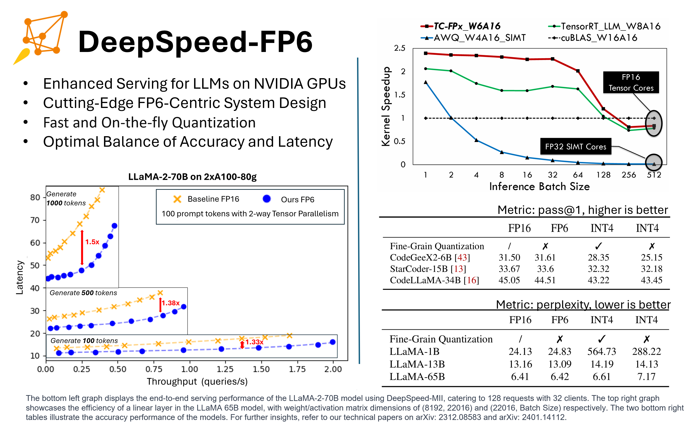
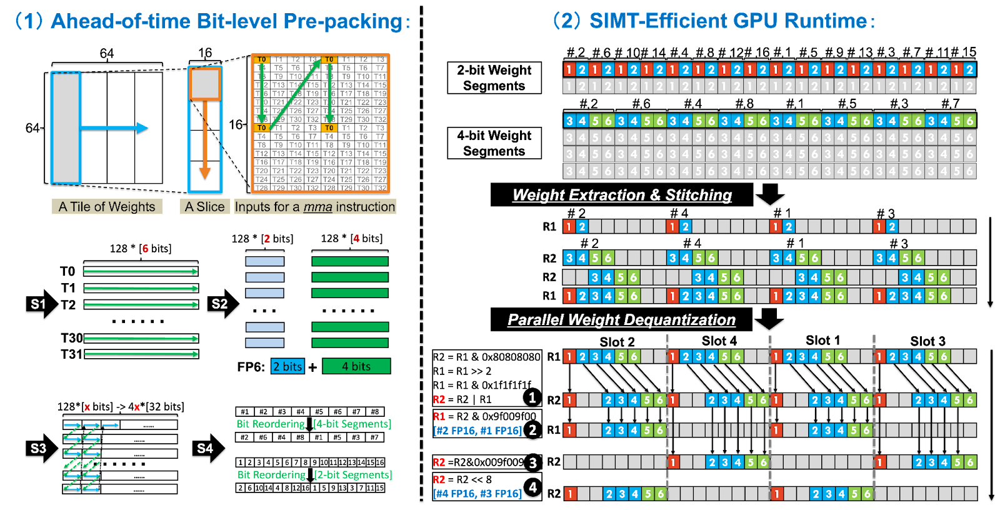
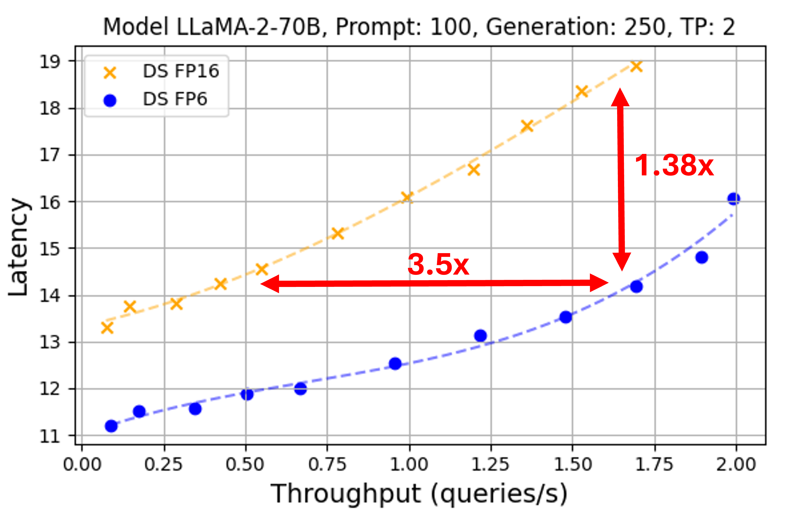
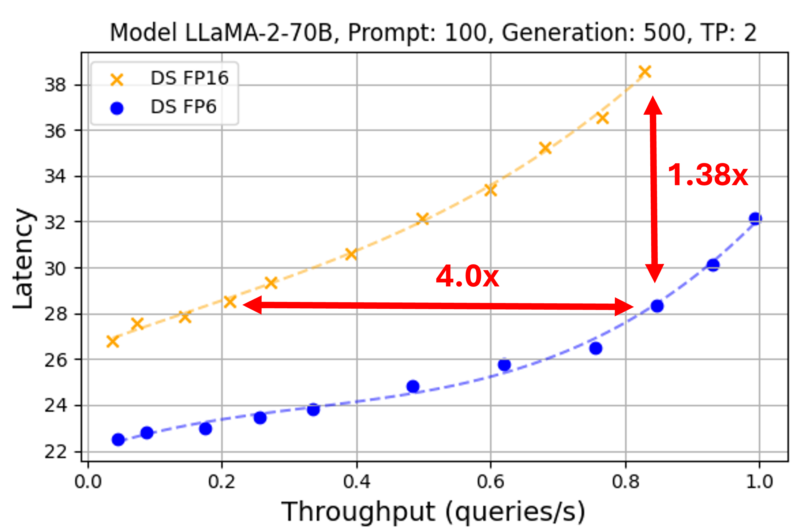
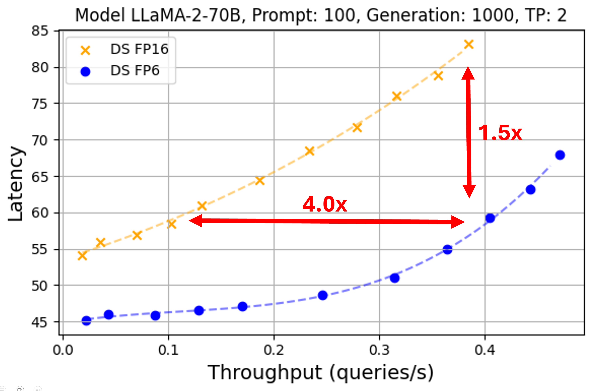

<div align="center">

# DeepSpeed-FP6：大型语言模型中以FP6为核心的强大推理服务

</div>

<div align="center">



</div>


要引用DeepSpeed-FP6，请引用以下两篇arxiv报告 - ZeroQuant(4+2) 和 FP6-LLM:

```
@article{wu2023zeroquant,
  title={Zeroquant(4+2): Redefining llms quantization with a new fp6-centric strategy for diverse generative tasks},
  author={Wu, Xiaoxia and Xia, Haojun and Youn, Stephen and Zheng, Zhen and Chen, Shiyang and Bakhtiari, Arash and Wyatt, Michael and Aminabadi, Reza Yazdani and He, Yuxiong and Ruwase, Olatunji and Song, Leon and others},
  journal={arXiv preprint arXiv:2312.08583},
  year={2023}
}

@article{xia2024fp6,
  title={FP6-LLM: Efficiently Serving Large Language Models Through FP6-Centric Algorithm-System Co-Design},
  author={Xia, Haojun and Zheng, Zhen and Wu, Xiaoxia and Chen, Shiyang and Yao, Zhewei and Youn, Stephen and Bakhtiari, Arash and Wyatt, Michael and Zhuang, Donglin and Zhou, Zhongzhu and others},
  journal={arXiv preprint arXiv:2401.14112},
  year={2024}
}
```


# Table of Contents
1. [为什么选择6位浮点(FP6)](#introduction)
2. [FP6的系统支持](#system-fp6)
3. [FP6的LLMs服务系统](#serving-llm)
4. [如何开始](#how-to-start)
5. [软件改进](#software-improvements)
6. [致谢和贡献](#ac)

# 1. 为什么选择6位浮点 <a name="introduction"></a>
大型语言模型（LLMs）领域正处于迅猛发展之中，模型量化是提升推理服务性能的关键技术之一。 我们的研究旨在提高计算效率和存储空间，同时保持模型质量。

**深入研究INT4的挑战**  在最近的研究成果 ZeroQuant(4+2)[1] 中, 我们探索了INT4量化技术(如GPTQ算法) 在大语言模型(LLMs)中的表现能力。虽然这些技术可以减小模型大小和参数存储量，但由于过拟合问题, 它们在更一般的许多任务中往往表现不佳，包括代码生成和摘要等更多生成任务。因此, 当前迫切需要新的方法来提高LLMs的效率和有效性。

 **FP6的突破**  我们对不同量化方法的探索将我们带到了FP6精度标准。尽管FP6数据格式在当前AI硬件的高效支持中存在挑战（我们将在下一节中解决这一挑战），该格式在各种任务的性能和灵活性方面均表现出色。值得注意的是，使用FP6量化的模型，如StarCoder-15B，在代码生成方面达到了与FP16模型相当的结果，而较小的模型(如BART-406M)在摘要方面达到了标准FP16性能水平。为了提高FP6在当前主流AI硬件上的执行效率，我们提出了一种4+2新颖的FP6 GPU kernel方案。这一创新使FP6成为提高LLMs效率的有效途径。更多详细信息请参阅我们的研究论文 ZeroQuant(4+2)[1]。


# 2. FP6的系统支持 <a name="system-fp6"></a>

**开创性的全栈GPU KERNEL设计** FP6量化的一个挑战是缺乏针对这种不规则位宽的高效GPU KERNEL设计。在我们最近的研究中（FP6-LLM[2]），我们设计并实现了TC-FPx，第一个具有Tensor Core支持的用于FP6和各种量化位宽(6位、5位、3位等)的浮点权重的GPU系统设计方案，缓解了LLM推理期间的“内存墙”问题。TC-FPx打破了底层GPU硬件的限制，允许GPU支持涉及任意位宽模型权重的矩阵乘法计算。在TC-FPx中，Tensor Cores用于矩阵乘法的密集计算，而SIMT cores在运行时有效地用于权重反量化，将模型权重反量化为FP16类型，Tensor Core基于此进行计算。它具有以下关键创新:
<div align="center">
  

</div>

* 运行前比特层级的数据排布转换。用以解决权重具有不规则位宽时不友好的内存访问挑战，实现GPU内存的最优访问；

* 运行时的高效SIMT计算。用以最小化权重反量化的运行时开销；

* 全栈的高效流水线设计。其SIMT计算、Tensor Core计算和GPU内存访问进行高效调度，最大程度提升性能。


平均而言，我们的FP6 kernel在NVIDIA A100 GPU上进行（因decoder的矩阵形状狭长而导致参数矩阵的访存成为瓶颈的）矩阵乘法时，处理速度比FP16 cuBLAS基准提高了2.1倍。值得注意的是，通过FP6量化实现的FP6内核使LLaMA-70b模型能够在单个A100 GPU上运行。这一显著成就使得其在batch小于32的LLM推理任务中，性能比FP16基准高出1.69到2.65倍。目前，TC-FPx内核仅支持NVIDIA Ampere GPU，并且仅在A100 GPU上进行了测试和验证。


# 3. 使用FP6服务LLMs <a name="serving-llm"></a>

我们已成功将FP6量化内核[3]集成到DeepSpeed-FastGen中，实现了运行时的即时量化。这一增强功能允许通过DeepSpeed-FastGen中的统一配置选项来高效量化和部署大型语言模型。通过我们的接口，用户可以输入HuggingFace模型名称或本地checkpoint目录。输入后，我们的系统将启动指定模型的加载，对每个线性层实现FP6量化，并将量化的权重进行比特层级的数据排布转换。转换后的张量随后作为更新后的权重，而原始的FP16权重被丢弃以优化内存使用。在推理阶段，FP6内核将利用这些6位的权重进行计算。

我们在两个A100 GPU-80G上评估了LLaMA-2-70b模型使用FP6量化的服务性能，实现了1.5倍的推理延迟减少和3.5倍的推理吞吐量增加，与FP16基线相比。FP6量化为模型推理提供了两个关键好处：它使大型语言模型（LLMs）能够在更少的GPU上部署——例如，LLaMA-70b在单个A100-80G GPU上就能以FP6形式运行，而FP16模型至少需要两个GPU。此外，它显著加快了小batch之下内存访问为瓶颈的线性层计算。此外，FP6量化减少了模型权重的GPU内存需求，允许同时服务更多查询，从而提高了服务吞吐量。

我们的系统在处理长序列生成时表现出很高的效率。如图1所示，对于超过提示长度的生成长度，我们的系统展现出显著的性能优势。随着生成序列长度的延伸，FP6与FP16之间的性能差异加大。这一趋势主要归因于解码长度扩展时，推理过程变得越来越受内存访问瓶颈限制，有利于我们的权重量化的GPU kernel，相对于FP16实现更大的kernel速度提升。需要强调的是，较长解码场景中内存访问瓶颈增强的两个因素如下：

首先，KV缓存的内存使用随序列长度增加而增加，减少了可容纳的batch大小并导致线性层的矩阵计算瓶颈变为参数的访存。

其次，在DeepSpeed-FastGen的prefill-decoding-mixed-batch技术背景下，对于decoding较长的情况，用于和decoding进行mixed-batching的prefill切块会相对不足，这导致纯粹用于decoding的batch频率增加，进一步加剧了访存的瓶颈。
<p align="center">
  
  
  
</p>

图1：在DeepSpeed-MII中，使用128个请求和32个客户端，对LLaMA-2-70B模型在2xA100-80g上进行端到端服务性能测试。我们尝试了128、256和512之间不同数量的请求，发现加速效果相似。

尽管FP6量化带来了显著的好处，但当前实现仍面临一些限制。值得注意的是，在GEMM因batch较大或有充足的GPU内存而使得瓶颈变为Tensor Core计算时，我们的仅限权重的量化kernel可能无法保持其性能优势，尤其是与厂商的优化库如cuBlas相比。然而，我们系统的低内存占用仍是一个关键优势。目前的支持限于非混合专家（Non-MoE）结构，我们正在努力将支持扩展到MoE结构。此外，当前系统仅与FP16输入模型兼容，因为当前实现的FP6 kernel仅支持处理FP16的激活。

</div>

# 4. 如何开始 <a name="how-to-start"></a>

DeepSpeed-FP6的量化和推理体验简单方便。这里我们以LLaMa-2-70B模型为例：
```python
import mii
pipe = mii.pipeline("NousResearch/Llama-2-70b-hf", quantization_mode='wf6af16')
response = pipe(["DeepSpeed is", "Seattle is"], max_new_tokens=128)
print(response)
```

您需要安装以下内容

```
pip install deepspeed-mii
pip install qtorch
```

要使用我们的DeepSpeed-FP6进行基准测试，请访问以下脚本：
```bash
https://github.com/microsoft/DeepSpeedExamples/blob/master/benchmarks/inference/mii/run_fp6.sh
```

也请访问[FP6-LLM github](https://github.com/usyd-fsalab/fp6_llm) 获取FP6的独立kernel。不要忘了给仓库加星标以表达您的支持！


# 5. 软件改进  <a name="software-improvements"></a>


我们的DeepSpeed-FP6目前仅支持线性GEMM。我们期待未来能够支持MoE GEMM。我们将继续根据您的反馈和支持改进DeepSpeed-FP6。DeepSpeed-FP6是更大DeepSpeed生态系统的一部分，包括一系列深度学习系统和建模技术。要了解更多，

* 请访问我们的 [网站](https://www.deepspeed.ai/) 了解详细的博客文章、教程和文档。
* 在我们的 [英文 X(Twitter)](https://twitter.com/MSFTDeepSpeed)、[日语 X(Twitter)](https://twitter.com/MSFTDeepSpeedJP) 和 [中文知乎](https://www.zhihu.com/people/deepspeed) 上关注我们，以获取 DeepSpeed 的最新消息。

我们欢迎您为 DeepSpeed 做出贡献！我们鼓励您报告问题、贡献 PRs、并在 [DeepSpeed GitHub](https://github.com/microsoft/DeepSpeed/) 页面上参加讨论。有关更多详细信息，请查看我们的 [贡献指南](https://github.com/microsoft/DeepSpeed/blob/master/CONTRIBUTING.md)。我们对与大学、研究实验室、公司等进行合作持开放态度，例如共同进行深度学习研究、应用 DeepSpeed 为现实世界的 AI 模型和应用提供支持等等。对于此类请求（以及其他不适合 GitHub 的请求），请直接发送电子邮件至 deepspeed-info@microsoft.com。

* 如果你喜欢我们的工作，请在[DeepSpeed GitHub](https://github.com/microsoft/DeepSpeed/)， [DeepSpeed-MII GitHub](https://github.com/microsoft/DeepSpeed-MII/) 和 [DeepSpeedExamples GitHub](https://github.com/microsoft/DeepSpeedExamples/)仓库“点赞”！


# 6. 致谢和贡献 <a name="ac"></a>
我们感谢悉尼大学和罗格斯大学的合作。我们还感谢开源库 [aspuru-guzik-group/qtorch](https://github.com/aspuru-guzik-group/qtorch).

贡献:
Xiaoxia Wu\* $^1$, Zhen Zheng\* $^1$, Haojun Xia\* $^2$, Arash Bakhtiari $^1$, Michael Wyatt $^1$, Shiyang Chen $^3$, Stephen Youn $^1$, Reza Yazdani Aminabadi, Yuxiong He, Olatunji Ruwase $^1$,  Zhewei Yao, Leon Song  $^1$ $^2$（项目负责人）

\* 平等贡献 1: 微软 2: 悉尼大学 3: 罗格斯大学

文献:

[1] ZeroQuant(4+2): Redefining LLMs Quantization with a New FP6-Centric Strategy for Diverse Generative Tasks. arXiv. https://arxiv.org/abs/2312.08583

[2] FP6-LLM: Efficiently Serving Large Language Models Through FP6-Centric Algorithm-System Co-Design. arXiv. https://arxiv.org/abs/2401.14112

[3] FP6-LLM kernel release. GitHub. https://github.com/usyd-fsalab/fp6_llm
