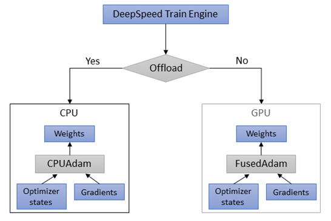
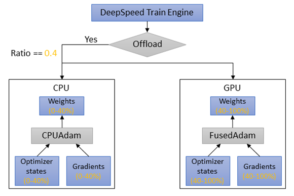
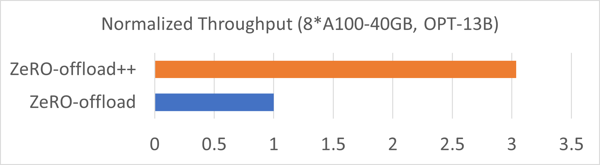

# DeepSpeed ZeRO-Offload++: 6x Higher Training Throughput via Collaborative CPU/GPU Twin-Flow

Deep learning has been successfully adopted in a wide range of applications such as speech recognition, chatbot, text and image generation, etc. To achieve better model serving accuracy, model size grows significantly. Take language models as example, from BERT with 110 million parameters to Megatron-Turing NLG with 530 billion parameters, the model size grows almost 5000x. Given limited GPU memory size, we need to efficiently utilize GPU memory to achieve good system throughput.

ZeRO offers memory efficient data parallel training scheme. For training large models like LLMs using ZeRO, GPU memory size is still often insufficient to hold all the model parameters. Thus, ZeRO-Offload is introduced to solve this insufficient GPU memory issue. ZeRO-Offload releases GPU memory pressure by offloading data and compute to the CPU side while minimizing CPU-GPU data copy overhead. Given CPU memory is often orders-of-magnitude larger than GPU memory, ZeRO-Offload was the first piece of work that enables billion-level parameter training even with very limited GPU memory resources (e.g., to an extreme: single GPU). ZeRO-Offload provides excellent performance when model size is multiple times larger than total GPU memory size.

However, system efficiency is still far from optimal when adopting ZeRO-Offload in some scenarios. Especially in the cases like small batch training, model that could not fit into GPU memory but not orders-of-magnitude bigger than GPU memory capacity, CPU offload not only introduce long end-to-end latency, but also underutilized GPU computation resources. To reduce memory copy latency as well as inefficient utilization of GPU introduced in these offload cases, we propose ZeRO-Offload++, which leverages both CPU and GPU coherently. ZeRO-Offload++ mainly includes 3 new features as _Twin-Flow_, MemCpy reduction, CPUAdam optimization. Now we release our __Twin-Flow__ feature.

The key benefits are:
* With _Twin-Flow_, ZeRO-Offload++ achieves up to **6x** training speedup compared with ZeRO-Offload.
*	High-level API provided in DeepSpeed config JSON makes it easy to use and fine-tune.

## Twin-Flow

In DeepSpeed, when training using popular optimizer like Adam, optimizer offloading follows an all-or-nothing policy. For simplifed example shown as Figure below, without offloading, all the parameters will be updated using GPU adam as FusedAdam optimizer. On the other hand, if offloading is enabled, all model weights use CPUAdam to update.

The major downside of this all-or-nothing offloading is, when offload all optimizer states to CPU side, both GPU memory and compute resources remain under-utilized. Although increasing batch size improves GPU utilization rate, each training iteration time is still super long compared with no-offloading case. To improve GPU compute and memory utilization rate as well as decrease training iteration time, we introduce a new feature in our DeepSpeed training engine called _Twin-Flow_.

In comparison, _Twin-Flow_ allows a portion of optimizer states to be held in CPU memory and the other portion of optimizer states remaining in GPU memory. When optimization step is triggered, both CPU and GPU can do parameter updates simultaneously. Once offloading is enabled, we provide an offload ratio configuration which allows users to adjust how many percentages of model weights are updated on CPU side and the rest are happened on GPU side. "_Twin_" comes from the idea that both CPU and GPU are using the same optimizer function here. "_Flow_" means parameters are not only hold in both host and device memory, but also computed using both CPU and GPU cores.

As shown in Figure below, with ZeRO-Offload enabled and we set _Twin-Flow_ ratio of 0.4 (40%). DeepSpeed Training engine will automatically assign first 40% (i.e. 0-40%) of weights step procedure on the CPU side using CPUAdam, and use GPU side FusedAdam to update the rest 60% (i.e., 40-100%) model parameters jointly. Therefore, with _Twin-Flow_, we can achieve decent GPU memory and core utilization rate, at the same time reduce training iteation time in optimizer offloading cases.

Note that this _Twin-Flow_ ratio can be adjusted based on how much GPU idle memory is available. The smaller this ratio is, the more GPU memory and cores are used and the shorter training iteration time it achieves. The ideal case is to be as near as GPU memory upper bound in order to minimize training iteration time.
Note that _Twin-Flow_ is not limited to Adam optimizer only, it can be applied to any optimizer (e.g., AdaGrad) from the user side.

## Performance Evaluation

We conduct our performance evaluations over both A100 and H100 DGX machine and test for OPT model with 13B and 30B parameters. We run 13B OPT model training on a 8 A100 DGX machine, and run OPT-30B model training using a 8 H100 DGX machine. With some tuning on offload ratio in ZeRO-Offload++, we achieve 6x and 3x training speedup of Meta OPT models on single DGX-H100-80GB and DGX-A100-40GB, respectively (top-most figure and bottom figure here).

## On-going Optimizations

* Reduce uncessary D2H/H2D memcpy

* On-the-fly fp16 to fp32 casting for CPUAdam

## Tutorials

Examples and Tutorials are [here](https://github.com/microsoft/Megatron-DeepSpeed/blob/main/examples_deepspeed/offload_pp/README.md)

## Contributors:

This project was made possible by the contributions of the following people from DeepSpeed Team:

[Guanhua Wang](https://www.microsoft.com/en-us/research/people/guanhuawang/), Masahiro Tanaka, Xiaoxia Wu, Lok Chand Koppaka, Samyam Rajbhandari, [Olatunji Ruwase](https://www.microsoft.com/en-us/research/people/olruwase/), [Yuxiong He](https://www.microsoft.com/en-us/research/people/yuxhe/) (team lead)
