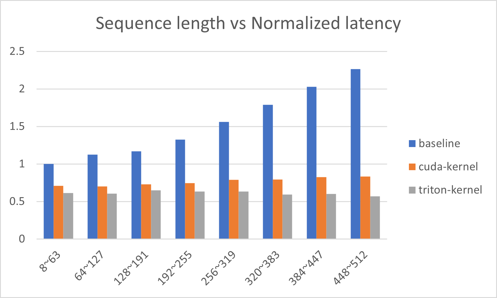
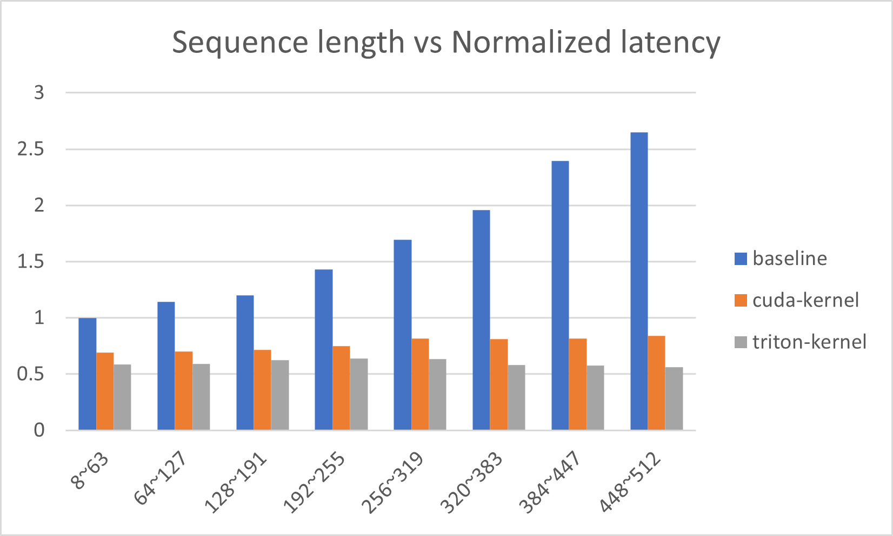

# DeepSpeed with Triton compiler

# 1. Overview

We have integrated [Triton](https://github.com/openai/triton), an open source compiler for GPU programming, into DeepSpeed, which further boosts the inference speed of BERT-like models in float16 precision.
By replacing some CUDA kernels or torch operators with Triton kernels, we achieved 1.14\~1.68x speedup (or 12\~41% latency reduction) for different models and GPUs, as shown in Table 1.

<div align="center">

| Hardware | Bert-base | Bert-large | Roberta-base | Roberta-large |
|----------|:------:|:------:|:------:|:------:|
| A100 |1.65x | 1.68x | 1.53x | 1.61x |
| V100 | 1.29x | 1.14x | 1.23x | 1.21x |

Table 1. The average speedup (see NOTE below for more detail)


</div>

For those transformer operators in float16, we have implemented kernels written in Triton language that replace ordinary CUDA kernels or torch operators.
The Triton kernels we implemented include softmax, layer-normalization, residual-addition and all the matrix multiplications except MLP layers (see NOTE below for details).
In our experiments, Triton kernels help to reduce the average latency (over difference sequence lengths) by 6\~24% (depending on model and hardware) when compared to the latency with CUDA-only kernels.


Figures below show the latency reduction in more detail.
Figure 1 visualizes latency reduction in different sequence lengths in A100 GPU for Bert-base model.
The baseline (blue) is from Huggingface transformers without any kernel injection, the orange is from Deepspeed with CUDA-only kernels and the gray is from Deepspeed with Triton kernels.
Figure 2 shows the same plot for Bert-large model in A100 GPU.

<div align="center">



*Figure 1: Normalized P90 latency for Bert-base model in A100 GPU across different sequence lengths*



*Figure 2: Normalized P90 latency for Bert-large model in A100 GPU across different sequence lengths*

</div>


Next, we dive deeper into this new feature in DeepSpeed.

# 2. How to use Triton in Deepspeed

You can enable Triton compilers to optimize these kernels by setting a flag in the DeepSpeed config file.

```
pipe = pipeline('fill-mask', model='bert-base-cased', framework='pt', device=0)
pipe.model = deepspeed.init_inference(pipe.model,
                                        dtype=torch.float16,
                                        replace_with_kernel_inject=True,
                                        enable_cuda_graph=True,
                                        use_triton=True,
                                        triton_autotune=True,
                                        max_out_tokens=pipe.tokenizer.model_max_length)
```


## Running BERT inference with Triton kernels

We use an example of Bert-base here.

```python
pip install deepspeed[triton]

git clone https://github.com/microsoft/DeepSpeedExamples.git
cd DeepSpeedExamples/inference/huggingface/fill-mask

deepspeed --num_gpus 1 test-bert.py --triton
```

To run a performance benchmark, you can use the following command:

```python
pip install deepspeed[triton]

git clone https://github.com/microsoft/DeepSpeedExamples.git
cd DeepSpeedExamples/benchmarks/inference

deepspeed --num_gpus 1 triton-bert-benchmark.py --model bert-base-cased --dtype fp16 --kernel-inject --deepspeed --graphs --triton
```

# NOTE
<!-- **_NOTE:_** -->
* For more information on how to use DeepSpeed, please visit our [GitHub Page](https://github.com/microsoft/DeepSpeedExamples) and our [website](https://www.deepspeed.ai/), where you can find blog posts, tutorials, and documentation.

* This feature is currently only supported for BERT, Roberta and other BERT-like models, and not for text-generation models yet.

* To achieve the best performance with Triton optimization, you need to activate CUDA graph and ‘triton_autotune’ in the DeepSpeed config. CUDA graph prevents the overhead of JIT compilation and a deep call stack in Triton. ‘triton_autotune’ executes an initial step to find the most suitable parameters for Triton kernels, which may take some time.

* We used [Triton 2.0.0.post1 release](https://pypi.org/project/triton/2.0.0.post1/) in our experiments.

* In our experiments, we used a batch size of 1, a sequence length range of 8 to 512, and a ‘fill-mask’ task. Table 1 shows the average P90 latency over the entire sequence length range, while Figures 1 and 2 show the P90 latency for specific sub-ranges. The baseline is the Huggingface transformers without any optimization. The speedup is calculated as (baseline P90 latency)/(DeepSpeed-Triton P90 Latency). We found that the CUDA kernel in MLP performed better than the Triton kernel in our experiments, so we used a hybrid approach that combines both kernels when Triton is enabled in the DeepSpeed config.
