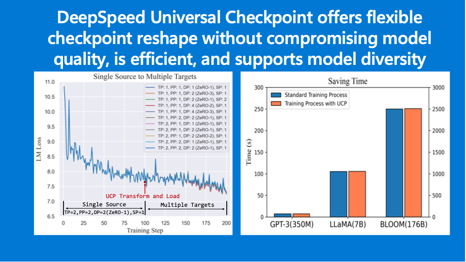
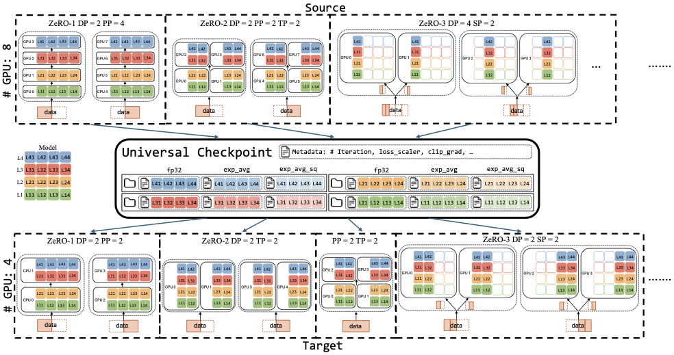
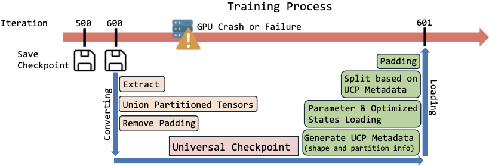
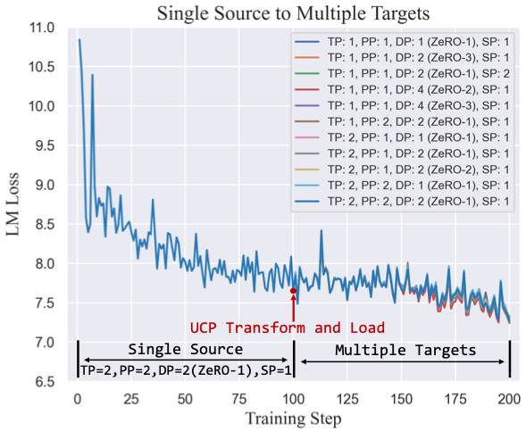
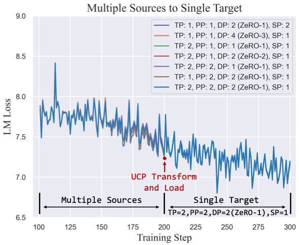
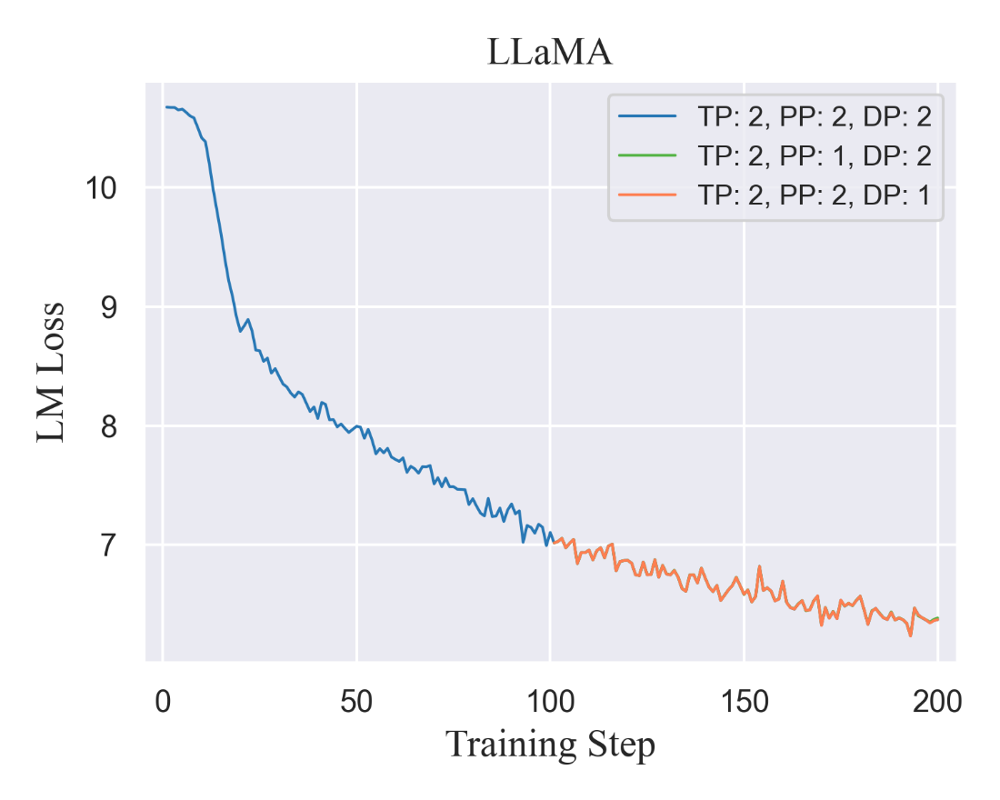
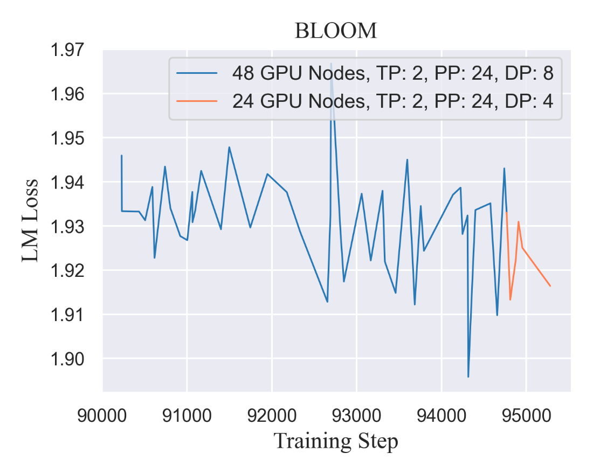
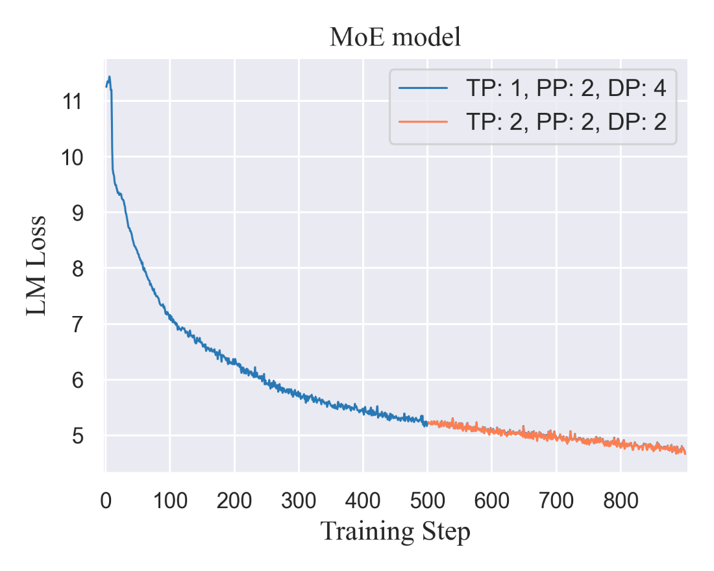

<div align="center">

# DeepSpeed Universal Checkpointing: Efficient and Flexible Checkpointing for Large Scale Distributed Training

</div>



To cite DeepSpeed Universal Checkpoint, please cite our [arxiv report](https://arxiv.org/abs/2406.18820):

```
@article{lian2024-ucp,
title={Universal Checkpointing: Efficient and Flexible Checkpointing for
Large Scale Distributed Training},
author={Xinyu Lian and Sam Ade Jacobs and Lev Kurilenko and Masahiro Tanaka
and Stas Bekman and Olatunji Ruwase and Minjia Zhang},
journal={arxiv preprint arxiv:406.18820},
year={2024},

}
```

# Introduction

Checkpointing is a crucial technique for reducing the cost of training
machine learning models, as it enables saving the model state during the process.
This way, if the system fails, the training can resume from the most recent checkpoint
instead of from the beginning. Additionally, checkpointing allows for
evaluating the model performance at various stages of training, which
facilitates hyperparameter tuning and finetuning for different and
varied downstream tasks.

However, there are challenges in the design, implementation and usage of
checkpointing especially in distributed training and finetuning
scenarios. Parallel training methods such as ZeRO data parallelism (ZeRO-DP),
pipeline parallelism (PP), tensor parallelism (TP) and sequence
parallelism (SP) are popular technologies for accelerating LLMs training.
However, elastic and flexible composition of these different parallelism
topologies with checkpointing is not currently available, in part, because
these techniques shard model and/or optimizer states making it difficult to
resume training with a checkpoint that was created on a different number of GPUs or
accelerators.

In this release, we are excited to introduce DeepSpeed Universal
Checkpointing (*UCP*), a most comprehensive solution to the problem of
distributed checkpointing. *UCP* enables efficient checkpoint creation
while providing the flexibility of resuming on arbitrary parallelism
strategies and hardware configurations. *UCP* also unlocks unprecedented
capabilities for large-scale training such as improved resilience to
hardware failures through continued training on remaining healthy
hardware, and reduced training time through opportunistic exploitation
of elastic capacity.

In summary, this release of *UCP* unlocks the following capabilities:

- Flexible checkpoints reshape along any of the training parallelism
  techniques (i.e., PP, TP, DP, ZeRO-DP, SP, MoE)

- Elastic resource management, scale up or scale down of training and
  finetuning accelerator resources

- Real world examples with support for multiple commercial-scale models
  (i.e., BLOOM, Megatron GPT, LLAMA, Microsoft Phi)

# Core Design

The key insight of DeepSpeed *UCP* is the selection of the optimal
representation in each phase of the checkpointing life cycle:
distributed representation for saving, and consolidated representation
for loading. This is achieved using two key mechanisms. First, the
universal checkpoint format, which consists of a consolidated
representation of each model parameter, and metadata for mapping
parameter fragments to the ranks of an arbitrary parallel training
configuration. Second, the universal checkpoint language, a simple but
powerful and robust specification language for converting distributed
checkpoints into the universal checkpoint format.

## Universal Checkpoint Format



Figure 1: UCP overview: top row and bottom row are Source and Target
parallelism configurations respectively. The middle row shows UCP as
an intermediate format of translating from Source to Target.

Figure 1 shows high level schematic description of *UCP* conversion
process and format. Conversion starts with top block of checkpointing in
any parallel format e.g, DP, TP, PP, SP. Saving in the native format of parallel training avoids any overhead of
consolidating into a single global checkpoint. To ensure that
a checkpoint saved in one parallel configuration (herein called *Source*) can be
easily converted and loaded for continuous training in another parallel configuration (herein called *Target*),
we introduce the idea of atomic checkpoint as an intermediate format.

The concept of atomic checkpoint is central to *UCP*. These are
fine-grained files containing the consolidated representation of each
model parameter, along with optimizer states. The atomic checkpoint
format is useful for three reasons. First, the atomic representation of
checkpoints decouples the dependencies of distributed checkpoints and
specific parallelism techniques and hardware configurations. As such,
one does not need to implement individual converters for each *Source*
and *Target* pair. Instead, *UCP* can act as a common interchange format
between different distributed training techniques, which then can be
easily transformed into other distributed training strategies, as shown
in Fig 2. By keeping the consolidated representation of each model
parameter, *UCP* enables easy splitting and flexible mapping of model states
or fragmented states to different GPUs on a parameter-by-parameter
basis, effectively reducing the working memory needed to load large
model checkpoints. Second, the *UCP* conversion happens lazily and
on-demand, e.g., when a training process detects a change of parallelism
technique and hardware configuration. In other words, the existing
distributed checkpoint saving logic does not need any change. Third, the
structure of the *UCP* also makes it easy to handle advanced techniques
in distributed training, such as mixed-precision training. In practice,
researchers and practitioners may switch between fp16 and bfloat16 mixed
precision training. By keeping the fp32 weight/optimizer values, the
training can resume either with fp16 or bfloat16.

## Universal Checkpoint Language



Figure 2: UCP language helps transform distributed checkpoints into the
UCP format and load UCP checkpoints based on the Target parallel
technique and new hardware configuration.


While *UCP* provides a common interface for different parallelism
strategies, the development of transformation from arbitrary distributed
checkpoints to *UCP* can still incur a high engineering and
implementation cost. This is because the number of distributed checkpoint files
and their contents can vary across the different parallel training techniques.

To tackle this challenge, *UCP* provides *UCP* language, which is a
simple but powerful specification language for converting a distributed checkpoint
into the atomic checkpoint format, described in previous
section. *UCP* does this in two ways. First, it provides a declarative
system with pre-defined *parameter patterns*, which cover a wide range
of parallelism strategies for model states. Parameter patterns contain
runtime information about how a parameter is partitioned across GPUs.
For instance, *nopattern* means that a parameter is uniquely associated
with a GPU rank, which is the most common pattern seen in techniques
such as ZeRO-1/2 and PP (see our technical report for a completed list
of currently supported parameter patterns). Second, *UCP* language
provides a set of common operators that facilitate the transformation of
distributed checkpoints into consolidated atomic checkpoints. At a
high-level, as illustrated in Figure 3, *UCP* language is invoked when
support for a new *Target* is needed or the hardware
configuration changes. It first transforms distributed checkpoints into
the *UCP* format. It then loads the *UCP* checkpoints based on the
*Target* parallel technique and new hardware configuration.

# Key Results

We evaluate *UCP* through a series of experiments on training LLMs. We
focus on the decoder-only Transformers: an architecture chosen due to
its state-of-the-art performance. Some of the largest models are also
decoder-based, making flexible and efficient checkpointing especially
important. In this blog, we present results of correctness verification
across different models and parallel strategies. For more results on
parallel efficiency analysis, detailed system and model architectures
and training hyperparameters, please see our technical report referenced
above.

*UCP* provides flexible checkpointing from a *Source* parallelism
strategy to a different *Target* with different hardware configurations.
To verify this capability, we conduct correctness tests of *UCP* with
two groups of experiments.

## Single Source to Multiple Target



Figure 3: Training curves of loading UCP checkpoints into different
Target at iteration 101 with various GPU counts and parallelism
strategies

To test if UCP allows resuming training with different parallelism
strategies and hardware configuration, we first train the GPT-3 model
using a configuration of TP=2, PP=2, DP=2 (ZeRO-1), and SP=1. Due to
constraints in time and resources, we limited the experiment to the
first 200 iterations. We convert the checkpoints saved at the 100th
iteration to *UCP* checkpoints and resume training with these *UCP*
checkpoints using different GPU counts and parallelism strategies. We
record the LM loss (average losses across the data parallel group) for
each iteration. Figure 3 illustrates that the training can be seamlessly
resumed with *UCP* checkpoints using different *Target* parallelism
strategies, achieving consistent convergence if the training were to
continue with the *Source* strategy.

## Multiple Source to Single Target



Figure 4: Training curves of transforming different Source parallelism
strategies at iteration 100 to UCP and loading UCP with a different
Target.

Figure 4 shows the training curves from multiple *Source* configurations
to a single *Target*. Given a fixed random seed, we first train the
GPT-3 model using different *Source* configurations. We then convert
their distributed checkpoints saved at the 100th iteration to *UCP*
checkpoints and resume training with a configuration of TP=2, PP=2,
DP=1, and SP=1. The results show that regardless of the different
*Source* configurations, their checkpoints can all be converted into
*UCP* and resume training with a different configuration. Most
importantly, the resumed training curves match the curves from the
*Source* at iterations 101--200. These results validate the
effectiveness of *UCP* of converting an arbitrary configuration to a
different configuration for resumed training.

## Varying Model Architectures

*UCP* is model architecture agnostic. As such, it is not only compatible
with GPT models but also flexible enough to support various other model
architectures and sizes. Figures 5, 6 and 7 show the training
convergence for LLaMA 7B, BLOOM 176B, and a variant of Mixtral-7x8B MoE,
when resuming from *UCP* at the middle of training with new parallelism
strategies. These figures show that training is seamlessly resumed with
*UCP*, achieving consistent convergence that aligns with the initial
training phase across these diverse models. These results suggest that
*UCP* is quite flexible for various model architectures and sizes.



Figure 5: Training curve with LLaMA model architecture. Source is
TP=PP=DP=2. Training is resumed at iteration 101 with new Targets
TP=DP=2, PP=1 and TP=PP=2, DP=1



Figure 6: Training curve of BLOOM model architecture. Source is TP=2,
PP=24, DP=8. Training is resumed at iteration 94767 with a new Targets
TP=2, DP=4, PP=24.



Figure 7: Training curve with a variant of the Mixtral-MoE model
architecture. Source is TP=1, PP=2, DP=4. Training is resumed at
iteration 501 with a new Target TP=PP=DP=2.

# General Availability of DeepSpeed Universal Checkpoint

We are excited to release DeepSpeed Universal Checkpoint. DeepSpeed
Universal Checkpoint is available in DeepSpeed versions >=
[0.14.4](https://github.com/microsoft/DeepSpeed/releases/tag/v0.14.4),
has been fully integrated with [Megatron-DeepSpeed](https://github.com/microsoft/Megatron-DeepSpeed) ([commit c3a13be](https://github.com/microsoft/Megatron-DeepSpeed/commit/c3a13be721da0d0de16c338d0d665b0f7d13d14f)).
Detailed tutorial on usage is available on
[DeepSpeed tutorial page](https://www.deepspeed.ai/tutorials/universal-checkpointing/).

We welcome contributions and collaboration from the broader open-source
community. DeepSpeed Universal Checkpoint is part of the bigger
DeepSpeed ecosystem of large-scale AI training and inference. For more
details on all DeepSpeed technologies and innovations, please visit our
[website]((https://www.deepspeed.ai/)) and follow us
on X, formerly Twitter, ([English](https://twitter.com/MSFTDeepSpeed),
[Japanese](https://twitter.com/MSFTDeepSpeedJP))
and [Chinese Zhihu](https://www.zhihu.com/people/deepspeed).

# Acknowledgements and Contributions
We thank the collaboration of University of Illinois at Urbana-Champaign,
Statosphere, and Intel Habana.

Contributions:
Xinyu Lian $^1$, Sam Ade Jacobs $^2$, Lev Kurilenko $^2$, Masahiro Tanaka $^2$,
Stas Bekman $^3$, Olatunji Ruwase $^2$, Minjia Zhang $^1$, Moshe Island $^4$

1: University of Illinois at Urbana-Champaign
2: Microsoft
3: StasoSphere
4: Intel Habana
