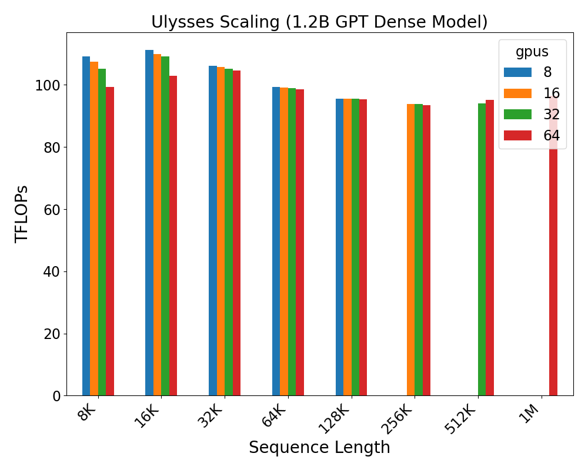
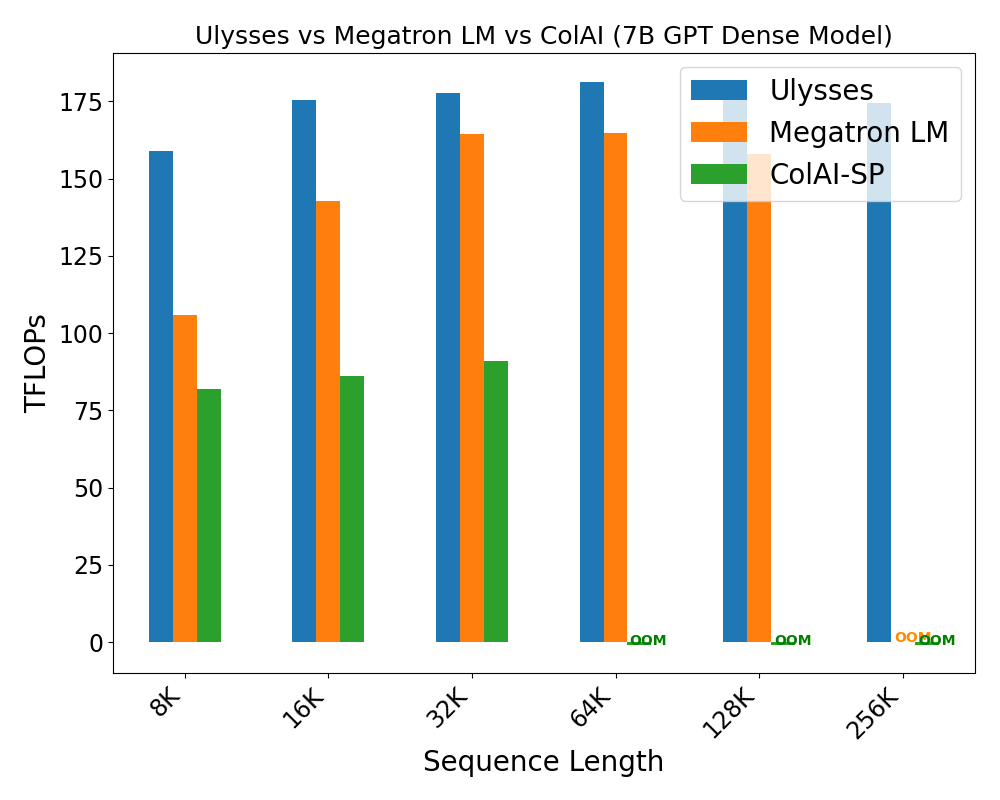
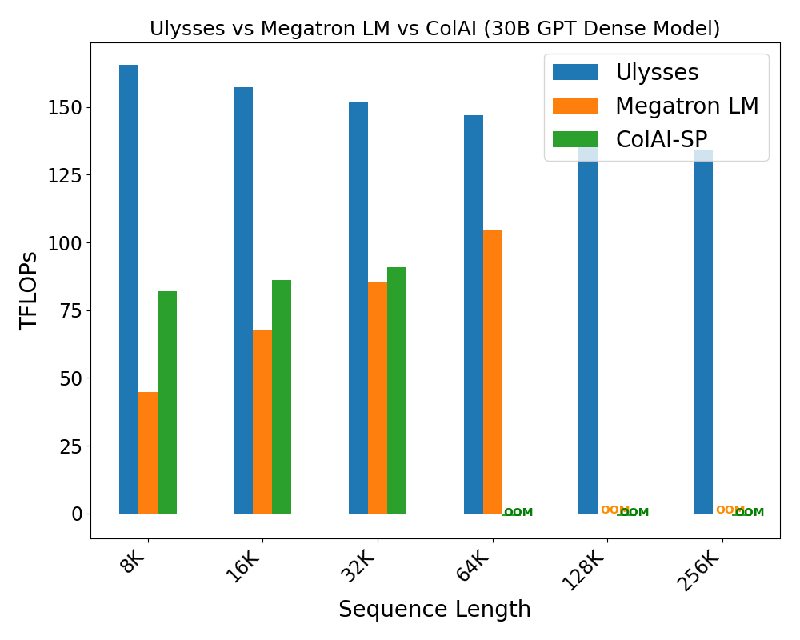
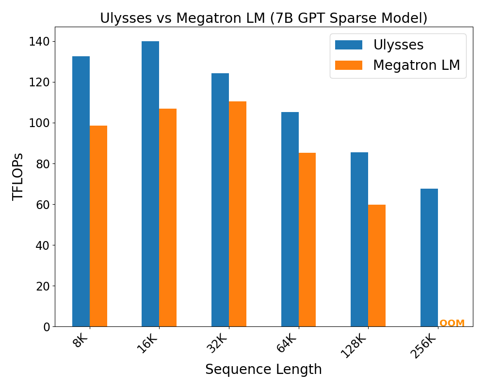
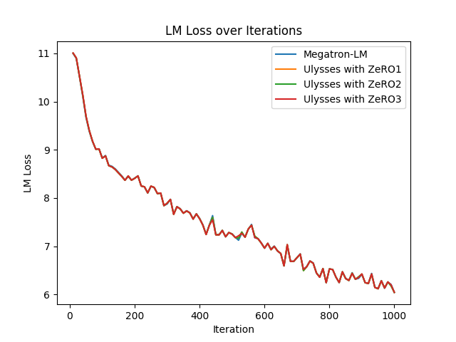

<div align="center">

# DeepSpeed Ulysses: System Optimizations for Enabling Training of Extreme Long Sequence Transformer Models

</div>

<div align="center">


</div>

To cite DeepSpeed-Ulysses, please cite our [arxiv report](https://arxiv.org/abs/2309.14509):

```
@article{jacobs2023deepspeed,
      title={DeepSpeed Ulysses: System Optimizations for Enabling Training of Extreme Long Sequence Transformer Models},
      author={Sam Ade Jacobs and Masahiro Tanaka and Chengming Zhang and Minjia Zhang and Shuaiwen Leon Song and Samyam Rajbhandari and Yuxiong He},
      journal={arXiv preprint arXiv:2309.14509},
      year={2023},
}
```

## Introduction

Training large models with long sequences is becoming very important
across the board from generative AI to models for scientific discovery.
On generative AI side, conversational AI, long document summarization
and video generation require reasoning over long contexts in spatial and
temporal domains. For example, multimodal foundation models such as ones
that process speech, images and waveforms concurrently require long
context reasoning over high dimensional inputs with extremely large
sequences. Similarly, chapter and book level summarization (estimated at
tens and hundreds of thousands of words) are of great importance in
conversational AI and abstract summarization tasks.

Long sequence length is equally critical for AI for science opening
doors for better understanding of structure biology, health care,
climate and weather forecasting and large molecular simulation. For
instance, by adapting large language models with gene sequences, we can
create language models that can learn the evolutionary patterns of
genomes using simple alphabets and extremely long sequences (the human
genome has 6.4 billion letters). In health care, diagnostic predictive
model conditioned on entire patient care record requires context of
extremely long sequence.

Despite the emerging importance of long sequence length for both
generative AI and AI for science, existing large model training systems
and the underlying parallelism technologies (data, tensor, pipeline,
sequence parallelism) are limited in their ability to support the
efficient long sequence training. Two challenges with existing
parallelism approach come to the fore. First, existing parallelism
approach such as data, tensor and pipeline parallelism cannot address
the scaling along sequence dimension. Second, existing sequence
parallelism approaches are not effective because of memory-communication
inefficiencies<span class="mark">.</span> Furthermore, existing
approaches have limited usability requiring intrusive and error prone
code refactoring.

In this release, we are proud to introduce *DeepSpeed-Ulysses (or
Ulysses, a very long novel)*, a simple, portable, and effective
methodology for enabling highly efficient and scalable LLM training with
extremely long sequence lengths.

DeepSpeed-Ulysses partitions individual samples along the sequence
dimension among participating GPU. Then right before the attention
computation, it employs *all-to-all communication* collective on the
partitioned queries, keys and values such that each GPU receives the
full sequence but only for a non-overlapping subset of the attention
heads. This allows the participating GPUs to compute attention for
different attention heads in parallel. Finally, DeepSpeed-Ulysses
employs another all-to-all to gather the results along the attention
heads while re-partitioning along the sequence dimension.

The key properties of DeepSpeed-Ulysses and its implementation released
with this blog are as follows:

*  ***4x larger sequence lengths*** than existing systems, while
enabling training with sequences with ***over a million tokens***.

* Communication reduction of ***over 10x*** compared to existing
systems, resulting in throughput improvements of ***up to 2.5x***, and
sustained throughput of over 175 TFlops/GPU (over 54% of hardware peak).

* Fully general and implementation agnostic attention: DeepSpeed
sequence parallelism supports dense as well as sparse
attention, and it works with efficient attention implementations such as
FlashAttention v2.

* Support for massive model training: DeepSpeed sequence parallelism
works together with ZeRO-3 to not only support large sequence lengths
but also massive model sizes.

* Easy-to-use and portable, requiring minimal code changes to the
existing training frameworks.

In subsequent sections, we provide detailed discussion of DeepSpeed-Ulysses
core design, communication complexity analysis,
experimental evaluation and comparison with existing work and highlight
of usability and guide on usage.

## Core Design of DeepSpeed-Ulysses

<div align="center">


*Figure 1: DeepSpeed sequence parallelism (DeepSpeed-Ulysses) design*
</div>

Figure 1 shows the core design of DeepSpeed-Ulysses. As with the known
transformer architecture, the design consists of input sequences *N*
partitioned across *P* available devices. Each local *N/P* partition is
projected into queries (Q), keys (K) and values (V) embeddings. Next,
(QKV) embeddings are gathered into global QKV through highly optimized
all-to-all collectives between participating compute devices. Sequel to
all-to-all collective is the attention computation per head in the form:

$$Output\ context = Softmax\ (\frac{QK^{T}}{\sqrt{d}})V$$

After the attention computation, another all-to-all collective
transforms *output context* tensor of attention computation to sequence
(*N/P*) parallel for subsequent operators (MLP MatMul, layer norm etc)
in the remaining modules of transformer layer block.

### Significant Communication Volume Reduction

What distinguishes DeepSpeed-Ulysses from the other existing
long-sequence approaches is our much smaller aggregate communication
volume and overall better scalability with increasing degree of sequence
parallelism compared to existing solutions, as demonstrated by the
communication volume analysis below:

On modern clusters with intra-node NVSwitch interconnect and inter-node
fat tree IB topology, the communication volume transmitted per link for
an all-to-all for aggregate message of size *M* over *P* GPUs is *M/P*.
For a transformer model with hidden size h, sequence length of N, and
parallelism degree of P, DeepSpeed sequence parallelism performs all-to-all for the QKV
projections with an aggregate message size of *3Nh* before the attention
computation, and another all-to-all for output context projection with a
size *Nh* for each transformer layer. Therefore, DeepSpeed sequence
parallelism incurs an aggregate communication volume per link of
***4Nh/P (or with the complexity of O(N/P).*** Note that this
communication volume is constant when both N and P are increased
proportionally.

In contrast, the existing approaches like Megatron-LM incur
communication volume that increases linearly with N regardless of P,
resulting in the ***communication complexity of O(N).*** For instance,
Megatron-LM performs two *all-gather* with the message volume of *Nh*
and two *reduce-scatter* with the volume of *Nh* for each transformer
layer. However, the cost of each all-gather and reduce-scatter of size M
remains M when *P \>\> 1*, instead of *M/P*. Therefore, Megatron-LM
sequence parallelism incurs a communication volume per link of ***4Nh***
which is P times larger than that for DeepSpeed sequence parallelism.
This allows DeepSpeed sequence parallelism to enable training with
extremely long sequences while achieving significantly higher training
efficiency compared to the existing approaches. Our evaluation results
match this analysis.

### Additional Highlights of DeepSpeed-Ulysses

***An Attention Agnostic Solution***

DeepSpeed implementation of distributed attention module is general
enough to support any attention: e.g., self-attention, cross-attention,
causal attention in both their dense and sparse counterparts, and their
various optimized kernels that support long-sequence at local attention
level such as different versions of FlashAttention.

The generality property of DeepSpeed-Ulysses stems from the modular
nature of its core design: an attention-centric sequence parallelism
design. Prior to attention computation is sequence parallelism of N/P
partition, attention computation is head parallelism with full attention
per head but just with fewer heads, thus attention computation can be
replaced with any type of attention mechanisms, e.g., dense attention
and various forms of sparse attention.

***Training Bigger Models with Longer Sequences through ZeRO-3 Integration***

While DeepSpeed sequence parallelism reduces the activation memory when
training with longer sequences, it does not impact the memory consumed
by the model states. Therefore, to support large sequence length
training with large language model, DeepSpeed sequence parallelism is
integrated with ZeRO-3.

[ZeRO Redundancy Optimizer Stage 3 (ZeRO-3)](https://www.microsoft.com/en-us/research/blog/zero-deepspeed-new-system-optimizations-enable-training-models-with-over-100-billion-parameters/) is a memory optimization technique for training large
models. Unlike the classic data parallel training of neural networks
where model states are replicated across data parallel ranks, ZeRO-3
optimizes memory usage by partitioning model states across data parallel
ranks. However, with sequence parallelism, training data can be
considered in both batch (sample) and sequence dimensions and the
associated parallel groups combined to form a larger group for ZeRO
parallelism.

Therefore, we extend ZeRO-3 partitioning to combination of data parallel
and sequence parallel ranks. In other words, in DeepSpeed sequence
parallelism, ZeRO partitions model states across both sequence and data
parallel group and collects per rank partitions (allgather) when they
are needed. Similarly, gradients are reduced across both data and
sequence parallel ranks for parameter update. ZeRO allows
for huge memory savings in both sequence and data dimensions and enables
scaling not just to large sequence lengths but also to large models.

## Evaluation

We evaluate DeepSpeed-Ulysses (Ulysses) on GPT,
a foundation model for many NLP tasks on up to 64 A100 GPUs with 40GB memory. Our
evaluations are four-fold: i) sequence length scalability, ii)
throughput for dense attention and comparison with existing system, and
iii) throughput with sparse attention and comparison with existing
system, iv) convergence study of DeepSpeed sequence parallelism. We discuss
and present evaluations from each of these categories next.

### Sequence Length Scalability

The first set of experiments is strong scaling of sequence length up to
1 million tokens on 1.2 billion parameter GPT model. Results of this
evaluation are shown in Figures 2. DeepSpeed sequence parallelism
allows increasing sequence length linearly with the
number of GPUs and
maintains similar computation throughput across different sequence
length at appropriate GPU count.

<div align="center">


*Figure 2: DeepSpeed sequence parallelism strong scalability evaluation
at different sequence length and GPU count.*
</div>

### Dense Attention Evaluation

Next, we evaluate Ulysses on 7 billion (7B) and 30 billion (30B) parameter
GPT dense attention models and compare against Megatron-LM's sequence
parallelism (Megatron LM) and Colosal AI sequence parallelism (ColAI-SP) on
32 and 64 A100 GPUs respectively. The results of these evaluations are shown
in Figures 3 and 4.

We compare Ulysses with Megatron-LM and ColAI-SP for 7B and 30B models
running various sequence lengths. We chose the sequence parallelism
degree and micro-batch size that produced the best performance
(measured as TFLOPs) for the three methods, this we call optimal
(batch size-sequence length) configurations. For Ulysses, we always
use a ZeRO-3 parallelism degrees of 32 and 64 for 7B and 30B models
respectively.


Figures 3 and 4 show that Ulysses consistently outperforms Megatron-LM
and ColAI-SP for the sequence length that can be run with them. In addition,
Ulysses can run longer sequence than the two existing methods. Ulysses
performance advantages are two folds: (1) Ulysses in combination with ZeRO-3
parameter sharding across both data and sequence parallel groups fits more
samples than Megatron-LM and ColAI-SP because of the memory optimization
leading to higher throughput (2) Ulysses benefits from efficient *all-to-all*
communication relative to *all-gather* *reduce-scatter* and *ring-style* P2P
communication as applied in Megatron-LM and ColAI-SP sequence parallelism.
However, for dense attention at long sequence length, the throughput is
primarily determined by local attention computation due to quadratic
computation complexity of attention, therefore performance gap between Ulysses
and the two existing methods closes for sequence length that can be run with them.

<div align="center">


*Figure 3: Evaluation of Ulysses vs Megatron LM vs ColAI-SP on GPT-7B parameter
 model with dense attention (32 GPUs).*
</div>

<div align="center">


*Figure 4:  Evaluation of Ulysses vs Megatron LM vs ColAI-SP on GPT-30B parameter
 model with dense attention (64 GPUs).*
</div>

### Sparse Attention Evaluation

Similarly, we evaluate Ulysses on 7 billion and 30 billion parameter sparse
attention models and benchmark against Megatron-LM sequence parallelism.
There is no public implementation of block sparse attention for ColAI-SP,
therefore, evaluation of sparse attention is in comparison with Megatron-LM.
Results of our evaluation are shown in Figures 5 and 6. We observe similar
trends with sparse attention as dense attention experiments. We observe more
than 2x throughput performance of Ulysses compared to Megatron-LM. For memory
saving, Ulysses leveraging ZeRO-3 scales to 4x longer sequence lengths
than Megatron-LM.

Ulysses outperforms Megatron-LM for sequence length that can be run with both.
In fact, the current Ulysses throughput is bottle-necked by the local sparse
attention implementation, and as a result Ulysses throughput decreases as
the sequence length increases. We expect this gap in performance between our
method and Megatron-LM to increase further for larger sequence lengths as we
improve the performance of the local sparse attention implementation in future.
A noteworthy observation is that the decreasing performance gap between Ulysses
and Megatron-LM observed in dense attention evaluation is less pronounced in
sparse attention evaluation, because the attention computation in sparse attention
is less dominant compared to dense attention.

<div align="center">


*Figure 5: Evaluation of Ulysses and Megatron LM sequence parallelism on GPT-7B
parameter model with block sparse attention (32 GPUs).*
</div>

<div align="center">


*Figure 6: Evaluation of Ulysses and Megatron LM sequence parallelism on GPT-30B
parameter model with block sparse attention (64 GPUs).*
</div>

### Convergence Study

Lastly, Figure 7 shows convergence of a 1.3 billion GPT model at 32K
sequence length on 8 A100 GPUs with sequence parallelism degree set at 4
for both DeepSpeed and Megatron-LM sequence parallelism. For DeepSpeed
sequence parallelism, we evaluate convergence with different ZeRO
stages. DeepSpeed sequence parallelism is a purely system optimization
technique that enables training of long sequence Transformer model, thus
there is no (negative) impact on quality of trained models, this assertion is
validated through experiments and is shown in Figure 5.

<div align="center">


*Figure 7: Convergence evaluation of DeepSpeed sequence parallelism with different
ZeRO memory optimization stages.*
</div>

## DeepSpeed-Ulysses Software Accessibility

DeepSpeed-Ulysses can be easily integrated into your code with just a
few lines of simple code changes. Here is an example of how to enable
it:

```python
from deepspeed.sequence.layer import DistributedAttention

# Replace the original self-attention (attn) with DeepSpeed-Ulysses’s self-attention

dist_attn = DistributedAttention(attn, get_sequence_parallel_group())
```

Compared to other libraries that support sequence parallelism, such as
Megatron-LM, DeepSpeed-Ulysses does not require model refactoring.
DeepSpeed-Ulysses has been fully integrated and tested with the
Megatron-DeepSpeed code repository. This means that if you are already
using this repository for training large language models, you can
seamlessly benefit from DeepSpeed-Ulysses to train models with massive
sequence length.

## Release: Try DeepSpeed-Ulysses Today

We are excited to release DeepSpeed-Ulysses, accessible through
DeepSpeed GitHub. Detailed tutorial on usage is available on [DeepSpeed
tutorial page](https://www.deepspeed.ai/tutorials/ds-sequence/).

We welcome contributions and collaboration as we together push forward
on what is possible when long context window is no longer a limitation.
DeepSpeed-Ulysses is part of the bigger DeepSpeed ecosystem of
large-scale AI training and inference. For more details on all DeepSpeed
technologies and innovations, please visit our [website]((https://www.deepspeed.ai/)) and follow us
on X, formerly Twitter, ([English](https://twitter.com/MSFTDeepSpeed), [Japanese](https://twitter.com/MSFTDeepSpeedJP)) and [Chinese Zhihu](https://www.zhihu.com/people/deepspeed).

We are open to collaborations with universities, research labs, and
companies. For such requests (and other requests unsuitable for GitHub),
please directly email to <deepspeed-info@microsoft.com>. If you like
our work, please "Star" our [repo](https://github.com/microsoft/DeepSpeed).
