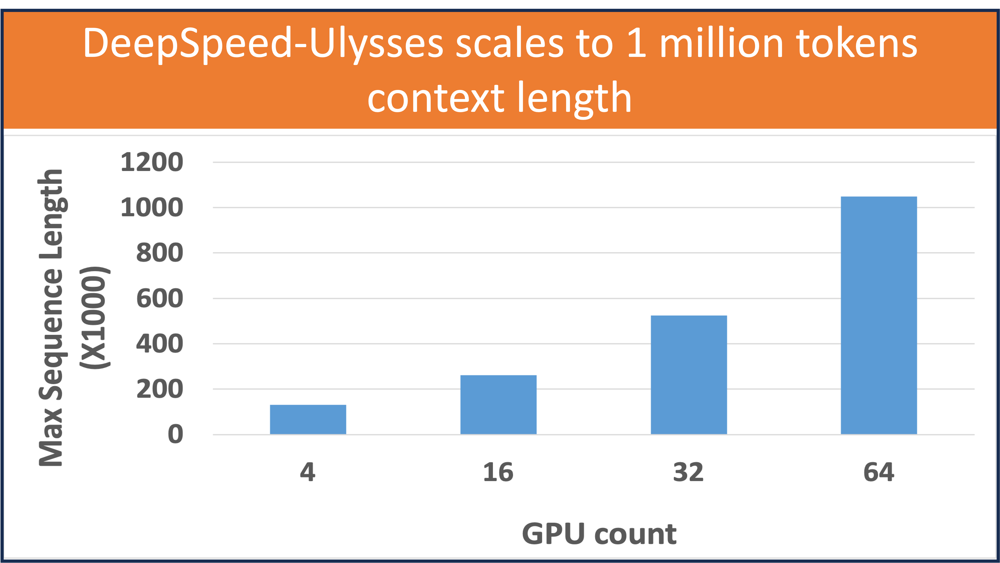
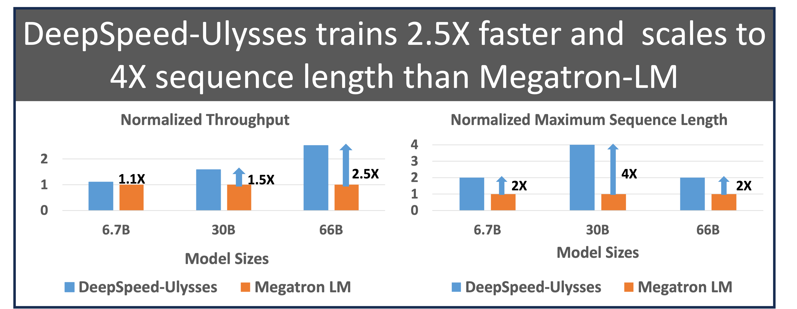
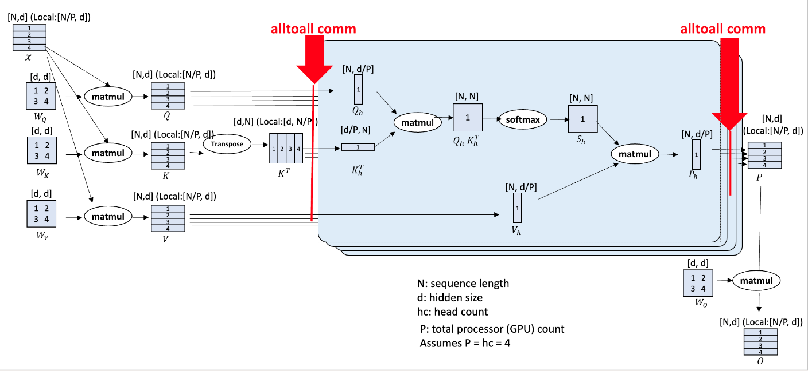
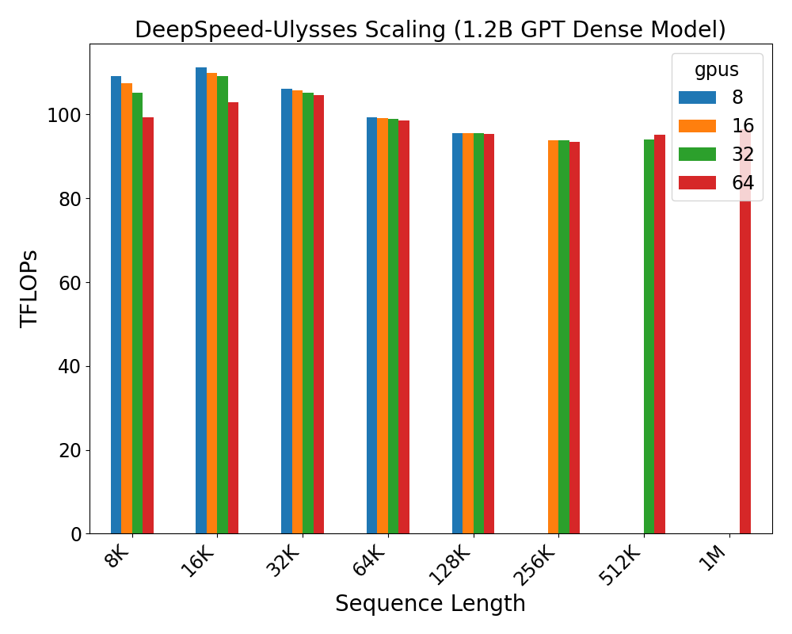
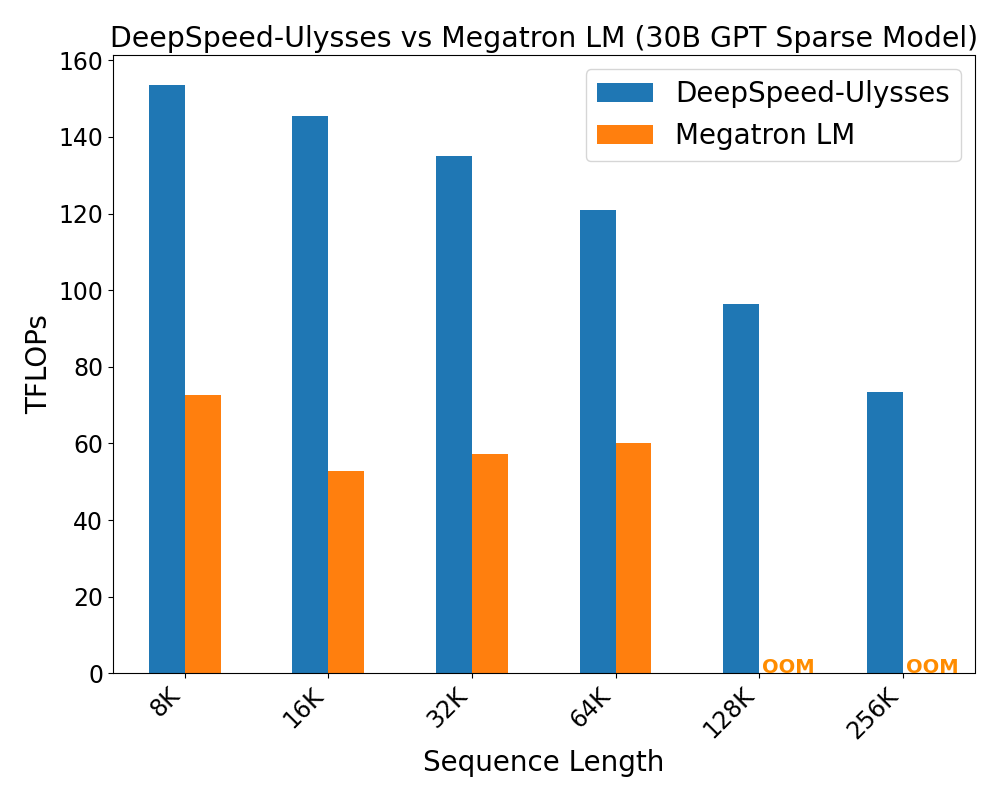
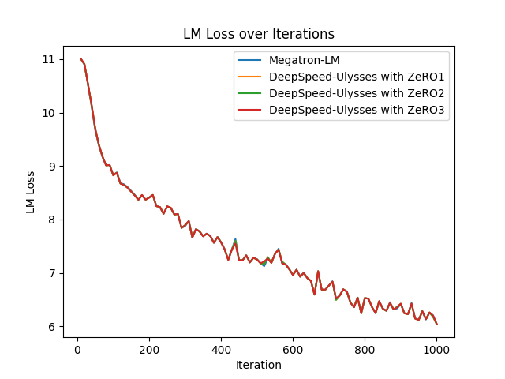

<div align="center">

# DeepSpeed Ulysses: 训练极长序列Transformer模型的系统优化

</div>

<div align="center">



</div>

## 简介

从生成性AI到科研模型，长序列训练正在变得非常重要。
在生成性AI领域，会话式AI、长文档摘要和视频生成等任务都需要在空间和时间层面对长上下文进行推理。
例如，多模态基础模型，如同时处理语音、图像和波形的模型，需要对具有极长序列的高维输入进行长上下文推理。
同样，章节和书籍级别的摘要（数万甚至数十万字）在会话式AI和摘要任务中也非常重要。

对于科学AI来说，长序列同样至关重要，它为更好地理解结构生物学、医疗保健、气候和天气预测以及大分子模拟打开了大门。
例如，通过在基因序列上训练大型语言模型，我们可以创建可以使用极长序列（人类基因组有64亿个碱基对）学习基因组进化模式的语言模型。在医疗保健领域，以所有的患者护理记录为条件的诊断预测模型需要极长序列的上下文。

尽管对于生成性AI和科学AI来说，长序列长度的重要性逐渐增长，但现有的大型模型训练系统和底层的并行技术（数据、张量、流水线、序列并行）并不能支持高效的长序列训练。现有并行方法存在两个主要挑战。首先，现有的数据、张量和流水线等并行方法无法解决序列维度的扩展问题。其次，由于内存通信效率低下，现有的序列并行方法不够高效。此外，现有方法的易用性不足，需要进行侵入性和复杂易出错的代码重构。

为了解决这些问题，我们很高兴宣布推出*DeepSpeed-Ulysses（或称为Ulysses，一个非常长的小说）*，这是一种简单、易用且高效的方法，用于支持具有极长序列长度的高效可扩展LLM训练。

DeepSpeed-Ulysses将各个样本在序列维度上分割给参与的GPU。然后，在attention计算之前，它对已分割的查询(Q)、键(K)和值(V)执行*all-to-all通信*操作，以使每个GPU接收完整的序列，但仅用于注意力头的非重叠子集。这使得参与的GPU可以并行计算不同的注意力头。最后，DeepSpeed-Ulysses还使用另一个all-to-all来在注意力头上收集结果，同时重新在序列维度上进行分区。

DeepSpeed-Ulysses及其与此博客一起发布的实现的关键特性如下：

* 与现有系统相比，序列长度增加了***4倍***，支持训练***超过百万个token***的序列。

* 与现有系统相比，通信减少了***超过10倍***，导致吞吐量提高了***高达2.5倍***，并且每个GPU的持续吞吐量超过175 TFlops（超过硬件峰值的54%）。

* 完全通用的attention：DeepSpeed序列并行支持密集和稀疏的注意力，并可与高效的注意力实现（如FlashAttention v2）一起工作。

* 支持大规模模型训练：DeepSpeed序列并行不仅支持大序列长度，还可以与ZeRO-3并用支持大模型尺寸。

* 易于使用和迁移，最小化对现有训练框架的代码更改要求。

在接下来的章节中，我们详细讨论DeepSpeed-Ulysses的核心设计、通信复杂度分析、实验评估以及与现有工作的比较，并展示其可用性和使用指南。

## DeepSpeed-Ulysses的核心设计

<div align="center">


*图1：DeepSpeed序列并行（DeepSpeed-Ulysses）设计*
</div>

图1显示了DeepSpeed-Ulysses的核心设计。与已知的Transformer架构一样，设计由*N*个输入序列在*P*个可用设备上分区组成。每个本地*N/P*分区都被投影到查询（Q）、键（K）和值（V）嵌入中。接下来，(QKV) 嵌入通过参与计算设备之间的高度优化的全对全集合（all-to-all collectives）进行全局的 QKV 收集。在全对全集合后，每个头的注意力计算形式为：

$$Output\ context = Softmax\ (\frac{QK^{T}}{\sqrt{d}})V$$

注意力计算后，另一个全对全集合将注意力计算的输出上下文张量转换为序列(*N/P*)并行，用于Transformer模型层的剩余模块中的后续操作（MLP MatMul、层归一化等）。

### 显著的通信量减少

DeepSpeed-Ulysses与其他现有的长序列方法的区别在于其更小的累积通信量以及随着序列并行度增加而更好的可扩展性，如下所示：

在具有节点内NVSwitch互连和节点间胖树IB拓扑的现代集群上，针对一个聚合消息大小为*M*的全对全传输，传输到*P*个GPU上的每个链接的通信量为*M/P*。
对于隐藏层大小为h、序列长度为N且并行度为P的Transformer模型，DeepSpeed序列并行会在注意计算之前对QKV投影执行聚合消息大小为*3Nh*的全对全操作，并在注意计算之后对输出上下文投影执行大小为*Nh*的另一个全对全操作。因此，DeepSpeed序列并行每个链接的聚合通信量为***4Nh/P（或O(N/P)复杂度）***。值得注意的是，当N和P成比例增加时，这个通信量是恒定的。

相比之下，现有的方法，如Megatron-LM，在N线性增长的情况下会导致通信量线性增加，而与P无关，从而导致***O(N)的通信复杂度***。例如，Megatron-LM对每个Transformer模型层都执行两个大小为*Nh*的*all-gather*操作，以及两个大小为*Nh*的*reduce-scatter*操作。然而，当*P \>\> 1*时，大小为M的每个all-gather和reduce-scatter的成本仍然是M，而不是*M/P*。因此，Megatron-LM序列并行会导致每个链接的通信量为***4Nh***，这比DeepSpeed序列并行大P倍。这使得DeepSpeed序列并行可以在实现显著更高的训练效率的同时支持极长序列训练。我们的实验评估结果与此理论分析相符。

### DeepSpeed-Ulysses的其他亮点

***通用的注意力解决方案***

DeepSpeed分布式注意力模块的实现足够通用，以支持任何类型的注意力，例如自注意、交叉注意和因果注意，无论是它们的密集还是稀疏版本，以及支持局部注意层级上的长序列的各种优化内核，例如不同版本的FlashAttention。

DeepSpeed-Ulysses的通用性来自其核心设计的模块化性质：一个以注意力为中心的序列并行设计。在注意力计算之前，序列并行性是对N/P分区的，而注意力计算是对每个头的并行性，每个头的注意力全都保留，但头的数量较少，因此注意力计算可以用任何类型的注意力机制替代，例如密集注意力和各种形式的稀疏注意力。

***通过ZeRO-3集成实现更大的模型和更长的序列训练***

尽管DeepSpeed序列并行在使用更长的序列进行训练时减少了激活内存的使用，但并不影响模型状态的内存占用。因此，为了支持具有大序列长度的大语言模型训练，我们实现了DeepSpeed序列并行与ZeRO-3的集成。

[ZeRO Redundancy Optimizer Stage 3 (ZeRO-3)](https://www.microsoft.com/en-us/research/blog/zero-deepspeed-new-system-optimizations-enable-training-models-with-over-100-billion-parameters/) 是一种用于训练大模型的内存优化技术。与传统的神经网络数据并行训练中，模型状态在数据并行等级上进行复制不同，ZeRO-3通过将模型状态在数据并行等级之间进行分区来优化内存使用。然而，使用序列并行时，训练数据可以在批（样本）和序列维度上考虑，相关的并行群组可以组合成一个更大的群组以实现ZeRO并行。

因此，我们将ZeRO-3分区扩展到数据并行和序列并行等级的组合。换句话说，在DeepSpeed序列并行中，ZeRO将模型状态分区在序列和数据并行组之间，并在需要时收集每个等级分区（allgather）。类似地，梯度将在数据并行和序列并行等级之间进行减少，用于参数更新。ZeRO可以在序列和数据维度上实现巨大的内存节省，并且不仅可以扩展到大序列长度，还可以扩展到大模型。

## 评估

我们在GPT（用于许多NLP任务的基础模型）上使用最多64个A100 GPU（40GB显存）对DeepSpeed-Ulysses进行了评估。我们的评估分为四个方面：i) 序列长度可扩展性，ii) 密集注意力的吞吐量以及与现有系统的比较，iii) 稀疏注意力的吞吐量以及与现有系统的比较，iv) DeepSpeed序列并行的收敛性研究。接下来，我们将对每个类别讨论和展示评估结果。

### 序列长度可扩展性

第一组实验是在12亿参数的GPT模型上将序列长度扩展到100万token。这个评估的结果如图2所示。DeepSpeed序列并行允许随着GPU数量的增加线性增加序列长度，并且序列长度与GPU数量保持线性比例关系，适当的GPU数量下保持相似的计算吞吐量。

<div align="center">


*图2：DeepSpeed序列并行强化可扩展性评估，使用不同的序列长度和GPU数量。*
</div>

### 密集注意力评估

接下来，我们在300亿参数的密集注意力模型上对DeepSpeed序列并行进行了评估，并与Megatron序列并行在64个A100 GPU上进行了对比。这些评估的结果如图3所示。

我们将DeepSpeed序列并行与Megatron-LM在不同序列长度下的性能进行了比较。对于我们的评估，我们选择了能使DeepSpeed序列并行和Megatron-LM分别达到最佳性能（通过吞吐量或TFLOPs衡量）的序列长度-批大小组合，我们称之为最佳（批大小-序列长度）配置。对于DeepSpeed序列并行，我们始终使用64的ZeRO并行度。

图3显示，DeepSpeed序列并行在相同序列长度下始终优于Megatron-LM。此外，DeepSpeed序列并行可以运行比Megatron-LM更长的序列。DeepSpeed序列并行的性能优势在于两个方面：（1）DeepSpeed序列并行结合ZeRO-3的内存优化，可以容纳更多的样本，从而提高吞吐量；（2）相对于Megatron-LM序列并行中应用的*all-gather*通信，DeepSpeed序列并行使用更高效的全对全通信。

<div align="center">


*图3：DeepSpeed和Megatron LM序列并行在300亿参数模型上的密集注意力评估。*
</div>

### 稀疏注意力评估

类似地，我们在300亿参数的稀疏注意力模型上对DeepSpeed序列并行进行了评估，并与Megatron序列并行进行了对比。我们的评估结果如图4所示。稀疏注意力的实验结果与密集注意力实验类似。我们观察到DeepSpeed序列并行的吞吐量性能相对于Megatron-LM提高了2倍以上。通过节省内存，DeepSpeed序列并行结合ZeRO-3可以扩展到比Megatron-LM更长4倍的序列长度。

DeepSpeed序列并行在相同序列长度下始终优于Megatron-LM。事实上，当前的DeepSpeed吞吐量受到本地稀疏注意力实现的瓶颈，因此DeepSpeed吞吐量随着序列长度的增加而降低。我们预计，随着未来局部稀疏注意力实现性能的改善，DeepSpeed与Megatron之间的性能差距将在更大的序列长度下进一步增加。

<div align="center">


*图4：DeepSpeed和Megatron LM序列并行在300亿参数模型上的稀疏注意力评估。*
</div>

### 收敛性研究

最后，图5显示了1.3亿参数GPT模型在32K序列长度下，使用序列并行度设置为4的情况下，在8个A100 GPU上的收敛性。对于DeepSpeed序列并行，我们使用不同的ZeRO阶段进行了收敛性评估。DeepSpeed序列并行是一种纯系统优化技术，用于实现长序列Transformer模型的训练，因此在训练模型质量上没有（负面）影响，并通过实验得到了验证，如图5所示。

<div align="center">


*图5：使用不同ZeRO内存优化阶段的DeepSpeed序列并行的收敛性评估。*
</div>

## DeepSpeed-Ulysses软件可用性

DeepSpeed-Ulysses只需进行少量简单代码更改来集成到您的代码中。下面是一个启用它的示例：

```python
from deepspeed.sequence.layer import DistributedAttention

# 将原始的自注意（attn）替换为DeepSpeed-Ulysses的自注意

dist_attn = DistributedAttention(attn, get_sequence_parallel_group())
```

与其他支持序列并行的库（如Megatron-LM）相比，DeepSpeed-Ulysses不需要进行模型重构。
DeepSpeed-Ulysses已经完全与Megatron-DeepSpeed代码库集成并经过测试。这意味着如果您已经
在使用这个代码库来训练大型语言模型，您可以无缝地使用DeepSpeed-Ulysses训练具有极长序列的模型。

## 立即尝试DeepSpeed-Ulysses

我们很高兴宣布推出DeepSpeed-Ulysses，您可以通过DeepSpeed GitHub获取代码。详细的使用教程在[DeepSpeed教程页面](https://www.deepspeed.ai/tutorials/ds-sequence/)上提供。

我们欢迎各种形式的贡献和合作，以共同推动当长上下文窗口不再是限制时的各种创新。DeepSpeed-Ulysses是大规模AI训练和推理的更大DeepSpeed生态系统的一部分。有关所有DeepSpeed技术和创新的更多细节，请访问我们的[网站]((https://www.deepspeed.ai/))，并关注我们在X（Twitter）上的帐号（[英文](https://twitter.com/MSFTDeepSpeed)，[日文](https://twitter.com/MSFTDeepSpeedJP)）和[中文知乎](https://www.zhihu.com/people/deepspeed)。

我们愿意与大学、研究实验室和公司合作。有关此类请求（以及不适合在GitHub上提出的其他请求），请直接发送电子邮件至<deepspeed-info@microsoft.com>。
