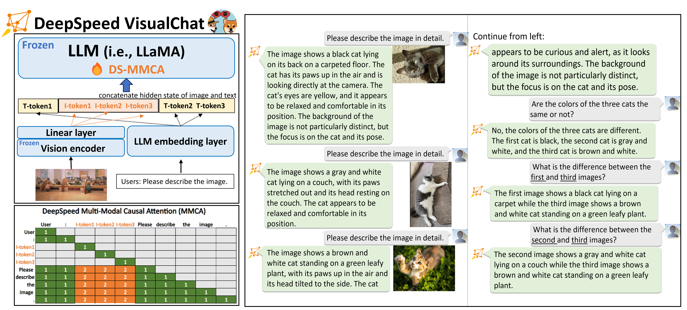
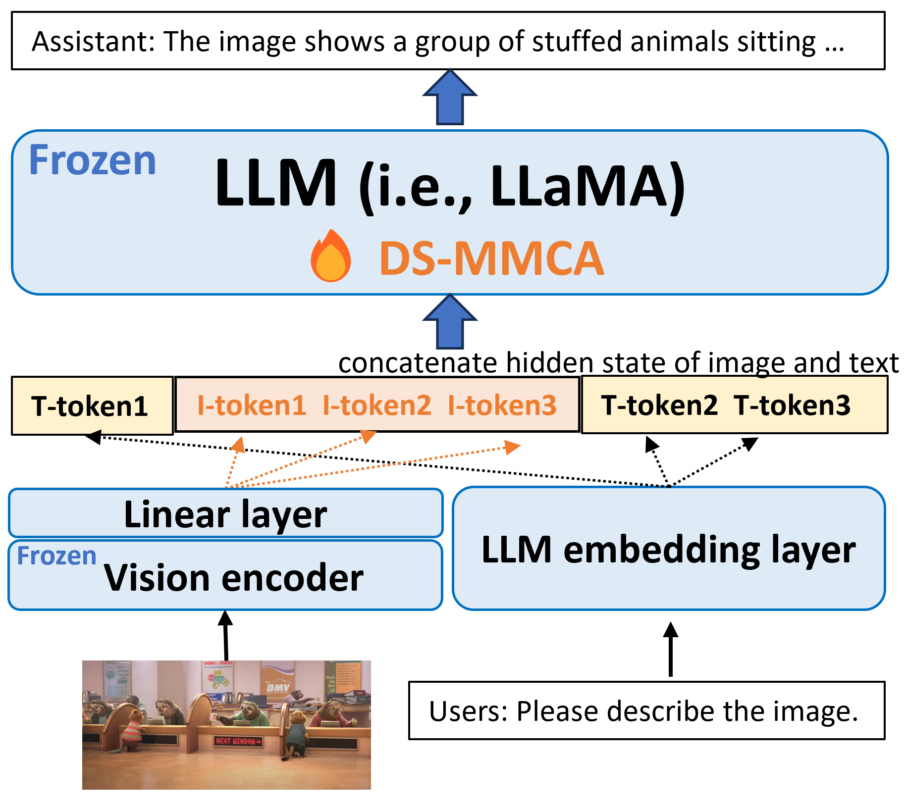
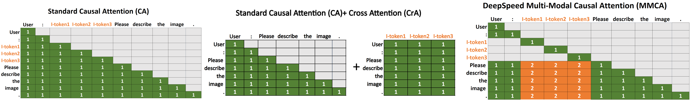
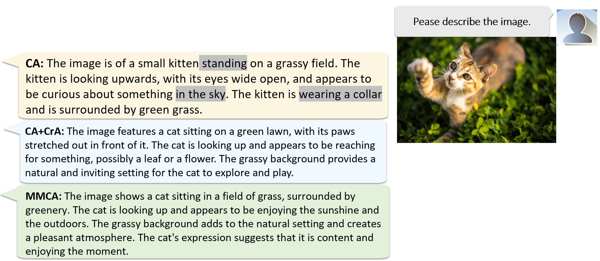
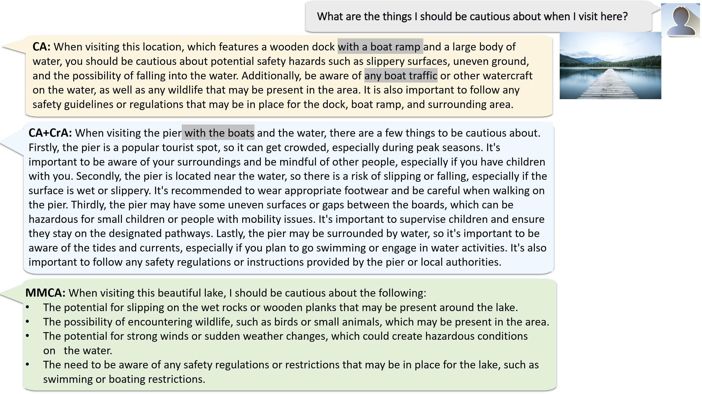
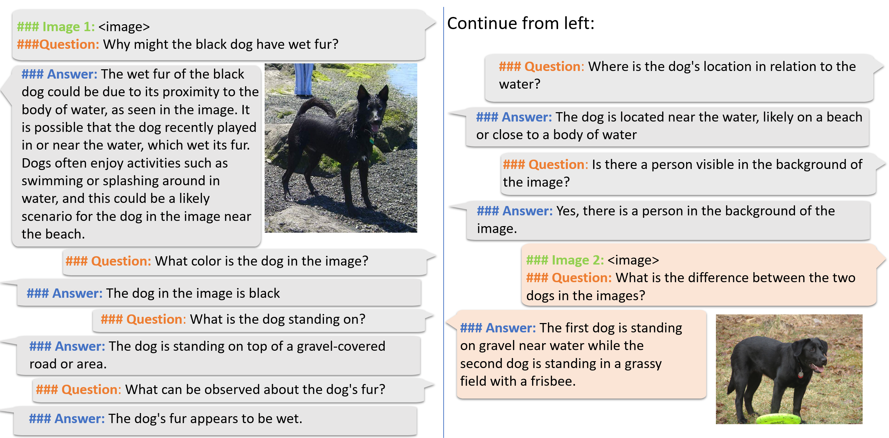
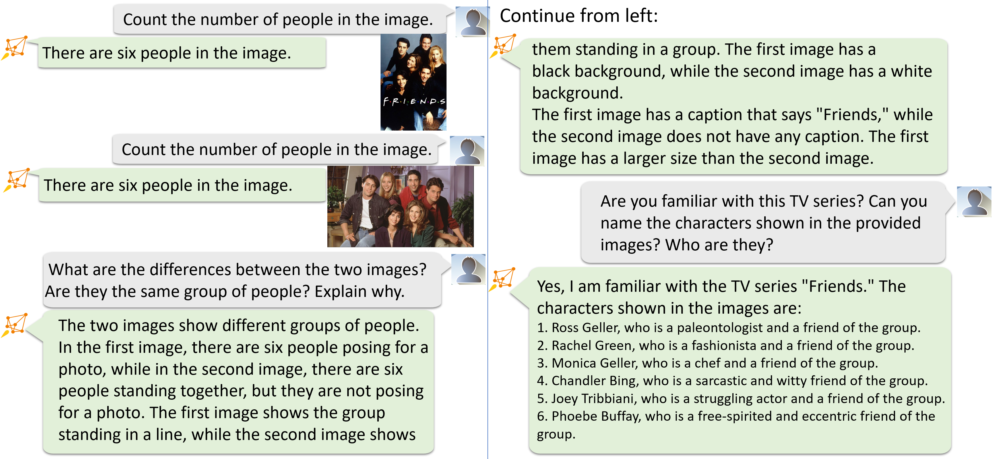
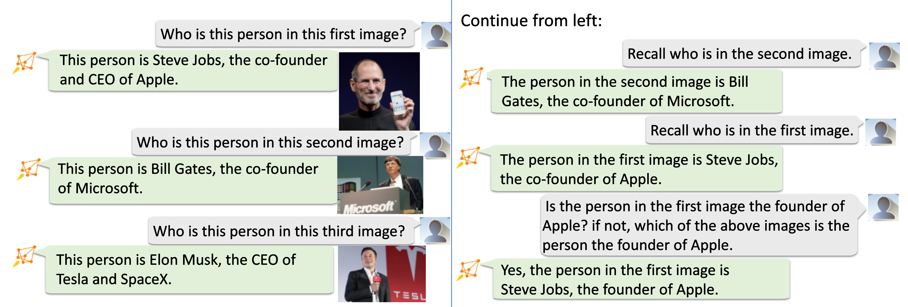
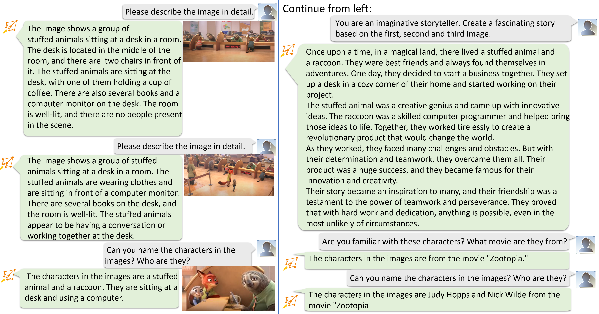

<div align="center">

# DeepSpeed-VisualChat: 複数ラウンド・複数画像の入力が可能なAIチャット体験を実現
</div>

<div align="center">



</div>

DeepSpeed-VisualChatを引用する場合、[arxiv上のレポート](https://arxiv.org/abs/2309.14327)を引用してください。

```
@article{yao2023deepspeed-visualchat,
  title={{DeepSpeed-VisualChat: Multi-Round Multi-Image Interleave Chat via Multi-Modal Causal Attention}},
  author={Zhewei Yao and Xiaoxia Wu and Conglong Li and Minjia Zhang and Heyang Qin and Olatunji Ruwase and Ammar Ahmad Awan and Samyam Rajbhandari and Yuxiong He},
  journal={arXiv preprint arXiv:2309.14327},
  year={2023}
}
```

# 1. 概要
GPTやLLaMaのような大規模言語モデル（LLM）は、テキスト生成やテキスト理解などの多くのタスクにおいて、Zero-shot/Few-shot学習、あるいはinstructed fine-tuningによって、非常に優れた能力を示してきました。しかし、AIエージェントをより多様なタスクに対応させるには、マルチモーダルを扱う能力が必要です。例えば、AIエージェントは画像を読んだり、音声を聞いたり、ビデオを見たりすることができる必要があります。こうした機能は、テキストベースのLLMにはほとんどありません。

近年、LLMに視覚的な能力を導入することは、研究・実践の両方において広く試みられています。特に、画像をそのまま与えて、LLMが理解できるようにする取り組みが行われています（大規模視覚言語モデル、略してLVLMなどと呼ばれる）。

こうした分野における、既存の研究の主な問題は以下の通りです：

* 視覚に関する質問への回答やキャプション付けのように、単一の画像に関連するタスクや、同時に入力される複数の画像の処理に重点が置かれており、画像とテキストが交互に入力されるような状況には対応していない
* システムのスケーラビリティは、～10Bのパラメータを持つモデルに限定される

しかし、本来はAIチャットエージェントには、複数のテキストと画像の両方が与えられる可能性があります。また、LLMの生成能力は、モデルサイズが大きくなるにつれて急速に向上することが知られており、～10Bのモデルではその能力が制限されてしまいます。

これらの問題を解決するために、我々は以下の新たな機能を備えたDeepSpeed-VisualChat（詳細は[arxivのレポート](https://arxiv.org/abs/2309.14327)を参照）を開発しました:

* ***完全にオープンソース化され、前例のないスケーラビリティを備えた複数ラウンド・複数画像を処理できるフレームワーク***： DeepSpeed-VisualChatは、完全にオープンソース化された先進的なフレームワークの1つであり、複数ラウンドを通じて画像とテキストが両方与えられる対話を可能にします。また、DeepSpeedを利用することで、比類ないスケーラビリティを実現しており、実際に2Bのビジュアルエンコーダーと70BのLLaMA-2デコーダーモデルで訓練を行えます。
* ***マルチモーダル因果的注意(MMCA)***: マルチモーダルモデルのための新しいアテンションMMCA（Multi-Modal Causal Attention）を考案し、異なるモダリティ間で独立にアテンションの重みを計算します。MMCAは、従来のcross attentionに類似したものですが、生成タスクのためのcausal attentionを強化しており、追加のモジュールやパラメータが不要になります。また、標準的なcausal attentionと比較して、優れた訓練データ効率を示します。
* ***順次与えられる画像とテキストを扱うためのデータブレンディング***: DeepSpeed-VisualChatは、既存のデータセットに様々なデータブレンディング技術を採用しています。これにより、順次与えられるテキストと画像の不足という、利用可能なオープンソースデータセットのほとんどに当てはまる課題を克服しています。

# 2 モデルアーキテクチャの概要
<div align="center">
  

  *図1: モデルアーキテクチャの概要*

</div>

*図1*に示すように、DeepSpeed-VisualChatのモデルアーキテクチャは、CLIPのような視覚エンコーダー、LLaMa-7Bのような言語デコーダー、特徴アライメントを行う linear projectionレイヤの3つのコンポーネントで構成されています。モデルのほとんどのパラメータは固定されており、言語モデルのembeddingとlinear projectionレイヤのみが学習可能です。その結果、学習可能なパラメータの総数は O(10M) (LLaMa-2-13B) から O(100M) (LLaMa-2-70B) となります。

# 3. DeepSpeed マルチモーダル Causal Attention (MMCA)

マルチモーダルモデルで、画像とテキストをつなぐ一般的なattentionの機構は二つあります。一つはMiniGPTやQWen-VLで使われているようなcausal attentionで、もう一つはOtterやFlamingoで使われているようなcross attentionです。


<div align="center">
  

  *図2: 異なるアテンションの機構: 「ユーザー：画像を説明してください」という入力文と3つの画像トークン（I-token1、I-token2、I-token3）と組み合わせて与えた場合の、それぞれのattention機構の構成を示しています。左側では、標準的なcausal attentionによって、画像トークンをテキストとして扱う様子を示しています。中央は、テキストトークンに対する標準的なcausal attentionを維持しながら、画像に適用されるcross attentionを使用する様子を示しています。右側では、画像トークンはself attentionのみを行い、テキストトークンはテキスト／画像トークンへのアテンションを独立に計算するという、新しいマルチモーダルのためのアテンションの提案を、オレンジ色のマスクで強調して示しています。この仕組みは、Q, Kをクエリとキーとしたとき、 softmax($`QK^T \odot M_1`$)+ softmax($`QK^T \odot M_2`$)として定義されます。M $`\in`$ R<sup>10x10</sup>としたとき、$`M_1`$=[M==1], and $`M_2`$=[M==2] です。*
</div>

<b>Causal Attention（CA）</b>：CAに基づく方法は、視覚的特徴（最終的な視覚エンコーダ層の出力からの特徴）を単純にテキストの特徴量に投影し、テキスト埋め込み層以降の通常のテキストの特徴量と組み合わせてLLMに送り込むというものです。CAの利点は、LLMにおける本来のアテンション機構の自然な拡張であり、そのため余分なモジュールやパラメータを導入しないことです。しかし、このアプローチにはいくつかの直感的な問題があります：

* 視覚トークンはすでに双方向に特徴量に変換されており、本来他の視覚トークンやテキストトークンとのアテンションの必要はありませんが、実際には前の視覚またはテキストトークンとのアテンションがあります。。
* テキストトークンの場合、モデルは前のテキストトークンと画像トークンとの間でどのようにアテンションの重みを配分するかを学習する必要があります。これらの問題により、LVLMにおけるCAのデータ効率にはしばしば問題があることが分かりました。この問題への対処として、LLaVAとQWen-VLは、視覚的特徴とテキストの特徴を完全に対応させるために、視覚言語の事前学習を必要とします。

<b>Cross Attention (CrA)</b>：代替案であるCross Attention (CrA) と CAの組み合わせは、より優れたデータ効率を示しますが、いくつかの欠点もあります：

* モデルに新しいパラメーターを導入する必要があります。例えば、Otterは、Cross Attentionによって導入された新しいパラメータがあるため、LLaVAが数百万個の学習可能なパラメータを持つのに対し、15億個以上のパラメータを必要とします。これにより、学習コストと必要メモリ量が大幅に増加します。
* 訓練中に会話の途中で画像が与えられた場合、前のテキストトークンは与えられた画像とのアテンションを求められないので、慎重な設計が必要です。

<b>マルチモーダル Causal Attention (MMCA)</b>：これらの問題を解決するために、我々は新しいマルチモーダルCausal Attention (MMCA) を提案します。この機構は、CAと同様のパラメータ効率と、CrAと同様のデータ効率の、両方の利点を持つものです。全体的なアイデアは以下の通りです：

* 視覚トークンは視覚エンコーダによってエンコードされるため、視覚トークンは自分自身とのアテンションのみを利用する。
* テキストトークンについては、その前のすべてのトークンに注目する。ただし、前のテキストトークンと画像トークンに対して、それぞれ別々のアテンションの重み行列を持つ。

MMCAの2つ目のポイントは、1つのモダリティに対するアテンションの重みが、もう1つのモダリティに影響を与える可能性があるということです。例えば、テキストトークンは、視覚情報よりもテキスト情報により大きなアテンションを持つかもしれません。そのため、アテンションの重み行列を両方のモダリティで正規化すると、視覚トークンのアテンションスコアが非常に小さくなる可能性があります。3つのアテンション機構の視覚化については、*図2*を参照してください。

<b>出力例</b> まず、異なるアテンションの機構を採用した、画像を一つだけ用いた会話におけるDeepSpeed-VisualChatの能力を示す様々な例を紹介します。これらの実験では、LLaMA2-7B言語モデルとQWen-VL視覚エンコーダを視覚エンコーダとして併用します。これら2つのモデルはlinear projection layerを介して接続されています。このモデルは2つのLLaVaデータセットで学習を行いました。*図3*と*図4*で実証されているように、DeepSpeed-VisualChatはMMCAと組み合わされることで、画像内の視覚的な詳細を効果的に識別し、ユーザーのクエリに対して首尾一貫した応答を提供します。さらに、MMCAは、Causal AttentionとCross Attentionの両方から合成されたマスクを使用するような、別のアテンション機構と比べて、より包括的で正確な画像詳細の把握が可能です。また、CrAとCAの組み合わせやMMCAとは対照的に、CA単独では若干エラーが多く（*図3*）、推論能力の程度が低い（*図4*）可能性があることも明らかです。

<div align="center">
  

  *図3: (1) 標準的なcausal attention (CA) (2) cross attentionと組み合わせた標準的なcausal attention (CA+CrA) (3)DeepSpeed-VisualChatの特別なマルチモーダルCausal Attention (MMCA) の出力比較を示す視覚入力と言語入力の例。*
</div>

<div align="center">
  

  *図4：DeepSpeed-VisualChatは、示された場面を美しい湖として正確に識別し、妥当な提案のセットを提示する。対照的に、ベースラインは画像を「ボート乗り場のあるドック」と誤認識している。*
</div>

# 4. データブレンディング

[arxivのレポート](https://arxiv.org/abs/2309.14327)に記載されているように、訓練には3つのソースから9つのデータセットを使用しました。複数ラウンド・複数画像の入力を可能にするために決定的に欠けている要素は、適切なデータがないことです。我々が見つけた複数ラウンド・複数画像の唯一のデータソースはSparklesDialogueデータセットで、そこにはわずか6520サンプルしか含まれていません。この制限に対処するため、既存の単一画像または単一ラウンドのデータから、複数ラウンド・複数画像のデータを合成するために、単純なデータ連結とLLaVA-Otterデータ混合という2つの方法を採用しました。

## 4.1 単純なデータ連結
LLaVAモデルで利用する "llava" と "llava_dial" データセットでは、各サンプルは1つの画像に対する単一／複数ラウンドの会話で構成されています。ユーザーが複数の画像について逐次質問するシナリオをシミュレートするため、これら2つのデータセットに対して、簡単なデータ後処理を行いました。具体的には、ランダムな数のサンプルを1つのサンプルとして連結しました。 "llava" の場合は1～3個のサンプルを連結し、"llava_dial" の場合は1～2個のサンプルを連結しました。

## 4.2 LLaVAとOtterのデータブレンディング

LLaVAモデルで使用されているllavaとllava_dialデータセット、およびOtterモデルで使用されているotter_mimicit_cgdデータセットは、すべてCOCO train2017画像を使用しています。llavaデータセットとllava_dialデータセットには、各サンプルに1つの画像に対する単発／複数回の会話が含まれます。otter_mimicit_cgdデータセットでは、各サンプルは画像のペアに対する1ラウンドの会話を含んでいます。そこで、otter_mimicit_cgdデータセットの各サンプルについて、同じ画像を使うllavaとllava_dialのサンプルを探し、「llava/llava_dial会話 -> otter_mimicit_cgd会話」という流れで新しいサンプルを構築しました。

<div align="center">
  

  *図5: LLaVA-Otterデータブレンド後のデータサンプル。灰色のダイアログボックスはLLaVAデータセットから、オレンジ色のダイアログボックスはOtterデータセットからのもの*
</div>

# 5. デモ
いくつかのオープンソースデータセットで2Bビジュアルエンコーダーと13B LLaMAモデルを使い、DeepSpeed-VisualChat-13Bモデルを訓練しました。DeepSpeed-VisualChat-13Bは、画像キャプション機能（*図6-8*）、計数とテキスト読み取り（*図6*）、著名人の認識（*図7*）、ストーリーテリング（*図8*）などを示しています。

<div align="center">
  

  *図6: DeepSpeed-VisualChatは、画像内の人数を数え、最初の画像のテキストを読み取ることができます。また、複数画像を横断的に理解することも可能です。*
</div>


<div align="center">
  

  *図7: DeepSpeed-VisualChatは有名人を認識し、その人物の業績と関連付けることができます*
</div>


<div align="center">
  

  *図8: DeepSpeed-VisualChatは、ストーリーを作ったり、映画を認識したりできます。*
</div>


# 6. DeepSpeed-VisualChatを使い始めるには
DeepSpeed-VisualChatは使いやすく、かつ優れたスケーラビリティを持つ学習フレームワークで、これまでLLaMa-2-70Bモデルでテストされています。
すべての実験で統一された命令チューニング形式を採用しており、そのテンプレートを以下に示します。

```
<System Instruction>      % You are a powerful vision-language assistant.

### Image 1: <image>       % some image, e.g., cat-1.png
### Question: <question>   % please describe the image.
### Answer: <answer>       % It's a cute black cat.

### Image 2: <image>       % some image, e.g., cat-2.png
### Image 3: <image>       % some image, e.g., cat-3.png
### Question: <question>   % What's the difference between the three cats?
### Answer: <answer>       % The colors of the three cats are different.
...
```

DeepSpeed-VisualChatの訓練は簡単かつ便利に実行できます。ここではCLIPビジュアルエンコーダーとLLaMa-7Bモデルを使用する例を示します：

```
git clone https://github.com/microsoft/DeepSpeedExamples.git
cd DeepSpeedExamples/applications/DeepSpeed-VisualChat/
pip install -r requirements.txt
cd training
bash training_scripts/run_7b.sh
```

訓練されたチェックポイントは自動的にHugging Faceと互換性のある形式で保存され、独自のビジュアルチャットAPIを提供するために使用できます：

```
cd ../chat
bash chat_scripts/run.sh # You need to change necessary variables, e.g, ckpt path
```

より大規模なモデル推論をサポートするために、我々はHugging Faceの大規模モデル推論をDeepSpeed-VisualChat APIに組み込みました。そのため、ユーザーはGPUメモリ容量とモデルサイズに基づいて、異なるGPU数を選択することができます。

詳細は[ランディングページ](https://github.com/microsoft/DeepSpeedExamples/tree/master/applications/DeepSpeed-VisualChat)をご参照ください。

# 7. 早速使ってみましょう！

DeepSpeed-VisualChatがオープンソース化され、AIコミュニティで利用できるようになったことを大変嬉しく思います。

* まずは、DeepSpeed-VisualChatのGitHubページをご覧ください： [GitHubランディングページ](https://github.com/microsoft/DeepSpeedExamples/tree/master/applications/DeepSpeed-VisualChat)

* DeepSpeed-VisualChatは、皆様からのフィードバックとサポートにより改良を続けていきます。私たちの[ロードマップ](https://github.com/microsoft/DeepSpeedExamples/tree/master/applications/DeepSpeed-VisualChat/README.md#-deepspeed-visualchats-roadmap-)は、現在サポートされている機能と将来的に計画している機能を示しています。

DeepSpeed-VisualChatは、さまざまなDeep Learningシステムやモデリング技術を含む、より大きなDeepSpeedエコシステムの一部です。詳細については、以下をご覧ください。

* 私たちの[ウェブサイト](https://www.deepspeed.ai/)で、詳細なブログ記事、チュートリアル、役立つドキュメントを提供しています。
* DeepSpeedの最新ニュースは、[English X(Twitter)](https://twitter.com/MSFTDeepSpeed)、[Japanese X(Twitter)](https://twitter.com/MSFTDeepSpeedJP)、[Chinese Zhihu](https://www.zhihu.com/people/deepspeed)をフォローしてください。

DeepSpeedは、皆様の開発への参加を歓迎しています。DeepSpeedのGitHubページで、バグ報告、Pull Request、ディスカッションへの参加が可能です。詳細は[ガイドライン](https://github.com/microsoft/DeepSpeed/blob/master/CONTRIBUTING.md)をご覧ください。また、大学、研究所、企業とのコラボレーションも行っています。こうしたコラボレーションについてのご要望（およびGitHubには適さないその他の話題）については<deepspeed-info@microsoft.com> まで直接メールをお送りください。

* 私たちの[DeepSpeed GitHub](https://github.com/microsoft/DeepSpeed/)および[DeepSpeedExamples GitHub](https://github.com/microsoft/DeepSpeedExamples/)リポジトリが気に入ったら、ぜひスターをつけてください！
