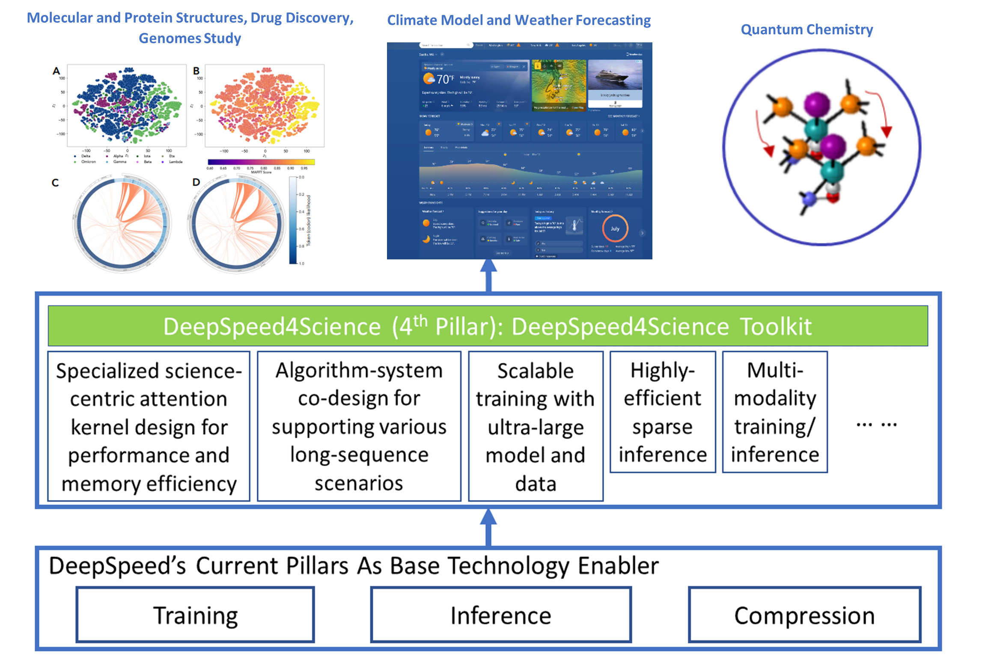
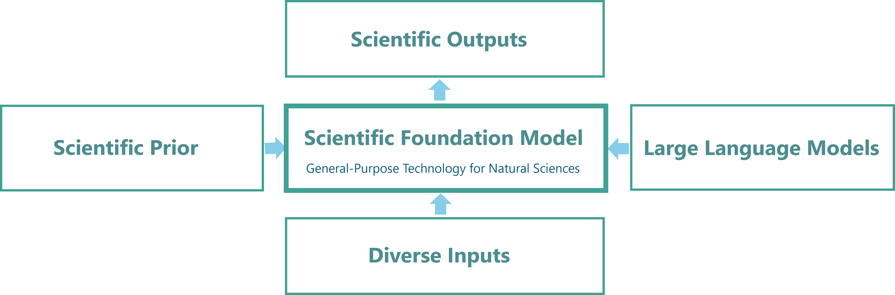
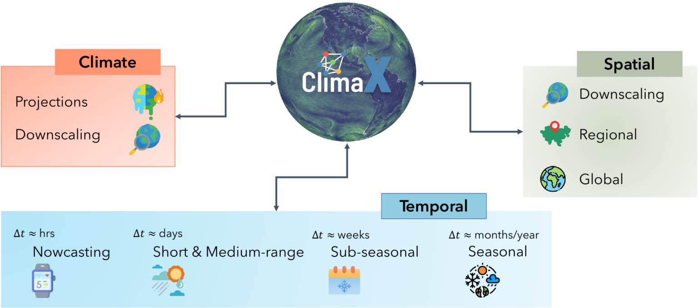
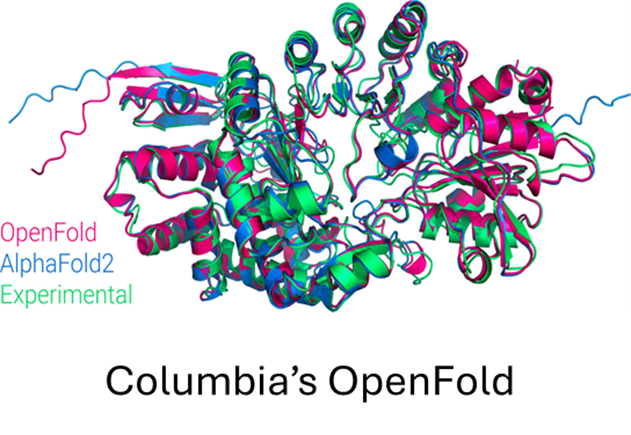
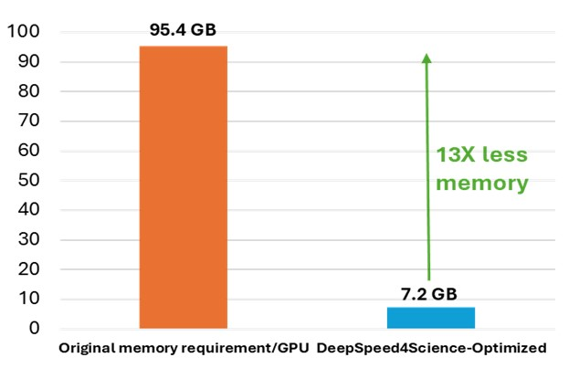

<div align="center">

# DeepSpeed4Scienceイニシアティブ: 洗練されたAIシステムのテクノロジーにより大規模な科学的発見を可能に

</div>

*こちらは英語ブログ[Announcing the DeepSpeed4Science Initiative: Enabling large-scale scientific discovery through sophisticated AI system technologies](https://www.microsoft.com/en-us/research/blog/announcing-the-deepspeed4science-initiative-enabling-large-scale-scientific-discovery-through-sophisticated-ai-system-technologies/)の公式の翻訳です*

<div align="center">


*図1：DeepSpeed4Scienceのアプローチ: 汎用の言語モデルのサポートを超え、科学的発見とその複雑さの解決に特化したAI技術を開発*
</div>

DeepSpeed4Science を引用するには、こちらの[white paper](https://arxiv.org/abs/2310.04610)を引用してください:

```
@article{song2023deepspeed4science,
  title={DeepSpeed4Science Initiative: Enabling Large-Scale Scientific Discovery through Sophisticated AI System Technologies},
  author={Song, Shuaiwen Leon and Kruft, Bonnie and Zhang, Minjia and Li, Conglong and Chen, Shiyang and Zhang, Chengming and Tanaka, Masahiro and Wu, Xiaoxia and Rasley, Jeff and Awan, Ammar Ahmad and others},
  journal={arXiv preprint arXiv:2310.04610},
  year={2023}
}
```

## はじめに

自然の出来事をモデル化し予測する深層学習の能力は急速に高まっており、次の１０年間に、自然科学に革命を起こすかも知れません。薬の開発から再生可能エネルギーまでの各セクターで、大きな進展をもたらす新しい科学的探求の時代が到来するでしょう。「地球上のすべての人と組織がもっと多くのことを成し遂げられるようにする」というMicrosoftのミッションに従い、この機会に、[DeepSpeedチーム](https://www.deepspeed.ai/)では[DeepSpeed4Science](https://deepspeed4science.ai/)という新しいイニシアティブを立ち上げました。これは、AIシステム技術のイノベーションを通じて他に類を見ない技術を構築し、様々な分野の専門家が、科学分野における大きな謎を解き明かす手助けをすることを目指しています。

[DeepSpeed](https://www.deepspeed.ai/)システムは、Microsoftが開発した、AI分野をリードするオープンソースのAIシステムのフレームワークであり、多様なAIハードウェア上での深層学習の訓練と推論において、前例のない規模と速度を実現します。図1は、この新しいDeepSpeed4Scienceイニシアティブでの基本的なアプローチを示しています。DeepSpeedの現在の柱となる技術（訓練、推論、圧縮）を基盤として活用しつつ、DeepSpeed4Scienceでは、大規模言語モデル（LLM）を加速するための汎用の技術的アプローチを超え、科学的発見を加速する目的で新たに構築された、一連のAIシステム技術を提供します。私たちは、重要な科学的ミッションを推進している、代表的な科学分野向けAIモデルを所有する内外のチームと連携し、ドメイン固有のAIシステムの課題を特定し、解決していきます。これには、気候科学、薬物設計、生物学的理解、分子動力学シミュレーション、がんの診断と監視、触媒/材料の発見、およびその他の分野が含まれます。

私たちの長期的なビジョンは、DeepSpeed4Scienceを、科学的発見をサポートする先進的なAIシステム技術を共有するための新しいソフトウェアプラットフォームおよび統一的なリポジトリに発展させることです。DeepSpeed4Scienceは、Microsoftの[AI for Good](https://www.microsoft.com/en-us/ai/ai-for-good)のコミットメントを反映して、包括的に設計されています。このことは、AI4Scienceへのもっとも重要な投資の成果として構築された、様々な代表的モデルへの、DeepSpeed4Scienceイニシアティブによるサポートに現れています。このブログでは、DeepSpeed4Scienceが、構造生物学の研究における2つの重要なシステムの課題にどのように対処するかを紹介します：(1) Evoformer中心のタンパク質構造予測モデルをスケールアップする際に極めて大きなメモリが必要となる問題を解決し、(2) パンデミックを引き起こすウイルスの進化の様子をよりよく理解するための非常に長いシーケンスのサポートを可能にします。

## 主要な初期コラボレータ

DeepSpeed4Scienceによる新しいシステム技術はAI駆動の幅広い科学研究を強化するものです。現在、DeepSpeed4Scienceは、[Microsoft Research AI4Science](https://www.microsoft.com/en-us/research/lab/microsoft-research-ai4science/)、[Microsoft WebXT/Bing](https://www.msn.com/en-us/weather/forecast/)、[U.S. DoE National Labs](https://www.energy.gov/national-laboratories)、および複数の大学のいくつかの重要な科学モデルをサポートしています。

### Microsoft内のパートナーシップ

#### 科学基盤モデル (Scientific Foundation Model, SFM), Microsoft Research AI4Science

<div align="center">



*図2: 科学基盤モデル (Scientific foundation model, SFM) とその探索: Distributional Graphormer*
</div>

科学的基盤モデル(SFM)は、多様なインプット、複数の科学領域(薬物、材料、生物学、健康など)、および計算タスクをサポートする、自然科学的発見を強化するための統一された大規模基盤モデルを作成することを目的としています。DeepSpeed4Scienceパートナーシップは、[Distributional Graphormer](https://www.microsoft.com/en-us/research/blog/distributional-graphormer-toward-equilibrium-distribution-prediction-for-molecular-systems/)などのMicrosoftの新しい生成AI手法などのプロジェクトに関する、SFMチームの継続的な研究を強化するための新しい訓練および推論テクノロジーを提供します。

#### ClimaX, Microsoft Research AI4Science

<div align="center">


*図3: 天気・気候の多様なモデリングタスクのための最初の基盤モデルClimaX*
</div>

気候の変化は、より頻繁な異常気象を引き起こしています。悪影響を軽減するため、これらのイベントが発生する場所を予測することがますます重要になっています。[ClimaX](https://www.microsoft.com/en-us/research/group/autonomous-systems-group-robotics/articles/introducing-climax-the-first-foundation-model-for-weather-and-climate/)は、さまざまな気象および気候モデリングタスクを実行するために設計された最初の基盤モデルです。さまざまな変数と解像度を持つ多くの異なるデータセットを扱えるため、天気予報の精度が向上する可能性があります。DeepSpeed4Scienceは、非常に大きな高解像度画像データ(数十から数百ペタバイトなど)を長いシーケンスで処理しながら、より大きな基盤モデルを効率的に事前訓練/ファインチューニングするためのClimaXの新しいシステムサポートを提供しています。

#### 分子動力学と機械学習型力場（Molecular Dynamics and Machine Learning Force Field），Microsoft Research AI4Science

<div align="center">


*図4: 100万ステップの分子動力学シミュレーション: RBD-proteinとprotein inhibitorの相互作用*
</div>

このプロジェクトは、古典的な分子動力学の効率とスケーラビリティを維持しながら、[AIを利用した力場モデル](https://www.microsoft.com/en-us/research/publication/ai2bmd-efficient-characterization-of-protein-dynamics-with-ab-initio-accuracy/)を使用して、原理に基づく精度（ab initio accuracy）に近い精度で大規模(原子数で100万規模)な分子システムの力学をシミュレートします。このシミュレーションは、化学的に重要なイベントを観察するのに十分な長さの軌道を生成できる効率を実現しています。通常、このプロセスには数百万から数十億の推論ステップが必要です。これは、グラフニューラルネットワーク(GNN)+ LLMモデルの推論速度を最適化する上で大きな課題となります。DeepSpeed4Scienceは、この課題に対して、新しいシステムサポートを提供します。

#### 天気 from Microsoft Start, Microsoft WebXT/Bing

<div align="center">


*図5: Microsoft Startにおける降水予想 (次の４時間について４分ごと)*
</div>

[天気 from Microsoft Start](https://www.msn.com/en-us/weather/forecast/)は、[ユーザーがライフスタイル、健康、仕事、活動についてより適切な決定を下せるよう](https://blogs.windows.com/windowsexperience/2022/08/31/microsoft-joins-noaas-weather-ready-nation-ambassador-initiative-to-help-improve-americas-readiness-and-response-to-weather-events/)、正確な気象情報を提供します。 (1 時間ごとに複数回更新される、10 日間に渡る正確かつグローバルな天気予報など)。 以前にも、この天気予報は、DeepSpeedの技術を使用して、マルチ GPU を用いた訓練を高速化していました。現在、DeepSpeed4ScienceはMicrosoft WebXT気象チームと協力して、最先端の機能と更なる改善により、マイクロソフトの気象サービスをさらに強化しています。

### 外部のコラボレータ

DeepSpeed4Scienceは、構造生物学研究のための2つの先駆的なLLMベースのAIモデルを扱うことから始まりました: オープンソースのハイフィデリティタンパク質構造予測モデルであるコロンビア大学の[OpenFold](https://openfold.io/)と、SARS-CoV-2(COVID-19)ゲノムの進化を学習する、[Gordon Bell Special Prize](https://www.acm.org/media-center/2022/november/gordon-bell-special-prize-covid-research-2022)を受賞したゲノム用言語モデルである[アルゴンヌ国立研究所](https://www.anl.gov/)の[GenSLMs](https://github.com/ramanathanlab/genslm)です。次のセクションでは、今日のAI主導の構造生物学研究が直面している2つの一般的なAIシステムの課題を紹介し、DeepSpeed4Scienceが科学研究をどのように強化したかについて説明します。

またDeepSpeed4Scienceは最近、より多様な科学モデルをサポートするために、その対象を拡大しました。たとえば、[Aurora Exascaleシステム](https://www.anl.gov/aurora)で、1兆パラメータの科学モデルを訓練するアルゴンヌ国立研究所との協力にあたって、DeepSpeed4Scienceテクノロジーは、求められるパフォーマンス要件とスケーラビリティを実現するのに重要な役割を果たします。さらに、DeepSpeed4Scienceは、がんの調査に関して、[オークリッジ国立研究所](https://ai-roadmap.ornl.gov/)および[国立がん研究所(NCI)](https://www.cancer.gov/)と協力することにより、[MOSSAICプロジェクト](https://www.olcf.ornl.gov/tag/mossaic/)の非構造化臨床テキストからの情報の高信頼度抽出と分類にも用いられます。さらに、DeepSpeed4Scienceのテクノロジーは、[ブルックヘブン国立研究所](https://www.bnl.gov/world/)にも採用され、LLMを使用してより現実的なシミュレーションデータを生成することにより、クリーンエネルギー研究用の大規模なデジタルツインモデルの開発をサポートします。外部のコラボレータとその科学ミッションに関するより詳細な情報は、[deepspeed4science.ai](https://deepspeed4science.ai/)に掲載しています。

## パートナーシップの事例

### 事例(I): DeepSpeed4ScienceのDS4Sci_EvoformerAttentionにより、Evoformerで構成された生物学モデルをスケールアップする際のメモリ問題を解決

<div align="center">



*図6: モデル学習の進行に伴うPDB chain 7B3A_AについてのOpenFoldの予測*
</div>

[OpenFold](https://github.com/aqlaboratory/openfold)は、DeepMindによる[AlphaFold2](https://alphafold.com/)をオープンソースで再現したものであり、新しいデータセットでAlphaFold2を訓練またはファインチューニングすることを可能にします。研究者は、これを使用して、AlphaFold2をゼロから再訓練して新しいモデルパラメータを作成し、AlphaFold2の初期訓練フェーズを研究し(図6)、新しいタンパク質フォールディングシステムを開発しました。

<div align="center">


*図7: OpenFoldで可能な最大の訓練サンプル次元を持つ多重配列アライメント（MSA）アテンションカーネル（バイアス付き）のバリエーションを訓練するために必要なピークメモリ。(左）AlphaFold2で使用されているEvoformerAttentionを用いたオリジナルのOpenFold実装。この種のタンパク質構造予測モデルの訓練/推論では、極めて多くのメモリが必要とされることは一般的な課題となっている。特に、最新技術として広く知られるFlashAttentionでも、このような科学研究のためのアテンションのバリエーションを効果的にサポートできない。(右）DS4Sci_EvoformerAttentionと呼ばれるDeepSpeed4Scienceの新しい技術は、精度を落とすことなく、OpenFoldモデルの訓練に必要なピークメモリを1/13に大幅に削減する。*
</div>

OpenFoldには、最先端のシステムテクノロジーを使用したパフォーマンスとメモリの最適化が含まれていますが、AlphaFold2をゼロから訓練することは依然として大きな計算コストがかかります。現段階でのモデルは、パラメータ数の絶対値は小さい（9,300万個）のですが、極めて大きなアクティベーションを持つアテンションのバリエーションが含まれています。標準的なAlphaFold2訓練のファインチューニングフェーズでは、これらのバリエーションのうちのの1つが生成したロジットテンソル(入力としてモデルに供給されるディープタンパク質MSAに対応するように設計されたもの)は、半精度浮動小数で12GBを超え、同等のサイズの言語モデルが使用するメモリを大幅に上回ります。Activation checkpointingや、DeepSpeed ZeRO 最適化などの手法を使用しても、非常に多くのメモリが必要とされるため、モデルを訓練できるシーケンスの長さと MSA の深さが大幅に制限されます。さらに、近似解を与えるような戦略を用いると、モデルの精度と収束に大きな影響を与える可能性があり、それでもメモリが爆発的に増加します(図7の左側のバー(オレンジ色))。

DeepSpeed4Scienceは、構造生物学研究(タンパク質構造予測や平衡分布予測など)におけるこの一般的なシステムの課題に対処するために、このカテゴリの科学モデルに広く見られるアテンションのバリエーション(つまりEvoformerAttention)用にカスタマイズされた正確なアテンションのカーネルを設計することにより、このメモリの非効率性の問題に対処しています。具体的には、高度なフュージョン/タイリング戦略とオンザフライのメモリ削減方法によって可能になるメモリ効率の高いDS4Sci_EvoformerAttentionカーネルのセットを、高品質の機械学習プリミティブとして、より広いコミュニティ向けに作成しました。これらをOpenFoldに組み込むことで、訓練中の速度が大幅に向上し、訓練と推論のためのモデルのピークメモリが大幅に削減されます。これにより、OpenFoldはより大きく、より複雑なモデル、より長いシーケンスで実験し、より幅広いハードウェアで訓練することができます。この技術の詳細については、[こちら](https://deepspeed4science.ai/2023/09/18/model-showcase-openfold/)をご覧ください。

### 事例(II): DeepSpeed4Scienceのシステムとアルゴリズムの両方からのアプローチにより、ゲノム基盤モデルでの非常に長い系列の使用をサポート

<div align="center">


*図8: GenSLMs：2022年ACM Gordon Bell Special Prize受賞COVIDゲノム用モデル（GPT-NeoXに基づく25B/33Bモデル）。SARS-CoV-2ゲノムの生物学的に意味のある特性を記述する潜在空間を学習するために使用される。このGIFは、重要なタンパク質ファミリーであるリンゴ酸デヒドロゲナーゼ（malate dehydrogenase）を可視化し、配列の長さやGC含量（アデニンとチミンと比較した核酸グアニンとシトシンの含量の比率。これはDNA鎖が熱に耐える能力を測るものである。）などの重要な特徴で色付けされた潜在空間の投影を表示している。*
</div>

アルゴンヌ国立研究所が開発し、[2022年ACM Gordon Bell Special Prize](https://www.acm.org/media-center/2022/november/gordon-bell-special-prize-covid-research-2022)を受賞したゲノム用言語モデルである[GenSLMs](https://github.com/ramanathanlab/genslm)は、ゲノムデータに大規模言語モデル(LLM)を適用することにより、SARS-CoV-2(COVID-19)ゲノムの進化を学習します。これは、パンデミックを引き起こすウイルス、特にSARS-CoV-2の新たに出現する亜種を特定し、分類する方法を変えるように設計されています。GenSLMsは、他の予測タスクに一般化できる最初のゲノム基盤モデルの1つです。潜在空間をうまく表現することにより、GenSLMsはウイルス配列だけでなく新しいドメインに適用し、細菌性病原体や真核生物をモデル化する能力を拡大し、機能、経路のメンバーシップ、進化的関係などを理解することができます。この科学的目標を達成するために、GenSLMsおよび同様のモデルは、[FlashAttention](https://arxiv.org/abs/2307.08691)のように、長いシーケンスのための一般的な戦略では扱うことが困難なレベルの、非常に長いシーケンスサポートを、訓練と推論の両方に対して必要とします。DeepSpeed4Scienceの新しい設計により、科学者はより長いシーケンスでモデルを構築および訓練できるようになり、以前は扱えなかった科学探索が可能になりました。

<div align="center">


*図9: 異なるスケールで異なるフレームワークがサポートする2つのGenSLMsモデルの最大シーケンス長。1ノードあたり8個の40G A100 GPUを搭載したNVIDIA DGXノードを使用。*
</div>

システムレベルでは、非常に長いシーケンスをサポートするための最新の[Megatron-DeepSpeedフレームワーク](https://github.com/microsoft/Megatron-DeepSpeed)を、[他の新しい最適化とともにリリースします](https://github.com/microsoft/Megatron-DeepSpeed/tree/main/examples_deepspeed/deepspeed4science/megatron_long_seq_support)。科学者は、（アテンションマスクと位置の埋め込みに関する）新しく追加されたメモリ最適化手法、テンソル並列処理、パイプライン並列処理、シーケンス並列処理、ZeROスタイルのデータ並列処理、モデル状態のオフロードなどの技術を相乗的な組み合わせにより、GenSLMsのような大規模な科学モデルをはるかに長いシーケンスで訓練できるようになりました。図9は、新しいリリースにより、GenSLMsの25Bおよび33Bモデルで、以前のMegatron-DeepSpeedよりもそれぞれ最大12倍および14倍の最長シーケンス長を処理できることを示しています。サポートされているシーケンス長に関しては、この新しいMegatron-DeepSpeedは、25Bモデルと33Bモデルでそれぞれ最大9.8倍と9.1倍でNVIDIAのMegatron-LMを大幅に上回っています。たとえば、GenSLMsの25Bモデルは、64個のGPUでのアルゴンヌチームの元の42Kシーケンス長と比較して、512Kのヌクレオチド配列で訓練できるようになりました。これにより、精度を損なうことなく、モデルの品質と科学的発見の範囲が大幅に向上します。Relative position embeddingなどのアルゴリズム戦略を必要とする科学者向けの追加サポートも、[このリリース](https://deepspeed4science.ai/2023/09/18/model-showcase-genslms/)に統合されています。

## まとめとロードマップ

DeepSpeed4Scienceイニシアティブを、いくつかのR&Dのハイライトや成果と共に発表できることを嬉しく思います。本日から、外部の協力者に関する情報や、現在および将来のDeepSpeed4Scienceテクノロジーリリースなど、新しいイニシアティブでの活動を[deepspeed4science.ai](https://deepspeed4science.ai/)上で進めていきます。私たちの高レベルな目標の1つは、大規模な科学的発見のための主要なシステムの問題点に広く対処するAIシステムテクノロジーを一般化することです。世界中の科学者によって、オープンソースのソフトウェアを通じてDeepSpeed4Scienceによって利用可能になる新機能が活用されることを願っています。科学的発見の障害となるAIシステム設計の課題を解決していくことを楽しみにしています。AI4Scienceの有望な未来を築くために、皆様の参加を歓迎します。お問い合わせは<deepspeed-info@microsoft.com>までお願いします。問題の報告や、PRを通じての貢献、ディスカッションへの参加は、[DeepSpeed GitHub](https://github.com/microsoft/DeepSpeed/)でお願いします。

## 謝辞

**Core DeepSpeed4Science Team:**

Shuaiwen Leon Song (DeepSpeed4Science lead), Minjia Zhang, Conglong Li, Shiyang Chen, Chengming Zhang, Xiaoxia (Shirley) Wu, Masahiro Tanaka, Martin Cai, Adam Graham, Charlie Zhou, Yuxiong He (DeepSpeed team lead)

**Our Founding Collaborators (in alphabetical order):**

**Argonne National Lab team:** Rick Stevens, Cristina Negri, Rao Kotamarthi, Venkatram Vishwanath, Arvind Ramanathan, Sam Foreman, Kyle Hippe, Troy Arcomano, Romit Maulik, Maxim Zvyagin, Alexander Brace, Yuntian Deng, Bin Zhang, Cindy Orozco Bohorquez, Austin Clyde, Bharat Kale, Danilo Perez-Rivera, Heng Ma, Carla M. Mann, Michael Irvin, J. Gregory Pauloski, Logan Ward, Valerie Hayot, Murali Emani, Zhen Xie, Diangen Lin, Maulik Shukla, Weili Nie, Josh Romero, Christian Dallago, Arash Vahdat, Chaowei Xiao, Thomas Gibbs, Ian Foster, James J. Davis, Michael E. Papka, Thomas Brettin, Anima Anandkumar

**AMD:** Ivo Bolsen, Micheal Schulte, Bo Begole, Angela Dalton, Steve Reinhart, Ashwin Aji, Jalal Mahmud, Mahesh Balashibramanian

**Brookhaven National Lab team:** Adolfy Hoisie, Shinjae Yoo, Yihui Ren.

**Columbia University OpenFold team:** Mohammed AlQuraishi, Gustaf Ahdritz

**Microsoft Research AI4Science team:** Christopher Bishop, Bonnie Kruft, Max Welling, Tie-Yan Liu, Christian Bodnar, Johannes Brandsetter, Wessel Bruinsma, Chan Cao, Yuan-Jyue Chen, Peggy Dai, Patrick Garvan, Liang He, Elizabeth Heider, PiPi Hu, Peiran Jin, Fusong Ju, Yatao Li, Chang Liu, Renqian Luo, Qi Meng, Frank Noe, Tao Qin, Janwei Zhu, Bin Shao, Yu Shi, Wenlei Shi, Gregor Simm, Megan Stanley, Lixin Sun, Yue Wang, Tong Wang, Zun Wang, Lijun Wu, Yingce Xia, Leo Xia, Shufang Xie, Shuxin Zheng, Jianwei Zhu

**Oakridge National Lab team:** Prassana Balaprakash, Georgia Tourass

**Princeton University:** William Tang, Kyle Felker, Alexey Svyatkovskiy (Microsoft liaison)

**Rutgers University:** Hang Liu

**WebXT Weather team:** Pete Luferenko, Divya Kumar, Jonathan Weyn, Ruixiong Zhang, Sylwester Klocek, Volodymyr Vragov
