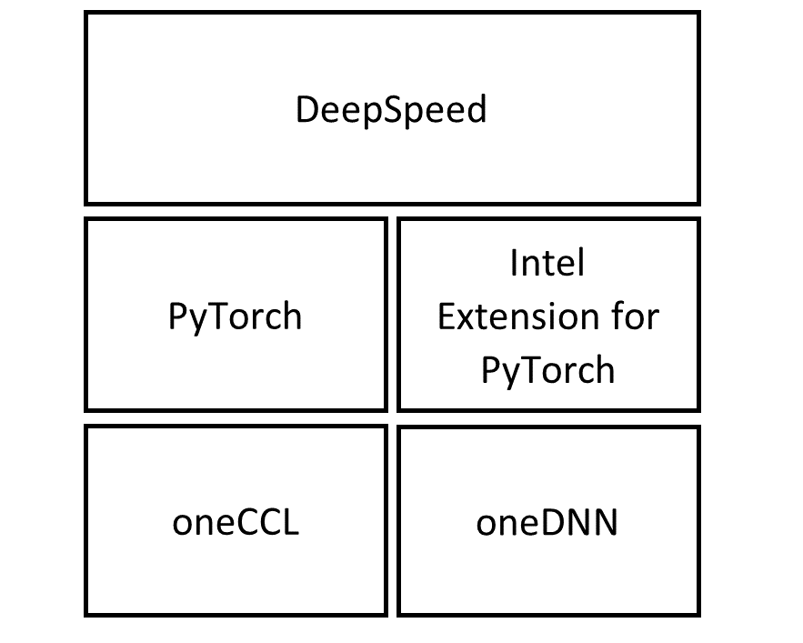
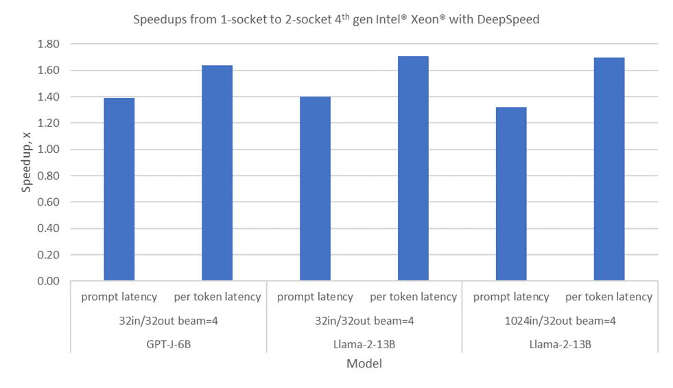

# Llama 2 Inference on 4th Gen Intel® Xeon® Scalable Processor with DeepSpeed

> This blog is co-published with Intel and can also be viewed on [Intel's website](https://www.intel.com/content/www/us/en/developer/articles/technical/xllama-2-on-xeon-scalable-processor-with-deepspeed.html).

## Introduction

Transformer models have revolutionized natural language processing with their ability to capture complex semantic and syntactic relationships. However, these models also pose significant challenges for efficient inference, especially for large language models (LLMs) that have billions of parameters. For example, running half-precision inference of Megatron-Turing 530B would require 40 A100-40GB GPUs [1]. To address challenges associated with the inference of large-scale transformer models, the DeepSpeed team at Microsoft* developed DeepSpeed Inference [2]. It provides high-performance multi-GPU inferencing capabilities and introduces several features to efficiently serve transformer-based PyTorch models using GPU. Today, we are very excited to share that DeepSpeed Inference has been implemented for the 4th Gen Intel® Xeon® scalable processor.

## 4th Gen Intel Xeon Processor

Intel launched the 4th gen Intel Xeon processor in January 2023. This CPU has built-in accelerators for AI, data analytics, networking, storage and HPC. Tile Matrix Multiplication (TMUL) is the built-in AI accelerator. It executes the Intel® Advanced Matrix Extensions (Intel®AMX). Intel AMX can significantly speed up deep learning (DL) applications, both in inference and training. Other notable new features in 4th gen Intel Xeon processors that can speed up DL applications include PCI Express Gen5 (PCIe 5.0) and DDR5. PCIe 5.0 doubles the I/O bandwidth from PCIe 4.0, increasing the bandwidth between CPU and connected devices. DDR5 offers up to 1.5x bandwidth increase over DDR4 [3].

4th gen Intel Xeon with Intel AMX sped up training of BERT-large by 4x compared to 3rd gen Intel Xeon [4]. TMUL executes Intel AMX instructions on data loaded in 2D registers, hence the name tiles. These instructions operate on 8-bit integer (INT8) or 16-bit bfloat (BF16) datatype. 4th gen Intel Xeon with Intel AMX can attain 2048 INT8 operations per cycle compared to 256 INT8 operations per cycle in 3rd gen Intel Xeon with Intel Advanced Vector Extensions 512 Neural Network Instructions (Intel AVX-512 VNNI). Its BF16 performance is 1024 operations per cycle compared to its FP32 performance of 64 operations per cycle. Therefore, Intel AMX can significantly speed up DL applications when INT8 or BF16 datatype is used for matrix multiplication or convolution computations, the common operations in transformer or convolution-based models.

## DeepSpeed enabled for 4th Gen Intel Xeon

DeepSpeed is a DL optimization software for scaling and speeding up DL training and inference. DeepSpeed Inference refers to the feature set in DeepSpeed implemented to speed up inference of transformer models [2]. It initially supported only CUDA GPU. We recently added support for CPU, specifically 4th gen Intel Xeon. Features currently implemented for 4th gen Intel Xeon include automatic tensor parallelism (AutoTP), BF16 and INT8 datatype support, and binding cores to rank.

DeepSpeed builds on top of PyTorch, which has been highly optimized for CPU inference and training. Intel® Extension for PyTorch* adds state-of-the-art optimizations for popular LLMs architectures, including highly efficient matrix multiplication kernels to speed-up linear layers and customized operators to reduce the memory footprint [5]. The runtime software components for DeepSpeed Inference on CPU are shown below in Figure 1. Intel® oneAPI Deep Neural Network Library (oneDNN) uses Intel AVX-512 VNNI and Intel AMX optimizations [6]. Intel® oneAPI Collective Communications Library (oneCCL)  is a library that implements the communication patterns in DL [7]. Intel® Neural Compressor (INC) was used to convert the LLMs from FP32 datatype to BF16 or INT8 datatype [8].


<div align="center">
 <br>
Figure 1. Software components for DeepSpeed Inference on CPU
</div>

## Technologies Introduced

To accelerate running LLMs with DeepSpeed on 4th-generation Intel Xeon, we introduced technologies into both DeepSpeed and Intel Extension for PyTorch.

1. Extend DeepSpeed Accelerator Abstraction Interface to provide CPU support [9]. We implemented CPU as a DeepSpeed Accelerator which allows CPU support to be plugged into DeepSpeed in a device-agnostic manner. Device-agnostic DeepSpeed model scripts which use DeepSpeed Accelerator Abstraction Interface can run on CPU devices without modification.
2.	Fine-grain core binding. We introduced two new DeepSpeed command line arguments: `--bind_cores_to_rank` and `--bind_core_list` to allow core binding with DeepSpeed AutoTP [10] on a node with multiple sockets or on a single socket with multiple sub-NUMA nodes (SNC). Using `numactl`` for each tensor parallel worker, we can bind workers to cores and NUMA memory. This reduces interference between workers and uses memory bandwidth and core more effectively.
3.	Optimized shared memory (SHM) based on AllReduce communication primitives for a single CPU node. We implemented a low latency SHM based AllReduce primitive which utilizes the shared memory of a single-node CPU system.
4.	Optimizations in Intel Extension for PyTorch

    a. oneDNN, Tensor Processing Primitives (TPP) and customized linear kernels for weight only quantization.

    b. Indirect Access KV Cache reduces memory reorder overhead when using KV cache.

    c. Subgraph fusion to reduce memory footprint.

    d. Fusion of AllReduce between multi-head attention and multilayer perceptron in transformer layer when there is no dependency between them.

## How to run DeepSpeed on CPU

Software required for DeepSpeed Inference on CPU (Specific details can be found in the configuration.)
* PyTorch
* Intel Extension for PyTorch [6]
* oneCCL binding for PyTorch [11]
* oneCCL [7]
* DeepSpeed [12]

After installing the required software, we can run inference for a model on CPU. Device agnostic interfaces are used to load and run the model. These device agnostic interfaces are accessed through deepspeed.accelerator.get_accelerator() as shown below in Listing 1. Refer to the DeepSpeed tutorial on DeepSpeed accelerator interfaces [13] for further details.

```python
# Listing 1. An example of using device agnostic interface to get the accelerator device and load and run a model.
import deepspeed
from deepspeed.accelerator import get_accelerator
...
# load model checkpoint into model
model = model.eval().to(get_accelerator().device_name())

ds_world_size = int(os.getenv('WORLD_SIZE', '0'))

engine = deepspeed.init_inference(model=model, mp_size=ds_world_size, \
  dtype=torch.bfloat16, replace_method="auto", \
  replace_with_kernel_inject=False)

model = engine.module
...
# evaluate model
```

Execute the inference code with DeepSpeed using the following command:

```bash
deepspeed --bind_cores_to_rank <python script>
```

This command detects the number of sockets on host and launches as many inference workers as the number of sockets. The LLM workload runs in parallel on the inference workers with DeepSpeed AutoTP [10]. AutoTP distributes inference computation among workers and reduces inference latency. For example, if the host has two sockets, this command will launch two inference workers to inference the input sample in parallel. The argument --bind_cores_to_rank instructs DeepSpeed to split the CPU cores and distribute them to each rank evenly. This ensures that each inference worker uses an exclusive set of CPU cores to avoid interfering with one another. If this argument is not specified, it will defer to the operating system to schedule the workers to the CPU cores, which may not be optimal.

Intel Extension for PyTorch is compatible with DeepSpeed AutoTP and can therefore be used to further optimize AutoTP models generated by DeepSpeed.

```python
# Use Intel Extension for PyTorch to optimize model
...
model = engine.module
import intel_extension_for_pytorch as ipex
model = ipex.optimize_transformers(model.eval(), dtype=torch.bfloat16, inplace=True)
...
```
Examples of LLM optimizations for DeepSpeed AutoTP models with Intel Extension for PyTorch are available at [14].

## Results

DeepSpeed enables optimal distribution of LLM inference on two 4th gen Intel Xeon sockets. Intel AMX on 4th gen Intel Xeon can be used to accelerate BF16 matrix multiplication operations. Support for Intel AMX is available through Intel Extension for PyTorch. Performance speedups in GPT-J-6B and LLaMA2-13B from DeepSpeed AutoTP on 2 sockets are shown in Figure 2 below. GPT-J-6B has 6 billion parameters, requiring 12 GB of memory for its weights. Llama-2-13B has 13 billion parameters, requiring 26 GB of memory for the weights. Latency improvement is the metric used. Prompt latency and per token latency improved as shown by the speedups in the plot.

<div align="center">
 <br>
Figure 2. Performance speedups from 1-socket to 2-socket 4th gen Intel Xeon with DeepSpeed AutoTP. Higher speedup represents higher performance. Per token latency is per token latency for 2nd and subsequent tokens. in/out refers to the input token size and output token size. Beam search size was 4. See backup for configurations, results may vary.
</div>

## Summary
DeepSpeed Inference has been enabled for 4th gen Intel Xeon with Intel AMX to accelerate matrix multiplications common in DL workloads. DeepSpeed Inference leverages 4th Gen Intel Xeon to speed up the inferences of GPT-J-6B and Llama-2-13B. We will continue to improve it for new devices and new LLMs. Intel Data Center GPU Max is a new GPU designed for AI for which DeepSpeed will also be enabled [15].

## Contributors
This work was made possible through deep collaboration between software engineers and researchers at Intel and Microsoft. The contributors of this work include Guokai Ma, Kiefer Kuah, Yejing Lai, Liangang Zhang, Xiaofei Feng, Xu Deng, Mengfei Li, Jianan Gu, Haihao Shen, and Fan Zhao from Intel; Olatunji Ruwase, Martin Cai, and Yuxiong He from Microsoft.

## Configuration
1-node, 2x Intel® Xeon® Platinum 8480+, 56 cores, HT On, Turbo On, 1024 GB (16x64GB DDR5 4800 MT/s [4800 MT/s]) , BIOS version Intel Corporation SE5C7411.86B.9525.D13.2302071333, 02/07/2023, ucode version 0x2b000190, Red Hat Enterprise Linux 8.6, kernel version 4.18.0-372.9.1.el8.x86_64, gcc 11.2.1, PyTorch 2.1.0.dev20230618+cpu,  DeepSpeed 0.9.5+3f5e4931, ipex 2.1.0+git31b7cd6, GPT-J-6B, LLaMA-2-13B.

## References

[1] 	Microsoft, "ZeRO-Inference: Democratizing massive model inference," 9 September 2022. [Online]. Available: https://www.deepspeed.ai/2022/09/09/zero-inference.html. [Accessed 12 April 2023].

[2] 	R. Y. Aminabadi, S. Rajbhandari, M. Zhang, A. A. Awan, C. Li, D. Li, E. Zheng, J. Rasley, S. Smith, O. Ruwase, Y. H. Y. Aminabadi, S. Rajbhandari, M. Zhang, A. A. Awan, C. Li, D. Li and El, "DeepSpeed Inference: Enabling Efficient Inference of Transformer Models at Unprecedented Scale," 30 6 2022. [Online]. Available: https://arxiv.org/abs/2207.00032.

[3] 	Intel, "4th Gen Intel(r) Xeon(r) Scalable Processors," [Online]. Available: https://www.intel.com/content/www/us/en/products/docs/processors/xeon-accelerated/4th-gen-xeon-scalable-processors-product-brief.html. [Accessed 12 4 2023].

[4] 	Intel, "Accelerate AI Workloads with Intel® AMX," [Online]. Available: https://www.intel.com/content/www/us/en/products/docs/accelerator-engines/advanced-matrix-extensions/ai-solution-brief.html. [Accessed 12 4 2023].

[5] 	Intel, "Large Language Models (LLM) Optimizations Overview," [Online]. Available: https://intel.github.io/intel-extension-for-pytorch/cpu/2.1.0+cpu/tutorials/llm.html.

[6] 	Intel, "Intel® Extension for PyTorch," [Online]. Available: https://github.com/intel/intel-extension-for-pytorch.

[7] 	Intel, "oneAPI Collective Communications Library (oneCCL)," [Online]. Available: https://github.com/oneapi-src/oneCCL.

[8] 	Intel, "Intel® Neural Compressor," [Online]. Available: https://github.com/intel/neural-compressor.

[9] 	Microsoft, "DeepSpeed Accelerator Abstraction Interface," [Online]. Available: https://github.com/microsoft/DeepSpeed/blob/master/docs/_tutorials/accelerator-abstraction-interface.md.

[10] 	Microsoft, "Automatic Tensor Parallelism for HuggingFace Models," [Online]. Available: https://www.deepspeed.ai/tutorials/automatic-tensor-parallelism.

[11] 	Intel, "Intel® oneCCL Bindings for PyTorch," [Online]. Available: https://github.com/intel/torch-ccl.

[12] 	Microsoft, "deepspeed," [Online]. Available: https://github.com/microsoft/deepspeed.

[13] 	Intel, "DeepSpeed Accelerator Abstraction Interface," [Online]. Available: https://github.com/microsoft/DeepSpeed/pull/3184.

[14] 	Intel, "Intel® Extension for PyTorch large language model example," [Online]. Available: https://github.com/intel/intel-extension-for-pytorch/tree/llm_feature_branch/examples/cpu/inference/python/llm.

[15] 	Intel, "Intel® Data Center GPU Max Series," [Online]. Available: https://www.intel.com/content/www/us/en/products/details/discrete-gpus/data-center-gpu/max-series.html.
