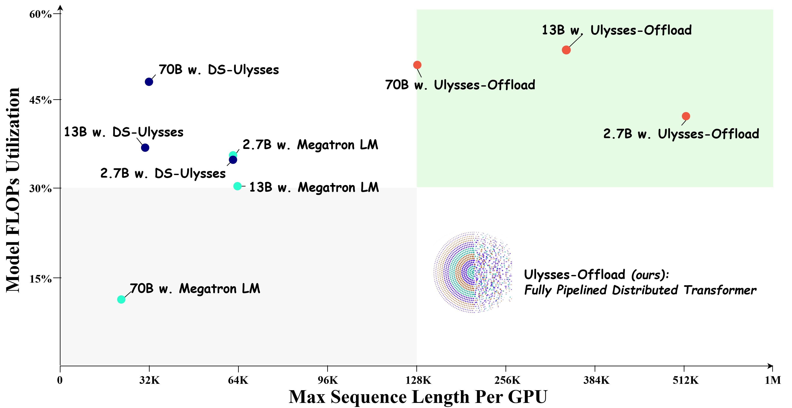
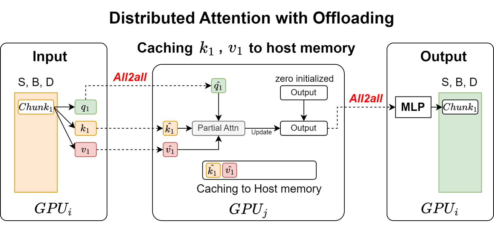
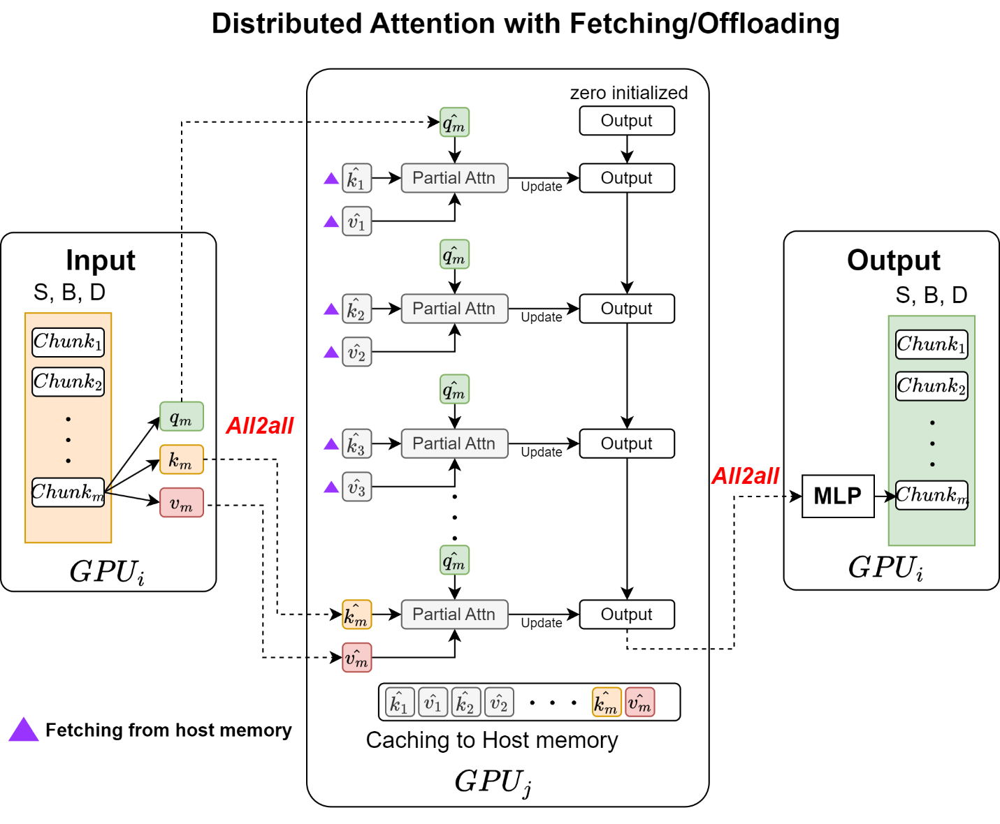
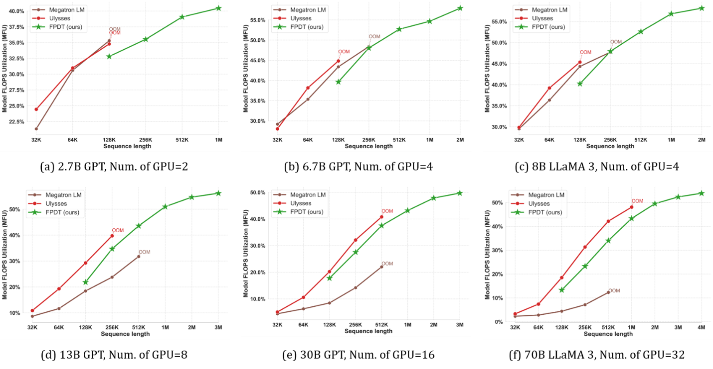
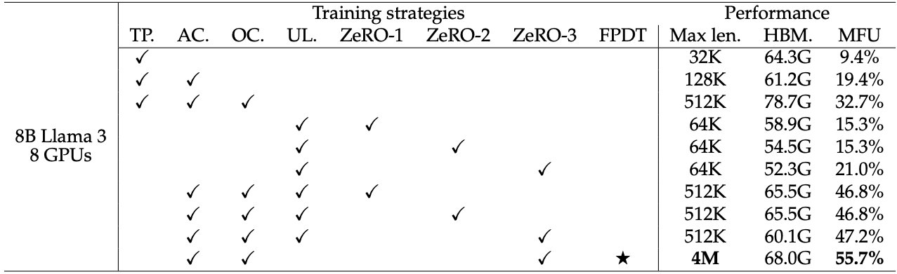

# Ulysses-Offload: Democratizing Long Context LLM Training

Figure 1: Ulysses-Offload supports 16x longer sequence lengths at 55%
Model FLOPs Utilization (MFU) than NVIDIA Megatron-SP and DeepSpeed Ulysses.

To cite and for more technical in depth of this release, please see
our [arxiv report](https://arxiv.org/abs/2408.16978):

@article{yao2024ulysses,

title={ Training Ultra Long Context Language Model with Fully Pipelined
Distributed Transformer},

author={Jinghan Yao and Sam Ade Jacobs and Masahiro Tanaka and Olatunji
Ruwase and Aamir Shafi and Hari Subramoni and Dhabaleswar K. (DK) Panda
},

journal={https://arxiv.org/abs/2408.16978},

year={2024}

}

## Introduction

In the rapidly evolving field of generative AI and scientific ML, the
ability to train large (language) models with ultra-long context
capabilities is becoming increasingly important. These models are
essential for a variety of complex tasks, such as understanding
lengthy documents, generating images and videos, and processing extensive
sequences in computational biology. However, training such models
efficiently poses significant challenges due to the enormous GPU
memory required.

Building DeepSpeed Ulysses, our previous project, which developed
system optimizations for training extremely long sequence transformer
models, we are excited to present Ulysses-Offload, in this release. Ulysses-Offload
is an innovative, resource-efficient technique that offers comparable
benefits to DeepSpeed Ulysses and other previous long-context
optimization methods, but with a lower hardware budget. Ulysses-Offload makes
ultra long-context large language models (LLM) training and finetuning
accessible to everyone, including those with limited GPU resources. Ulysses-Offload enables
training with context lengths of up to 2 million tokens using just 4
NVIDIA A100-40GB GPUs. Ulysses-Offload supports 16x longer sequence lengths at 55%
Model FLOPs Utilization (MFU) than NVIDIA Megatron-SP and DeepSpeed Ulysses
(see Figure 1). The next section highlights the key innovations of Ulysses-Offload,
and subsequent sections provide additional details on the design and
usability of Ulysses-Offload, followed by experimental results.

## Key Innovations

### 1. Fully Pipelined Distributed Transformer (FPDT)

The core innovation of our work is the Fully Pipelined Distributed
Transformer (FPDT). This approach leverages a pipelined sequence
chunking, which allows for the training of LLMs with sequence lengths up
to 2 million tokens on just 4 A100-40GB GPUs. By breaking down the
sequence into manageable chunks and processing them in a pipelined
manner, Ulysses-Offload significantly reduces the memory footprint while
maintaining high computational efficiency. This method ensures that the
GPUs are utilized effectively, even when dealing with extremely long
sequences.

### 2. Memory Optimization

One of the critical aspects of our approach is the comprehensive
analysis and optimization of the memory footprint during LLM training.
We target the reduction of redundant intermediate buffers in both the
forward and backward passes of the training process. By optimizing the
use of GPU and host CPU memory, we can train larger models with longer
sequences without running into GPU memory limitations. This optimization
is crucial for enabling the training of ultra-long context models on a
limited number of GPUs. It is worth noting that Ulysses-Offload memory optimization
is orthogonal and complementary to model- parameter-focused memory
optimization techniques used by DeepSpeed ZeRO and PyTorch FSDP. Ulysses-Offload optimizes memory footprint of activations associated with long sequences while ZeRO and FSDP optimize memory footprint of model parameters.

### 3. Compatibility and Flexibility

Ulysses-Offload is designed to be agnostic to existing training techniques and
works efficiently across different LLM models, including popular
architecture like GPT and Llama. This flexibility ensures that our
approach can be easily integrated into various training workflows.
Additionally, Ulysses-Offload is compatible with advanced memory optimization
techniques such as DeepSpeed ZeRO and PyTorch FSDP, further enhancing
its usability and performance.

## Core Design of Ulysses-Offload

Figure 2 illustrates the core structure of Ulysses-Offload. Ulysses-Offload leverages multiple
memory hierarchies in modern GPU clusters, thus boosting hardware
efficiency and cost-effectiveness while achieving very high model FLOP
utilization (MFU). The design of Ulysses-Offload centers around pipelining,
scheduling, and memory management. These well-known optimization
techniques are essential for scaling LLM context length to a million
scale with a few GPUs and will be discussed in the subsequent
subsections.

Figure 2: Core design

###

### Pipelining and Scheduling

Ulysses-Offload employs sequence chunking and pipelined computation design to manage the memory
and computational load efficiently. In traditional Transformer model,
input (hidden state) tensor is projected to q, k, v tensors. Each of these tensors can be denoted *\[B, S, H, D\]*, where *B* is batch
size, *S* is sequence length, *H* is number of heads and *D* is hidden
dimension per head. With sequence parallelism such as DeepSpeed Ulysses,
input tensor is partitioned along sequence dimension across sequence
parallel group P, that is *\[B, S/P, H, D\]* prior to alltoall collective
communication. The alltoall collective communication gathers partitioned tensors
along sequence dimension and scatter them along head dimension essentially
transforming tensor from *\[B, S/P, H, D\]* to *\[B, S, H/P, D\]*. Post attention computation, a second alltoall communication transforms *\[B, S, H/P, D\]* back to *\[B, S/P, H, D\]*

In our Ulysses-Offload design, input sequence are partitioned at a much finer granularity than DeepSpeed Ulysses. In other words, we made changes to sequence partitioning such that we further subdivide per GPU *S/P* sequence into smaller *u*
chunks. Thus, the input tensors are now represented as \[*B, S/uP, H,
D*\]. We denote these chunks as *Ti*,
where$\ i\  \in \ 0,1,\ldots,\ u - 1.$ As shown in Figure 1,
*Ti* is projected to query *qi*, key
*ki*, and value *vi*. Then, similar to DeepSpeed Ulysses, an alltoall collective communication gathers partitioned tensor
along sequence dimension and scatter them along head dimension. In our chunk
design, the sequence length for each chunk is reduced by a factor of *u*
compared to Ulysses. Please note that our Ulysses-Offload chunking procedure is generally applicable to other sequence parallelism techniques.

Figure 3: Core design with offload description

Figure 3 gives an example of how to perform the computation of chunk
*Tm*. After the alltoall collective communication,
*GPUj* receives
$\widehat{q}m,\ \widehat{k}m,\ and\ \widehat{v}m$*.* We then fetch the
previous sequence chunk by chunk from the host memory to
GPUj, and perform online attention with the current
$\widehat{q}m$ and update the output chunk accordingly. Note that, in a
strict manner, at any given time, only one set of chunks
$\widehat{k}i,\ and\ \widehat{v}i$ is placed on GPU's HBM, reducing the
memory footprint to $\frac{1}{u}$ compared to the non-offloading version
without double buffering. With double buffering, memory footprint is
reduced by *2/u*.

### Memory Management

Ulysses-Offload optimizes memory usage by carefully managing the allocation and
deallocation of buffers during training. This involves:

1.  Double Buffering:

    - Two sets of buffers are maintained to overlap computation with
      data transfer.

    - While one set of buffers is used for computation, the other set is
      preloaded with the next chunk of data.

2.  Hierarchical Memory Utilization:

    - GPU High Bandwidth Memory (HBM) is used for active computation.

    - Host memory is used to store intermediate results that are not
      immediately needed, reducing the pressure on GPU memory.

## Integration with Existing Frameworks

Ulysses-Offload is designed to integrate seamlessly with popular deep learning
frameworks such as PyTorch. Ulysses-Offload provides user-friendly APIs that
abstract the complexities of pipelined training and memory management.
Users can adopt Ulysses-Offload with minimal changes to existing codebases.

## Experimental Results

Figure 4: Supported sequence lengths and corresponding Model FLOPs
Utilization (MFU) using Megatron-SP, Ulysses, and our proposed Ulysses-Offload (FPDT). OOM
denotes the point where increasing sequence length will cause memory
issues. We show Ulysses-Offload's performance when the sequence length is larger
than 128K, as shorter sequences can be properly handled by existing
strategies.

### Extended Sequence Lengths

In our experimental setup, we compare Ulysses-Offload with two existing methods:
Microsoft DeepSpeed Ulysses and NVIDIA Megatron-SP. Both DeepSpeed
Ulysses and Megatron-SP employ similar approaches to sequence
parallelism but differ in the collective communication used for
gathering sequences before the attention block. The former utilizes
alltoall communication, whereas the latter employs allgather. Ulysses-Offload
builds upon the DeepSpeed Ulysses approach. The primary advantage of
Ulysses-Offload is its capability to support the training of large language models
(LLMs) with ultra-long sequence lengths using fewer GPUs. As shown in
Figure 4, our method enables the training of 8B parameter models with
sequence lengths of 2 million tokens using only 4 GPUs. For even larger
models, such as GPT-30B and Llama-70B parameter models, Ulysses-Offload supports
sequence lengths up to 3 million and 4 million tokens using 16 GPUs and
32 GPUs respectively. This represents a 16x increase in sequence length
compared to current state-of-the-art solutions (see Figure 5), making
Ulysses-Offload a game-changer for tasks that require processing long sequences.

### High Hardware Efficiency

As shown in Figure 4 with different model sizes ranging from GPT-2.7B to
Llama-80B parameters, Ulysses-Offload achieves over 55% Model FLOPs Utilization
(MFU), ensuring that the hardware resources are utilized effectively.
This high level of efficiency is maintained even when dealing with
extremely long sequences (up to 4 million context length), making Ulysses-Offload
an ideal solution for training large-scale LLMs. By maximizing the use
of available hardware, Ulysses-Offload reduces the overall cost and complexity of
training long-context models. Our [technical report](https://arxiv.org/abs/2408.16978) offers
further insights into optimizing sequence chunks to balance the
trade-off between memory usage and MFU.

Figure 5: A comprehensive analysis on long-context LLM training with
different training techniques: tensor parallelism (TP), activation
checkpoint (AC), activation checkpoint with CPU offloading (OC), Ulysses
(UL), and our approach Ulysses-Offload (FPDT).

## Implementation and Usability

Ulysses-Offload is designed to be easily integrated with popular deep learning
frameworks such as DeepSpeed, Megatron-DeepSpeed and PyTorch. Users can
adopt our approach with minimal changes to their existing training
pipeline, making it accessible to a broad audience. The integration
process involves setting up the sequence chunk pipeline and configuring
the memory optimization techniques, both of which are straightforward
and well-documented (see tutorial).

Our pipeline design and memory optimization techniques are
straightforward to implement, making Ulysses-Offload accessible to researchers and
practitioners aiming to train long-context LLMs efficiently. We provide
detailed [technical report](https://arxiv.org/abs/2408.16978),
documentation and examples to guide users through the setup process,
ensuring a smooth transition to using Ulysses-Offload. Additionally, Ulysses-Offload, in the
tradition of DeepSpeed provides user-friendly API which abstracts the
complexities of mixed precision training and memory optimization,
allowing users to focus on their research and development tasks.

## General Availability of DeepSpeed Ulysses-Offload

We are excited to release Ulysses-Offload. Ulysses-Offload has been
fully integrated with Megatron-DeepSpeed and accessible through both
DeepSpeed and Megatron-DeepSpeed GitHub repos. Click here for detailed
[tutorial](https://www.deepspeed.ai/tutorials/ulysses-offload/) on usage.

We invite the community to explore our implementation, contribute to
further advancements, and join us in pushing the boundaries of what is
possible in LLM and AI. This release is part of the bigger DeepSpeed
ecosystem of large-scale AI training, finetuning and inference. For more
details on all DeepSpeed technologies and innovations, please visit our
[website]((https://www.deepspeed.ai/)) and follow us
on X, formerly Twitter, ([English](https://twitter.com/MSFTDeepSpeed),
[Japanese](https://twitter.com/MSFTDeepSpeedJP)) and
[Chinese Zhihu](https://www.zhihu.com/people/deepspeed).
