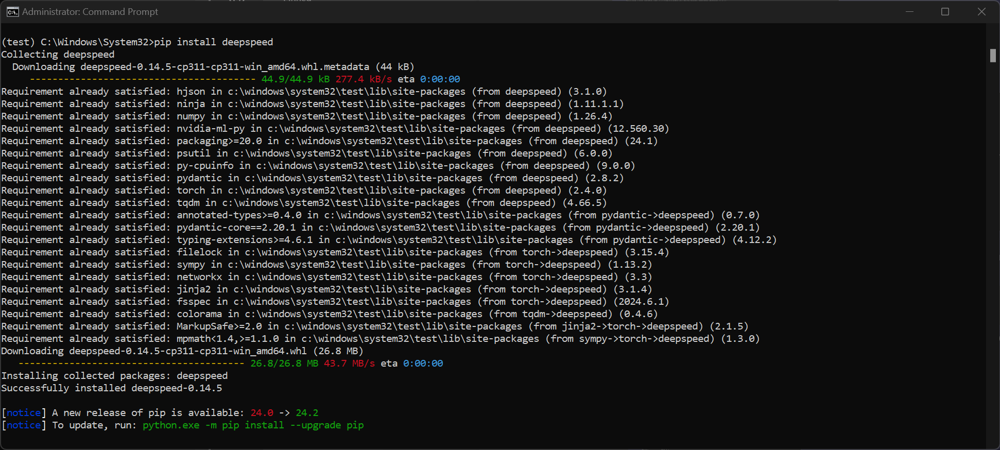
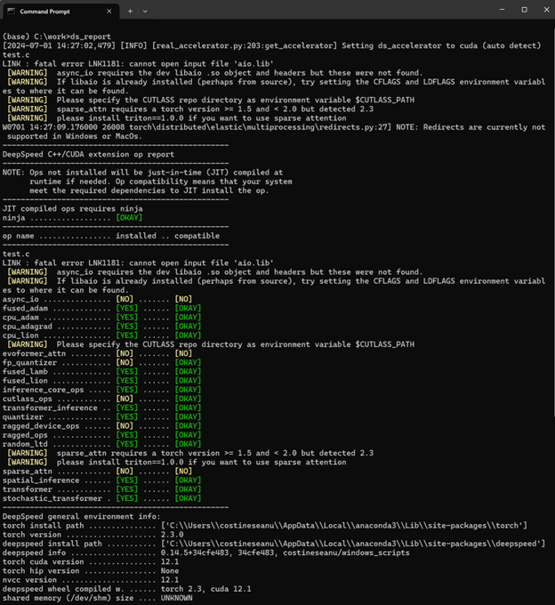
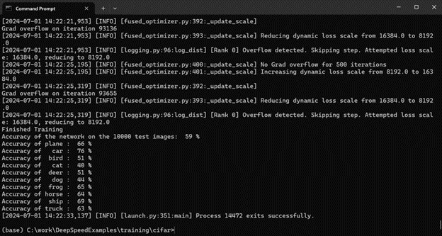
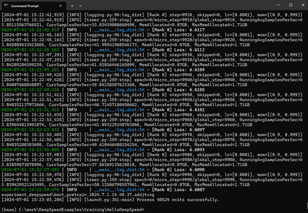
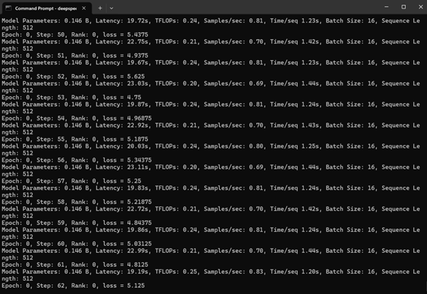

# DeepSpeed on Windows

# Introduction

DeepSpeed is a popular open-source deep learning optimization library that makes distributed training and inference easy, efficient, and effective. DeepSpeed has been widely used to train a variety of state-of-the-art models, including Phi-3, Megatron-Turing-530B, BLOOM-176B, and Arctic because of its rich suite of sophisticated optimizations (e.g., ZeRO, 3D parallelism, MoE, etc.). However, the lack of native support for Microsoft Windows, the most popular operating system, means that DeepSpeed innovations are inaccessible to many AI developers and users. To address this problem, we started an effort to make DeepSpeed run natively with full features on Windows, while ensuring the same ease-of-use enjoyed on Linux.

In this blog, we are pleased to announce some early achievements on this journey: DeepSpeed can now be installed in Windows and run natively for single-GPU training, finetuning, and inferencing. Importantly, both the installation and usage experiences are identical to those on Linux. Furthermore, the finetuning and inferencing workloads demonstrate the functioning of three critical DeepSpeed features, HuggingFace Transformers integration, LoRA support, and CPU Offloading. DeepSpeed on Windows is available in DeepSpeed versions 0.14.5 and above. In the rest of this blog, we present examples to demonstrate these achievements.

# Evaluation Environment
We conducted the experiments on a Surface Laptop Studio 2 running Windows 11 Version 23H2 and Build 22631.3880. The laptop is equipped with a single NVIDIA RTX A2000 GPU with 4GB VRAM. We used Pytorch version 2.3.0 and HuggingFace Transformers version 4.41.2. The example scripts used are from the [DeepSpeedExamples repo](https://github.com/microsoft/DeepSpeedExamples), therefore you need to clone the repo before running any of the following examples.

# Installation
DeepSpeed can be installed on Windows in one of two ways. The easier way is to use the pip package manager, while the other is to build from source. The prerequisites for in both cases are Python 3.x and Pytorch with CUDA support.

## Installing via pip
To install DeepSpeed, simply run: `pip install deepspeed`. This will install the latest version of DeepSpeed (0.14.5 at this time). Unlike the Linux counterpart, the Windows version comes with all the operators already prebuilt, so there is no need to have a CUDA SDK or C++ compiler installed.

    

    pip installation of DeepSpeed on Windows.

## Building from Source
To build DeepSpeed from source, you need to clone the DeepSpeed repository and run the `build_win.bat` compilation script.

## Validating Installation
Regardless of the installation choice, you can check that the installation was successful by running ds_report. The output should look like this:

    

    ds_report output confirming  Windows installation of DeepSpeed.

# Pretraining Examples
We use an image classification model, CIFAR10, and a language model, BERT, to demonstrate pretraining on Windows with DeepSpeed.

## Pretraining CIFAR10
The scripts and codes required for CIFAR10 pretraining example are available in the following path: DeepSpeedExamples\training\cifar. You can launch the CIFAR10 pretraining experiment using the following command: `deepspeed cifar10_deepspeed.py –deepspeed`. The final output should look something like this:

    

    Pretraining CIFAR10 model on Windows using DeepSpeed.

## Pretraining BERT
The scripts and codes for the BERT pretraining example are available in the following path: DeepSpeedExamples\training\HelloDeepSpeed. You can launch the BERT pretraining experiment using the following command: `deepspeed train_bert_ds.py --checkpoint_dir experiment_deepspeed`. The final output should look like this:

    

    Pretraining BERT model on Windows using DeepSpeed.

# Fine Tuning Example
We demonstrate fine tuning capability by using the supervised fine tuning (SFT) step of DeepSpeed-Chat application. We conduct SFT of the HuggingFace facebook/opt-125m model while enabling LoRA and CPU offloading memory optimizations. The command line for running this example is as follows:
deepspeed training\step1_supervised_finetuning\main.py --model_name_or_path facebook/opt-125m --gradient_accumulation_steps 8 --lora_dim 128 --only_optimize_lora --print_loss --zero_stage 2 --deepspeed --dtype bf16 --offload --output_dir output
The output should look like this:

    

    Supervised Finetuning of facebook/opt-125m model on Windows using DeepSpeed.

# Inference Example
We demonstrate inference capability by using ZeRO-Inference for token generation. ZeRO-Inference reduces hardware cost of inferencing by offloading to CPU or NVMe memories. We use the example scripts here to run token generation using Llama-2-7B model from HuggingFace. We offload the model weights to CPU memory since the 4GB VRAM is insufficient to host both the model and the generation working set. We use the following command line to generate 32 tokens from a prompt of 8 tokens:
deepspeed run_model.py --model meta-llama/Llama-2-7b-hf --batch-size 64 --prompt-len 8 --gen-len 32 --cpu-offload
The output will look something like this:

    

    LLAMA2-7B token generation on Windows using ZeRO-Inference.

# Summary
Enabling DeepSpeed, a popular deep learning framework, to run natively on Windows, the most popular operating system, is a crucial step towards empowering every person and every organization to benefit from the ongoing AI revolution.  In this blog, we have shared early results of our work towards this goal. Although Windows support of DeepSpeed is a work-in-progress, we hope that the above updates are encouraging and already useful to users. The next items on our roadmap include running on multiple GPUs, weight quantization, and performance studies.

# Acknowledgements
This work is a result of significant contributions from current and former DeepSpeed members including Costin Eseanu, Logan Adams, Elton Zheng, Reza Yazdani Aminabadi, Martin Cai, and Olatunji Ruwase. We also acknowledge the valuable contributions of DeepSpeed users who righteously demanded this feature, provided critical workarounds, partial solutions, and constructive feedback, and most importantly, stuck with us.
