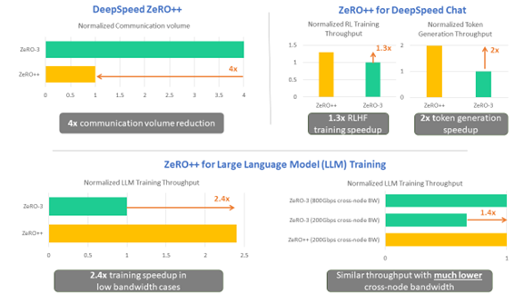
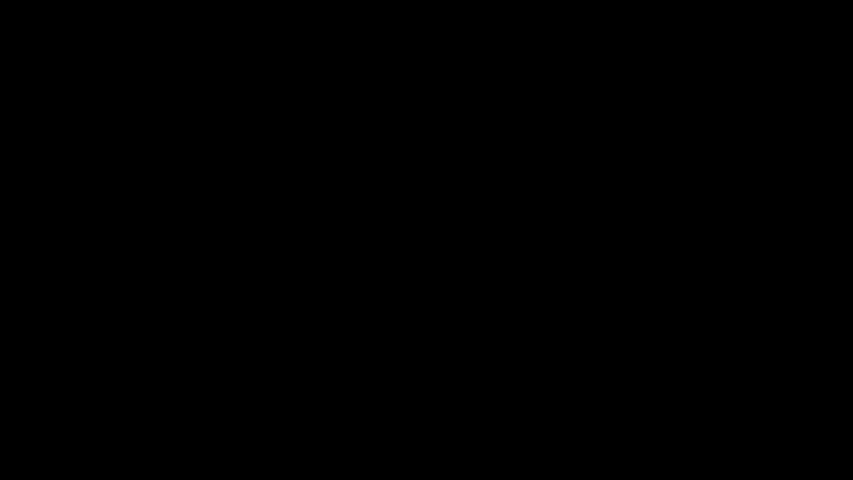
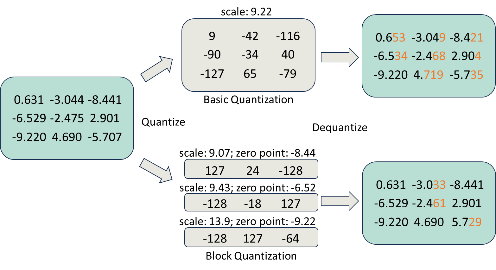
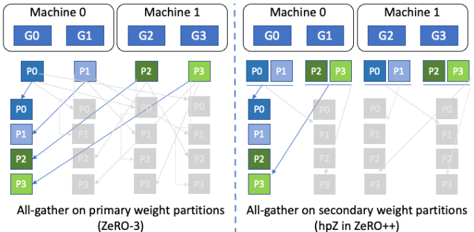
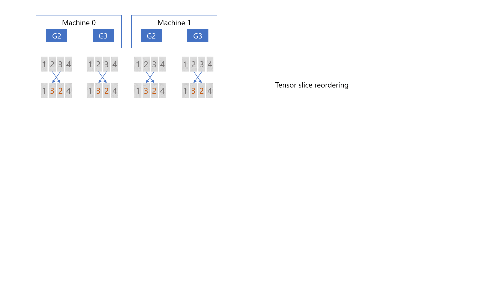
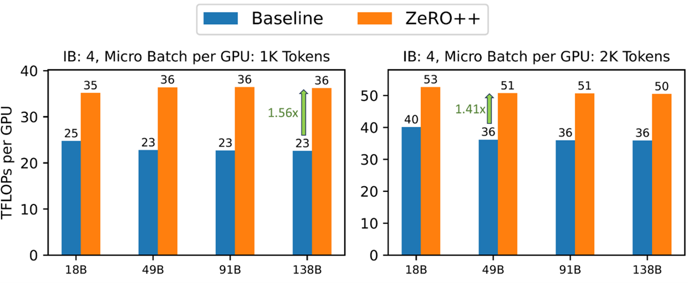
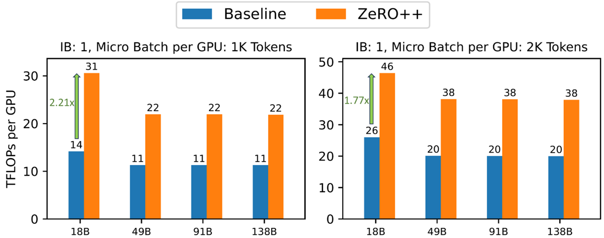
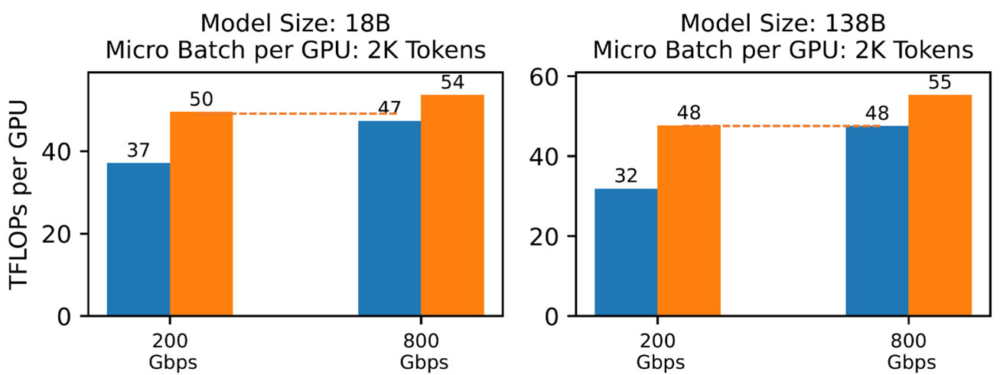
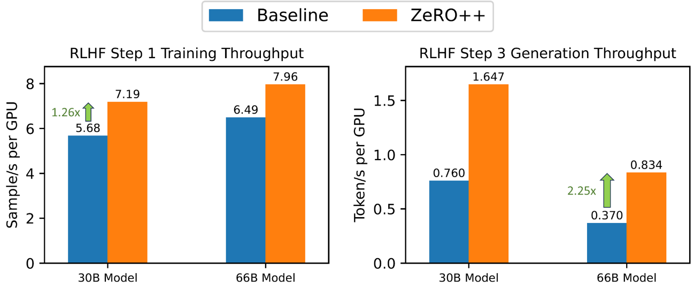

# DeepSpeed ZeRO++：降低4倍网络通信，显著提高大模型及类ChatGPT模型训练效率

图1: DeepSpeed ZeRO++ 简介

大型 AI 模型正在改变数字世界。基于大型语言模型 (LLM)的 Turing-NLG、ChatGPT 和 GPT-4 等生成语言模型用途广泛，能够执行摘要、代码生成和翻译等任务。 同样，DALL·E、Microsoft Designer 和 Bing Image Creator 等大型多模态生成模型可以生成艺术、建筑、视频和其他数字资产，使内容创作者、建筑师和工程师能够探索全新的创意生产力。\
\
然而，训练这些大型模型需要在数百甚至数千个 GPU 设备上使用大量内存和计算资源。 例如，训练 [Megatron-Turing NLG 530B](https://www.microsoft.com/en-us/research/blog/using-deepspeed-and-megatron-to-train-megatron-turing-nlg-530b-the-worlds-largest-and-most-powerful-generative-language-model/)模型需要使用超过 4,000 个 NVidia A100 GPU。 有效地利用这些资源需要一个复杂的优化系统，以将模型合理分配到各个设备的内存中，并有效地并行化这些设备上的计算。 同时，为了使深度学习社区能够轻松进行大型模型训练，这些优化必须易于使用。

DeepSpeed 的 ZeRO [优化系列](https://www.deepspeed.ai/tutorials/zero/)为这些挑战提供了强大的解决方案，并已广泛用于大型深度学习模型例如TNLG-17B、Bloom-176B、MPT-7B、Jurrasic-1的训练中 。尽管它具有变革性的能力 ，在一些关键场景中，ZeRO 会在 GPU 之间产生大量数据传输开销，这降低了训练效率。 这种情况特别发生在以下场景中：a) 全局batch size较小，而 GPU数量多，这导致每个 GPU 上batch size较小，需要频繁通信；或者 b) 在低端集群上进行训练，其中跨节点网络带宽有限，导致高通信延迟。在这些情况下，ZeRO 的训练效率会受到限制。

为了解决这些限制，我们发布了 [ZeRO++](https://arxiv.org/abs/2306.10209) 。 ZeRO++相比 ZeRO将总通信量减少了 4 倍，而不会影响模型质量。 这有两个关键意义：

1. *ZeRO++加速大型模型预训练和微调*
    1. 每个GPU上 batch size较小时: 无论是在数千个 GPU 上预训练大型模型，还是在数百个甚至数十个 GPU 上对其进行微调，当每个 GPU 的batch size较小时，ZeRO++ 提供比 ZeRO 高 2.2 倍的吞吐量，直接减少训练时间和成本。
    2.  低带宽计算集群: ZeRO++ 使低带宽集群能够实现与带宽高 4 倍的高端集群类似的吞吐量。 因此，ZeRO++ 可以跨更广泛的集群进行高效的大型模型训练。

2. *ZeRO++加速 ChatGPT 类的 RLHF训练*

    1. 虽然 ZeRO++ 主要是为训练而设计的，但它的优化也自动适用于 [ZeRO-Inference](https://www.deepspeed.ai/2022/09/09/zero-inference.html#:~:text=ZeRO-Inference%20adapts%20and%20optimizes%20ZeRO-Infinity%20techniques%20for%20model,memory%2C%20thus%20hosting%20no%20%28zero%29%20weights%20in%20GPU.)，因为通信开销对于 ZeRO 的训练和推理同样适用。 因此，ZeRO++ 可以提高人类反馈强化学习 (RLHF) 等算法的效率，因为RLHF结合了训练和推理。

    2. 通过与 DeepSpeed-Chat 的集成，与原始 ZeRO 相比，ZeRO++ 可以将 RLHF 训练的生成阶段效率提高多达 2 倍，强化学习训练阶段效率提高多达 1.3 倍。

接下来，我们将更深入地解释 ZeRO 及其通信开销，并讨论 ZeRO++ 中为解决这些问题而进行的关键优化。 然后我们将展示 ZeRO++ 对不同模型大小、批量大小和带宽限制的训练吞吐量的影响。我们还将讨论 ZeRO++ 如何应用于 DeepSpeed-Chat，以加速使用 RLHF的对话模型的训练。

## ZeRO++详解

图2: ZeRO optimizer 工作流程图

ZeRO 是数据并行(Data Parallelism)的一种内存高效版本，其中模型状态会被分割储存在所有 GPU 上，而不需要在训练期间使用基于gather/broadcas的通信进行复制和重建。这使 ZeRO 能够有效地利用所有设备的聚合 GPU 内存和计算力，同时提供简单易用的数据并行训练。\
\
假设模型大小为 M。在前向传播过程中，ZeRO 执行全收集/广播(all-gather/broadcast)操作以在需要之时为每个模型层收集参数（总共大小为 M）。 在向后传递中，ZeRO 对每一层的参数采用类似的通信模式来计算其局部梯度（总大小为 M）。 此外，ZeRO 在对每个局部梯度计算完毕后会立刻使用 reduce 或 reduce-scatter 通信进行平均和分割储存（总大小为 M）。 因此，ZeRO 总共有 3M 的通信量，平均分布在两个全收集/广播(all-gather/broadcast)和一个减少分散/减少(reduce-scatter/reduce)操作中。

为了减少这些通信开销，ZeRO++ 进行了三组通信优化，分别针对上述三个通信集合：

图3:qwZ的分区量化图例

### ZeRO通信过程中的权重量化 (qwZ)

首先，为了减少 all-gather 期间的参数通信量，我们采用权重量化在通信前将每个模型参数从 FP16（两个字节）动态缩小为 INT8（一个字节）数据类型，并在通信后对权重进行反量化。 然而，简单地对权重进行量化会降低模型训练的准确性。 为了保持良好的模型训练精度，我们采用分区量化，即对模型参数的每个子集进行独立量化。目前尚且没有针对分区量化的高性能现有实现。 因此，我们自行从头开始实现了一套高度优化的量化 CUDA 内核，与基本量化相比，精度提高 3 倍，速度提高 5 倍。

图4: 权重的分层分割存储(hpZ)

### ZeRO模型权重的分层分割存储 (hpZ)

其次，为了减少向后传递期间全收集(all-gather)权重的通信开销，我们用 GPU 内存进行通信。 更具体地说，我们不像在 ZeRO 中那样将整个模型权重分布在所有机器上，而是在每台机器中维护一个完整的模型副本。 以更高的内存开销为代价，这允许我们用机器内的模型权重全收集/广播(all-gather/broadcast)代替昂贵的跨机器全收集/广播(all-gather/broadcast)，由于机器内通信带宽更高，这使得通信速度大幅提升。

图5: qgZ 端到端的工作流程

### ZeRO通信过程中梯度量化 (qgZ)

第三，要降低梯度的reduce-scatter通信成本更具挑战性。 因为直接应用量化来减少通信量是不可行的。 即使我们使用分区量化来降低量化误差，梯度reduce也会累积并放大量化误差。 为了解决这个问题，我们只在通信之前量化梯度，但在任何reduce操作之前将它们反量化到原有精度。 为了有效地做到这一点，我们发明了一种名为 qgZ 的基于 all-to-all 的新型量化梯度通信范式，它在功能上等同于压缩的归约-分散(reduce-scatter)操作。

qgZ 旨在解决两个挑战：i) 如果我们简单地在 INT4/INT8 中实施 reduce-scatter 会导致显著精度损失，以及 ii) 在传统tree或ring-based reduce-scatter中使用量化需要一长串量化和反量化步骤，这直接导致误差积累和显著的延迟，即使我们在全精度上进行reduce。为了解决这两个挑战，qgZ 不使用tree或ring-based reduce-scatter算法，而是基于一种新颖的分层 all-to-all 方法。

qgZ 中有三个主要步骤：i）梯度切片重新排序，ii）节点内通信和reduce，以及 iii）节点间通信和reduce。 首先，在任何通信发生之前，我们对梯度进行切片并对张量切片重新排序，以保证通信结束时每个 GPU 上的最终梯度位置（即图 5 中的绿色块）是正确的。 其次，我们量化重新排序的梯度切片，在每个节点内进行 all-to-all 通信，从 all-to-all 中对接收到的梯度切片进行反量化，并进行局部reduce。 第三，我们再次量化局部reduce后的梯度，进行节点间的all-to-all通信，再次对接收到的梯度进行反量化，并计算最终的高精度梯度reduce，得到图5中绿色块的结果。\
\
这种分层方法的原因是为了减少跨节点通信量。 更准确地说，给定每个节点 N 个 GPU、M 的模型大小和 Z 的量化比率，单跳 all-to-all 将生成 M\*N/Z 跨节点流量。 相比之下，通过这种分层方法，我们将每个 GPU 的跨节点流量从 M/Z 减少到 M/(Z\*N)。 因此，总通信量从 M\*N/Z 减少到 M\*N/(Z\*N) = M/Z。 我们通过重叠节点内和节点间通信以及融合 CUDA 内核来进一步优化 qgZ 的端到端延迟（张量切片重新排序 (Tensor Slice Reordering)+ 节点内量化(Intra-node quantization)）和（节点内反量化 (Intra-node Dequantization) + 节点内梯度整合 (Intra-node Reduction) + 节点间量化(inter-node quantization)）。

|     Communication Volume    |     Forward all-gather on weights    |     Backward all-gather on weights    |     Backward reduce-scatter on gradients    |     Total    |
|:---------------------------:|:------------------------------------:|:-------------------------------------:|:-------------------------------------------:|:------------:|
|             ZeRO            |                   M                  |                    M                  |                       M                     |       3M     |
|            ZeRO++           |                  0.5M                |                    0                  |                     0.25M                   |     0.75M    |

### **通信总量优化**

通过结合以上所有三个组件，我们将跨节点通信量从 3M 减少到 0.75M。 更具体地说，我们使用 qwZ 将模型权重的前向全收集/广播从 M 减少到 0.5M。 我们使用 hpZ 消除了反向传播期间的跨节点 all-gather，将通信从 M 减少到 0。最后，我们使用 qgZ 将反向传播期间的跨节点 reduce-scatter 通信从 M 减少到 0.25M。

## **ZeRO++ 加速大型语言模型训练**

在这里，我们展示了 ZeRO++ 在 384 个 Nvidia V100 GPU 上的真实 LLM 训练场景的测试结果。

图6: 在 384 个 V100 GPU 上的各种模型大小下 ZeRO++ 与 ZeRO 的吞吐量，节点间使用 4 个 Infiniband (IB) 进行互连，每个以 100 Gbps 运行。

### **在GPU小batch size情况下ZeRO++实现更高的训练效率**

**高带宽集群:** 如图 6 所示，我们首先展示了 ZeRO++ 相对于 ZeRO 的吞吐量改进，针对不同的模型大小和微批量(micro-batch size)大小，测试使用 4x Infiniband (IB) 以实现 400Gbps 跨节点互连带宽，每个以 100Gbps 运行。 在 micro-batch size为每 GPU 1k tokens时，ZeRO++ 比 ZeRO-3 的吞吐量提高了 28% 到 36%。 对于 2k tokens micro-batch size大小，ZeRO++ 比 ZeRO-3 实现了 24% 到 29% 的吞吐量增益。

图7: 在 384 个 V00 GPU 上 100Gbps 跨节点带宽时各种 LLM 的吞吐量

**低带宽集群:** 在 100Gbps等低带宽网络环境中，ZeRO++ 的性能明显优于 ZeRO-3。 如图 7 所示，与 ZeRO-3 相比，ZeRO++ 在端到端吞吐量方面实现了高达 2.2 倍的加速。 平均而言，ZeRO++ 比 ZeRO-3 基线实现了大约 2 倍的加速。

图8: ZeRO++ 以显着降低的带宽实现高带宽集群性能

### **实现高带宽ZeRO和低带宽ZeRO++集群之间的模型训练效率等效**

此外，与 ZeRO 在高得多的带宽环境下相比，ZeRO ++ 可以在低带宽集群中实现相当的系统吞吐量。 如图 8 所示，对于 18B 和 138B 模型大小，具有 200Gbps 跨节点带宽的 ZeRO++ 可以达到与 800Gbps 跨节点带宽的 ZeRO-3 相似的 TFLOP。

鉴于 ZeRO++ 出色的可扩展性，我们将 ZeRO++ 视为用于训练大型 AI 模型的下一代 ZeRO。

## **DeepSpeed-Chat 与ZeRO++结合用于 RLHF 训练**

### **RLHF训练简介**

ChatGPT 类模型由 LLM 提供支持，并[使用 RLHF 进行微调](https://openai.com/blog/chatgpt)。 RLHF 由生成（推理）阶段和训练阶段组成。 在生成阶段，演员(actor)模型将部分对话作为输入，并使用一系列前向传递生成响应。 然后在训练阶段，评论(critic)模型根据质量对生成的响应进行排名，为演员模型提供强化信号。 使用这些排名对参与者模型进行微调，使其能够在后续迭代中生成更准确和适当的响应。

RLHF 训练带来了巨大的内存压力，因为它使用了四种模型（演员、参考、评论、奖励）。 常见的解决方案是采用低秩自适应训练 (LoRA) 来解决 RLHF 的内存压力。 LoRA 冻结了预训练模型的权重，并将可训练的秩分解矩阵注入到 Transformer 架构的每一层中，显着减少了可训练参数的数量。 LoRA 通过减少内存使用来加速 RLHF，允许更大的批处理(batch)大小，从而大大提高吞吐量。

### **DeepSpeed-Chat with ZeRO++ 用于 RLHF 训练**

图9: ZeRO++ 加速了 RLHF 训练的生成和训练阶段

ZeRO++在RLHF + LoRA的场景下有着独特的应用，因为大多数模型权重都被冻结了。 这意味着 ZeRO++ 可以将这些冻结的权重量化保存到INT4/8 中，而不是将它们存储在 fp16 中并在每次通信操作之前对其进行量化。 通信后的反量化仍然是为了让权重为计算做好准备，但反量化后的权重在计算后被简单地丢弃。

以这种方式使用 ZeRO++ 进行 RLHF 训练可以减少内存使用和通信量。 这意味着通过减少通信以及由于减少内存使用而启用更大的批处理大小来提高训练吞吐量。 在生成阶段，ZeRO++ 使用 hpZ 将所有权重通信保持在每个节点内，以利用更高的节点内通信带宽，减少通信量，进一步提高生成吞吐量。\
\
ZeRO++ 已集成到 DeepSpeed-Chat 中，以支持 ChatGPT 类模型的 RLHF 训练。 在图 9 中，我们比较了不同大小的 actor 模型的 RLHF 生成吞吐量。测试配置为 32个V100 GPU ，actor 模型大小为30B 和 66B以测试 ZeRO 和 ZeRO++性能。 结果表明，ZeRO++ 的 RLHF 生成吞吐量比 ZeRO 高出 2.25 倍。 我们还展示了在 16 个 V100 GPU 上训练阶段的加速，其中 ZeRO++ 实现了比 ZeRO 高 1.26 倍的吞吐量，这是由于 ZeRO++ 支持的更低通信量和更大批量大小。

##  **DeepSpeed ZeRO++现已发布!**

我们非常高兴能够发布 DeepSpeed ZeRO++ 并让 AI 社区中的每个人都可以使用它。请访问我们的 GitHub 页面以获取 [LLM训练教程](https://www.deepspeed.ai/tutorials/zeropp/)。 用于 DeepSpeed-Chat 的 ZeRO++ 将在未来几周内发布。\
有关 ZeRO++ 的更多技术细节，请查看我们的[arxiv论文](https://arxiv.org/pdf/2306.10209.pdf)。

DeepSpeed-ZeRO++ 是 DeepSpeed 生态系统的一部分。 要了解更多信息，请访问我们的网站，在那里您可以找到详细的博客文章、教程和有用的文档。

您还可以在我们的[英文 Twitter](https://twitter.com/MSFTDeepSpeed)、[日文 Twitter](https://twitter.com/MSFTDeepSpeedJP) 和[中文知乎](https://www.zhihu.com/people/deepspeed) 上获取最新的 DeepSpeed 新闻。

DeepSpeed 欢迎您的贡献！ 我们鼓励您在 DeepSpeed GitHub 页面上报告问题、贡献 PR 并加入讨论。 有关更多详细信息，请参阅我们的贡献指南。 我们对与大学、研究实验室和公司的合作持开放态度。 对于此类请求（以及其他不适合 GitHub 的请求），请直接发送电子邮件至 <deepspeed-info@microsoft.com>。

**贡献者:**

DeepSpeed 团队的以下人员的贡献使该项目成为可能：

[Guanhua Wang](https://www.microsoft.com/en-us/research/people/guanhuawang/), Heyang Qin, Sam Ade Jacobs, Connor Holmes, [Samyam Rajbhandari](https://www.microsoft.com/en-us/research/people/samyamr/), [Olatunji Ruwase](https://www.microsoft.com/en-us/research/people/olruwase/), Ammar Ahmad Awan, Jeff Rasley, Michael Wyatt, [Yuxiong He](https://www.microsoft.com/en-us/research/people/yuxhe/) (team lead)
